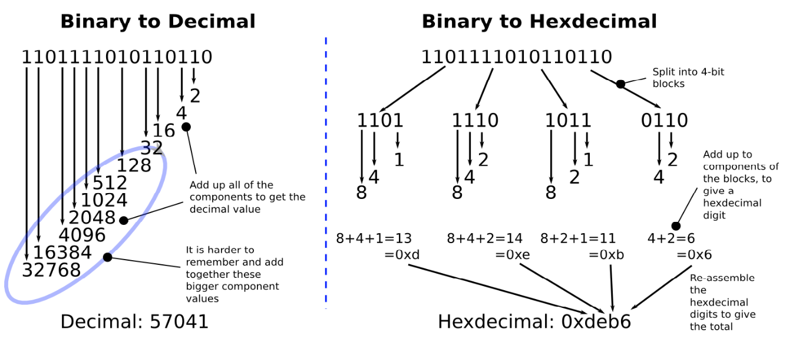
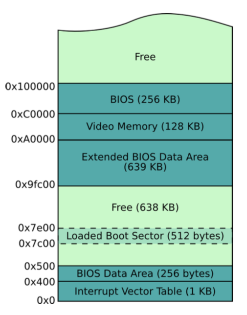
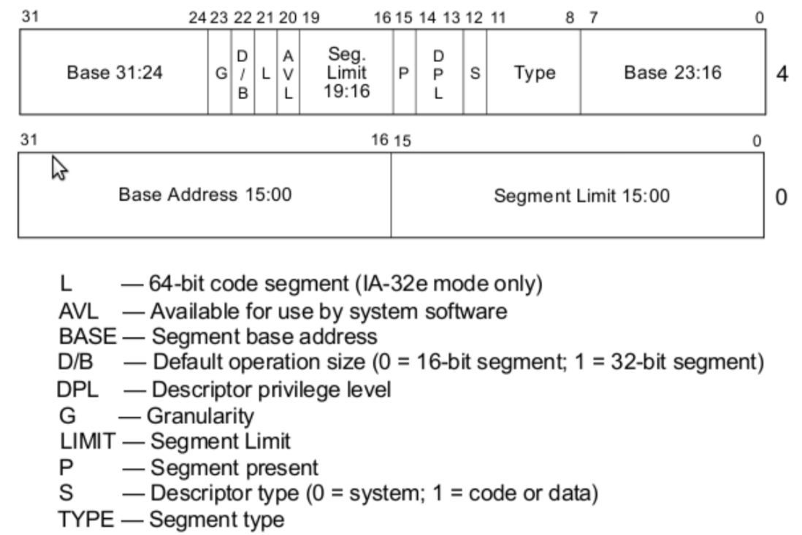

>原文地址 [Writing a Simple Operating System — from Scratch](http://www.cs.bham.ac.uk/~exr/lectures/opsys/10_11/lectures/os-dev.pdf)

## 前言

我们之前都使用过操作系统（以下简称 OS）（例如 Windows XP，Linux等），甚至我们可以为其中的某个 OS 写过程序。但 OS 到底是干嘛用的呢？我们所看到的有哪些是硬件处理的，哪些是软件处理的？以及计算机到底如何工作的？

已故的兰卡斯特大学的 Doug Shepherd 教授（我的老师）曾经告诉我，他曾经从无到有写过一个 OS，之后就再也没有碰到任何他感觉恼人的编程问题，以及无法进行下去的研究。今天，我们理所当然的在我们的日常工作使用这些奇妙的机器，而无需了解任何底层的内容，不需要了解软件是如何与其进行交互的。

在这里，我们将专注与广泛使用的 x86 架构的 CPU，我们将抛开所有的软件，遵循 Doug 早期的步伐，按照如下过程学习：

- 计算机是如何启动的
- 如何在没有 OS 的情况下编写底层程序
- 如何配置 CPU，使得我们能够使用它的拓展功能
- 如何运行高级语言编写的代码，使得我们能够加快自制 OS 的编写进度
- 如何构建基本的 OS 服务，比如设备驱动，文件系统，多任务处理

注意，从实用操作系统的角度，本指南并非旨在扩展，而是旨在将来自多个来源的信息片段汇集到一个完整且连贯的文档中，从而为您提供底层编程实践经验，比如 OS 是如何编写的，以及在编写的时候会遇到的问题。本指南采用的方法比较独特，因为特定的语言和工具（例如汇编，C，Make等）不是重点，而是被视为达到目的的手段：我们将学会如何通过这些手段达到我们主要的目标。

这项工作不是作为替代品，而是作为其他优秀工作的垫脚石，例如 Minix 项目和一般的操作系统开发。


# 架构和启动

## 2.1 启动

现在，开始我们的旅途！

当我们启动计算机时，它必须在没有任何 OS 的帮助下完成初始化。然而，它必须从已经加载的永久存储器（比如硬盘等）中加载 OS

我们不久就会发现，启动阶段，计算机提供的功能非常有限：在这个阶段，甚至一个简单的文件系统都非常奢侈（比如读写一个硬盘的问题），但是我们连这个都没有。幸运的是，我们有 BIOS （the Basic Input/Output Software）：一系列软件列程，这些最初是从芯片加载到内存，并在电源开启的那一刻被初始化。 BIOS 提供对关键设备（比如屏幕、键盘和硬盘）的自动检测和基本控制。

当 BIOS 完成对设备的底层测试（最主要的是检测挂载的内存是否工作正常）之后，它必须启动在某个设备中存储的 OS。这里，我们要注意，BIOS 不能简单从硬盘挂载一个代表 OS 的文件，因为 BIOS 没有文件系统。 BIOS 必须从物理设备的特定地址读取特定区块的数据（通常大小是 512 字节）。

所以，BIOS 最初的阶段是硬盘的第一个区块找到 OS（比如，0头0道0扇区），这一区块被称为启动区块。因为某些硬盘可能没有包含 OS（可能这些硬盘存储了另外一些内容），所以对于 BIOS，检测一个硬盘的区块是否包含启动代码还是只是包含简单数据是非常重要的。注意 CPU 并不区分数据和代码，两者都会被解释为 CPU 指令，只是代码是一些对应 CPU 指令的有用算法实现。

对于 BIOS 简单的理解是，启动区块的最后两个字节内容必须是 `0xaa55`。所以，BIOS 循环检测每个存储设备，读取启动区块到内存中，然后指导 CPU 去开始执行在启动区块之后的第一个区块内容（也就是 `0xaa55` 结尾的区块）。

从这里开始，我们开始控制计算机的执行。

## 2.2 启动代码

我们可以使用二进制编辑器，来写原始字节值到文件中（一个标准的文本编辑器会转换字符比如‘A‘成一个 ASCII 编码的值）。因此我们可以制作一个简单合法的启动区块。

启动区块的机器代码，每个字节16进制展示：
```
e9 fd ff 00 00 00 00 00 00 00 00 00 00 00 00 00
00 00 00 00 00 00 00 00 00 00 00 00 00 00 00 00
[ 29 more lines with sixteen zero-bytes each ]
00 00 00 00 00 00 00 00 00 00 00 00 00 00 55 aa
```

注意有三个重要的地方：

- 最初的三字节，`0xe9`，`0xfd` 和 `0xff`。实际上是机器代码指令，是每个 CPU 生厂商定义的，为了执行无穷循环。
- 最后两个字节，`0x55` 和 `0xaa`，组成了魔法数字，暗示 BIOS 它是一个启动区块，而不是碰巧存放在启动区块的数据。
- 中间有很多行零，只是为了简单的把魔法 BIOS 数字放在 512 区块的末端。

要十分关注大小端机制。你可能很奇怪为什么魔法数字 `0xaa55` 在我们的启动区块中被写成连续的字节 `0x55` 和 `0xaa`。这是因为 x86 架构以小端格式处理多个字节值，也就是低位字节存放在高位地址。这和我们熟悉的方式不太一样。比如经过系统的处理，我有 $0000005 美元在我的银行账户，现在我可以退休了（因为我有5百万美元！！），甚至还能捐一点出来！！

编译器和汇编器能帮助我们隐藏大小端的细节，比如说一个 16 位的数据会被自动转换成正确的格式。但是，有时候了解大小端很重要，比如说当寻找 bug 的时候，想要知道一个字节是如何被存放在存储设备上的。

这可能是计算机能运行的最小的程序，不管怎样，它是合法的。我们可以通过两种方式测试。第二种方式最安全也最适合我们的实验目的：

- 使用任何可能的方式，将上述二进制代码写到不重要的存储设备的第一个区块（比如说 U 盘），然后重启电脑。
- 使用虚拟机软件，比如 VMWare 或者 VirtualBox，然后设置上述代码到虚拟机中的磁盘，然后启动虚拟机

如果计算机启动以后一直处于等待状态，没有“没有找到 OS” 这样的信息的话，说明上述代码已经被成功加载和执行。这行代码主要做的就是无限循环，没有这个循环，CPU 就会去执行内存中的下一个指令，大部分情况下是随机的未初始化的字节。这会导致 CPU 进入一些非法的状态，甚至有可能会令 BIOS 运行一些列程去格式化你的磁盘！

记住，是我们编程，然后计算机盲目的执行我们的指令，直到断电。所以我们要确保他执行我们设计好的代码而不是一些在内存中随机存在的字节。在底层，我们有很多权限和能力去控制计算机。我们来开始学习这些吧！

## 2.3 CPU 仿真

有许多方便的第三方工具，帮助我们测试这些底层代码，而不需要不断的启动机器，或者冒着重要数据被丢失的风险。比如说使用 CPU 仿真器，有 Bochs 和 Qemu。不像虚拟机（比如 VMWare 和 VirtualBox）会尝试优化性能，并且借助宿主计算机直接在 CPU 上执行指令，仿真器包含一个模拟 CPU 架构的程序，使用变量来表示 CPU 寄存器，并用高层的控制结构来模拟底层调整等。总的来说，它更慢，但是更适合开发和测试这样的系统。

注意，为了让仿真器做任何有用的事，需要编写代码并被编译成磁盘镜像文件来运行。一个镜像文件就是原生数据（比如机器代码和字节），并会被写进硬盘、CD 或者 U 盘中。甚者有些仿真器能够从下载或者 CD 中的镜像文件中成功的启动和运行一个真实的 OS（虽然这种情况最适合的方案还是虚拟机技术）。

仿真器翻译底层显示设备的指令成像素，并在桌面上渲染，然后你就能在真实的显示器上看到了。

总之，对于这篇文档的练习，在仿真器上能成功运行的机器代码也能成功的在真实架构的设备上运行，唯一的区别就是慢了点。

### 2.3.1 Bochs：x86 CPU 仿真器

Bochs 需要我们在本地目录配置一个文件 `bochsrc`，描述真实设备（比如屏幕和键盘）是如何被仿真的，最重要的是，当仿真计算机开始运行时，磁盘镜像是如何被启动的。

下面展示了一个我们将用到的 Bochs 的配置文件的样子：

```
# Tell bochs to use our boot sector code as though it were 
# a floppy disk inserted into a computer at boot time. 
floppya: 1_44=boot_sect.bin, status=inserted
boot: a
```

为了用 Bochs 测试我们的启动代码，只需要输入

```
$bochs
```

一个简单的实验，试着改变 BIOS 的魔法数字然后重写运行 Bochs。

因为 Bochs CPU 仿真器和真实的很接近，完成在 Bochs 上的测试之后，你可以在真实设备上启动之前的代码，你会发现它会运行的更快。

### 2.3.2 QEMU

QEMU 和 Bochs 很像。但是它更加的高效，并且除了 x86 之外的其他 CPU 架构。不过他的文档没有 Bochs 丰富。它不需要配置文件就可以运行，比如这样：

```
$qemu <your-os-boot-disk-image-file>
```

## 2.4 16进制表示法

我们前面已经看过一个 16进制的例子。理解为什么16进制在底层编程经常被使用到很重要。

首先，可能会问，我们理解10进制是那么自然，为什么不用10进制呢？我不是这方面的专家，不过很可能因为大部分人有十个手指，所以我们习惯用十进制。

十进制的基底是10，有十个不同的数字符号。16进制的基底是16，需要16个数字符号，所以需要额外6个符号，一个简单的做法是使用字符，比如 1，2，...8，9，a，b，c，e，d，f，其中符号 d 表示 13。

为了区别不同的进制，16进制表示的时候会在前面加 `0x`，或者有时候在尾部加 `h`，碰巧不带任何字符的16进制数字要比较注意，比如 0x50 不等于十进制中的 50，而是 80。

计算机表示一个数使用的是一系列位（二进制位），因为计算机基本只能区别两个电路状态：0 和 1，就好像计算机只有两个手指一样。所以为了表示一个大于1的数字，计算机需要将一系列位给组合起来，就像我们表示大于9的数字用两个或者更多的位（比如 456，23...)。

为了简化期间，特定数量的一系列位会被称为 `byte`（字节），一个字节包含8位。其他的比如 `short`、`int`、`long` 相应的表示 16位，32位，64位。我们也会使用术语 `word` （字）表示 CPU 当前模式的最大的处理单元大小：比如在 16 位模式下，一个字表示 16 位数值，在32位保护模式下，一个字表示32位数值，等等。

所以，16进制的优势在于，一系列位的表示会相当的长，很难书写，但是很容易被转换成更短的16进制表示，并且，我们将4位二进制数字表示成一位16进制数字，而不是将所有位表示成一个数字（不管是16进制还是32或者64进制），因为这样更加简单。下面的图清楚的展示了这个：

将二进制数字转换成十进制和16进制：
 


# 引导扇区编程（16位模式）

即使有样例代码，你也毫无疑问会觉得在二进制编辑器编写机器代码是很令人沮丧的。你必须记住或者经常查阅，某些特定的机器码在 CPU 上的不同功能。幸运的是，汇编语言可以更加用户友好，同时能表达特定的机器码在 CPU 上的作用。

在这一章，我们会研究引导扇区编程，让我们能够在熟悉汇编的同时又能够在功能匮乏的引导阶段把我们的程序运行起来。

## 重识引导扇区

现在，让我们用汇编语言重新构建一个扇区代码（而不是之前那样直接用机器代码），因为用汇编可以很好的表达底层变量。

使用汇编器，我们可以将汇编代码转换成真实的机器代码：

```
$nasm boot_sect.asm -f bin -o boot_sect.bin
```

`boot_sect.asm` 代码如下：

```
;
; A simple boot sector program that loops forever. 
;

loop:                   ; Define a label, "loop", that will allow 
                        ; us to jump back to it, forever.
jmp loop                ; Use a simple CPU instruction that jumps
                        ; to a new memory address to continue execution. 
                        ; In our case, jump to the address of the current 
                        ; instruction.
times 510-($-$$) db 0   ; When compiled, our program must fit into 512 bytes,
                        ; with the last two bytes being the magic number,
                        ; so here, tell our assembly compiler to pad out our
                        ; program with enough zero bytes (db 0) to bring us to the ; 510th byte.
dw 0xaa55               ; Last two bytes (one word) form the magic number, 
                        ; so BIOS knows we are a boot sector.
```

`boot_sect.bin` 是汇编器生成的机器代码，我们可以安装到磁盘的一个引导扇区上。

注意，我们这里使用 `-f bin` 选项来指示 `nasm` 产生原始的机器代码。如果不用该选项，会产生一些代码包，这些代码包包含额外的元信息，用于和其他资源链接的时候，比如说我们可能用于更典型的 OS 上会使用到。我们不需要这些，因为除了底层 BIOS 例程，我们是唯一的在计算机上运行的软件。我们就是 OS！！虽然现在我们啥都没有做，只是无穷的循环，不过我们很快就会在此基础上做些事情。

除了保存这个文件到引导扇区然后重启机器，我们也可以很方便的用 Bochs 测试我们的程序：

```
$bochs
```

或者，我们也可以使用 QEMU：

```
$qemu boot_sect.bin
```

除此之外，也可以使用虚拟机加载该镜像文件，或者将该镜像文件写入到可启动的介质（比如 U 盘），然后从真实的计算机上启动它。注意将镜像文件写入介质，不是简单的将它添加到介质的文件系统中：你必须借助合适的工具将它从底层直接写入扇区。

如果我们了解汇编器转换的真是机器代码，可以运行下面的命令，它会将二进制内容转换成16进制格式，方便阅读：

```
$od -t x1 -A n boot_sect.bin
```

运行这个命令，你会看到之前熟悉的机器代码。

祝贺你！！你刚用汇编器写了一个启动代码！我们将会知道，所有的 OS 必须用这种方式启动，然后才能使用高层的抽象（比如高层语言，c/c++）。

## 16位模式

CPU 厂商必须保证他们的产品能够兼容以前的 CPU，这导致一些老的软件，在特定的老的 OS 上，能够运行在更现代的 CPU 上。

Intel 提供的兼容解决方案是模拟老的 CPU：Intel 8086。这款 CPU 支持模拟16位指令并且没有内存保护机制。内存保护对于现代的 OS 的稳定非常重要。因为它允许 OS 严格限制用户进程访问内核内存，无论是故意的还是有意的。因为这会令用户进程规避 OS 的安全机制，甚者令整个系统面临风险。

所以，为了向后兼容，对于 CPU，支持现代 OS 的更高级的32或者64位保护模式的同时，又能通过16位初始化启动，让老的 OS 继续运行，是非常重要的。在后面我们会详细介绍如何从16位模式过度到32位保护模式。

通常，我们说 CPU 是16位的，指的是它一次只能执行最长是16位的指令。比如，一个16位 CPU 有一个特别的指令能够在一个 CPU 周期内将两个16位的数字加起来。如果一个进程需要将两个32位数字相加的话，那么比起16位，它需要更多的 CPU 周期。

首先，我们会研究16位模式环境，因为所有的 OS 都是从此开始的。后面我们会学习32位保护模式，以及这样的好处。

## 额，你好？

现在我们开始写一个简单的启动代码，只是简单的打印信息到屏幕上。为此，我们需要学习一些基本的 CPU 工作概念和如何使用 BIOS 管理屏幕设备

首先，让我们思考我们这里要做什么。我们想要在屏幕上打印一个字符。但是我们不知道如何使用屏幕设备，因为可能有很多不同种类的屏幕设备，并且有不同的接口。这就是为什么使用 BIOS 的原因。因为 BIOS 已经做了自动检测硬件机制，至少很明显，启动阶段 BIOS 就能在屏幕上打印信息。或许这能帮我们一手。

所以，接下来，我们希望请求 BIOS 能为我们打印一些字符，但是怎么做？这里没有 Java 库帮助我们打印信息到屏幕，这简直就是做梦。但是我们可以确定，在计算机内存的某个地方， BIOS 机器代码知道如何打印信息到屏幕。真相是，我们可以知道 BIOS 在内存中的代码，并用某种方式执行它。但显示很糟糕，因为不同的机器 BIOS 内部的细节会有所不同。

在这里，我们使用基本的计算机机制：中断。

### 中断

中断是一种让 CPU 暂时停止当前正在处理的任务，并转而去执行更高优先级的执行，完成之后再返回处理原先的任务的机制。一个中断可以通过软件中断触发（比如 int 0x10），或者被一些更高优先级任务的硬件设备触发（比如读取网络设备的输入数据）。

每一种中断被表示成在中断向量表中的索引。中断向量表是被 BIOS 初始化的，并位于内存的其实地址（比如在物理内存的 0x0 位置），包含的内容是一些地址指针指向 ISR （中断服务例程），一个 ISR 是一系列机器指令，很像我们的启动代码，不过处理的是一些独特的中断服务。（比如从磁盘或者网络读取数据）

BIOS 会添加一些它自己的 ISR 到中断向量表中，来处理计算机某些方面的任务。比如，中断 `0x10` 引起屏幕相关的 ISR 被调用；中断 `0x13` 则是处理磁盘相关的 I/O ISR。

不过，为 BIOS 的每一个例程分配一个中断是很浪费的。所以 BIOS 比如使用 switch 语句，根据预先在某个 CPU 寄存器（`ax`) 中的值来引发一个中断路由到一个相应的 ISR 中。

### 寄存器

就像我们在高层语言中使用变量，如果在某个例程中能够暂时存储数据会很有用。所有的 x86 CPU 都有4中不同目的的寄存器，`ax`、 `bx`、 `cx` 和 `dx`。并且，这些寄存器每个都能存放一个字的数据（16位，两个字节大小），能被 CPU 读写，比起内存访问，几乎没有访问延迟。在汇编程序中，其中一个最重要的通用操作是在寄存器之间移动（准确的说是拷贝）数据：

```
mov ax, 1234    ; store the decimal number 1234 in ax
mov cx, 0x234   ; store the hex number 0x234 in cx
mov dx, ’t’     ; store the ASCII code for letter ’t’ in dx
mov bx, ax      ; copy the value of ax into bx, so now bx == 1234
```

注意 `mov` 指令的目的地址是第一个参数，而不是第二个，不过不同的汇编器可能转换会有所不同。

有时候，处理一个字节会更加方便，所以这些寄存器允许我们独立设置它的高位和低位字节：

```
mov ax, 0       ; ax -> 0x0000, or in binary 0000000000000000
mov ah, 0x56    ; ax -> 0x5600 
mov al, 0x23    ; ax -> 0x5623
mov ah, 0x16    ; ax -> 0x1623
```

### 小结

回忆一下，我们将要用 BIOS 为我们在屏幕上打印字符。通过设置 `ax` 寄存器为 BIOS 指定的值，我们会调用特殊的 BIOS 例程，然后它会帮助我们触发一个特殊的中断。这个特殊的 BIOS 例程是 BIOS 滚动输入。它会在屏幕上打印一个字符，然后向前移动光标，准备输出下一个字符。有个完整的 BIOS 例程表，展示每个中断以及如何预先设置相应的寄存器值。 在这里，我们需要中断 `0x10` ，设置 `ah` 为 `0x0e`（表示需要 tty 模式），同时设置 `al` 为我们想要打印的字符的 ASCII。

下面的代码展示了完成的启动区块代码。注意，在这种情况下，只需要设置 `ah` 一次，然后每个不同的字符设置不同的 `al`

```
;
; A simple boot sector that prints a message to the screen using a BIOS routine.
;
mov ah, 0x0e              ; int 10/ah = 0eh -> scrolling teletype BIOS routine
mov al, ’H’ 
int 0x10 
mov al, ’e’ 
int 0x10 
mov al, ’l’ 
int 0x10 
mov al, ’l’ 
int 0x10 
mov al, ’o’ 
int 0x10
jmp $                   ; Jump to the current address (i.e. forever).

;
; Padding and magic BIOS number. 
;

times 510-($-$$) db 0   ; Pad the boot sector out with zeros
dw 0xaa55               ; Last two bytes form the magic number,
                        ; so BIOS knows we are a boot sector.
```

下面的原生机器码展示了上述汇编代码经过汇编处理的结果：

```
b4 0e b0 48 cd 10 b0 65 cd 10 b0 6c cd 10 b0 6c 
cd 10 b0 6f cd 10 e9 fd ff 00 00 00 00 00 00 00 
00 00 00 00 00 00 00 00 00 00 00 00 00 00 00 00
*
00 00 00 00 00 00 00 00 00 00 00 00 00 00 55 aa
```

上述代码是 CPU 真实执行的代码，如果你惊讶于你要付出如此多的努力和理解来完成这么一个程序，那么请记住，这些指令和 CPU 十分相关，它们看起来简单，但是执行却非常快。你已经开始理解计算机的工作方式了，因为它就是这样字的。


## 你好，世界！

现在我们开始尝试写一个稍微有点不同的但更高级一点的“你好”程序。这会引入一点其他的知识，比如基本的 CPU 知识和内存布局。

### 内存，地址以及标签

我们之前提到过 CPU 是如何获得以及执行内存中的指令的，也知道 BIOS 是如何加载 512 字节的启动代码到内存中的，并且也完成了它的初始化，让 CPU 无限循环的执行第一条指令。

所以，我们的启动区块代码在内存的某个地方，那么具体哪里呢？我们可以想象主内存是一个很长的字节序列，能够被通过地址（比如索引）被访问到。如果我们想知道内存中第 54 字节的内容，那么 54 是我们的地址，为了简单方便起见，经常被表示成16进制格式： `0x36`。

我们启动代码的开始处，也就是机器码的最开始在内存的某个地址处，并且是 BIOS 帮我们放在那儿的。我们可以假设，除非我们知道，那么 BIOS 应该在内存的开始处加载我们的代码，即地址 `0x0`。这不是很直观，因为我们知道 BIOS 在加载我们的代码很久之前就已经为计算机做了初始化的工作，并会不断的为硬件中断服务，比如时钟，磁盘驱动等等。所以，这些 BIOS 例程（比如， ISR，专门处理屏幕打印的，等等），他们自己必须被预先存放在内存的某处，并且在使用的时候需要被保护（就是不能被覆盖）。我们前面也说到，中断向量表处于内存的开始处，这是 BIOS 为我们做的。我们的代码会不断的使用这张表，在下一个中断发生的时候，计算机可能奔溃也可能重启，但中断和中断的编号会有效的对应起来。

BIOS 一般总是加载启动代码到地址 `0x7c00`，并能保证这个地址没有被重要的 BIOS 例程占用。下图展示了当启动代码被加载时计算机一个经典的底层内存布局。我们让 CPU 往任何地址写数据，这会导致不好的事情发送，因为我们要写的内存地址处可能恰好存放了其他例程，比如说时钟中断和磁盘驱动。



### 打印 X

现在我们要开始玩一个游戏叫做“找到这个字节”，通过这个，我们会描述内存映射、汇编代码中的标签，以及知道 BIOS 加载到哪里了。我们将会写一个汇编程序，会持有一个字节的字符数据，然后我们会尝试在屏幕上打印改字符。为此，我们需要知道绝对内存地址，这样我们才能加载它到 `al` 然后让 BIOS 打印它。

```
;
; A simple boot sector program that demonstrates addressing. 
;
    
mov ah, 0x0e    ; int 10/ah = 0eh -> scrolling teletype BIOS routine

; First attempt 
mov al, the_secret 
int 0x10            ; Does this print an X?

; Second attempt
mov al, [the_secret] 
int 0x10            ; Does this print an X?

; Third attempt 
mov bx, the_secret 
add bx, 0x7c00
mov al, [bx]
int 0x10            ; Does this print an X?

; Fourth attempt
mov al, [0x7c1e]
int 0x10            ; Does this print an X?

jmp $               ; Jump forever. 

the_secret:
  db "X"

; Padding and magic BIOS number.

times 510-($-$$) db 0 
dw 0xaa55
```

首先，当我们在程序中定义数据的时候，我们用前置标签（`the_secret`）。我们可以在程序的任意地方放置标签，它们唯一的目的是方便的给我们从代码开始位置到某条指令的偏差。


```
b4 0e b0 1e cd 10 a0 1e 00 cd 10 bb 1e 00 81 c3 
00 7c 8a 07 cd 10 a0 1e 7c cd 10 e9 fd ff 58 00 
00 00 00 00 00 00 00 00 00 00 00 00 00 00 00 00
*
00 00 00 00 00 00 00 00 00 00 00 00 00 00 55 aa
```

上述是汇编器生成的机器代码，可以发现程序中的 X，它的16进制表示是`0x58`，并且在距离代码开始30（`0x1e`）的偏移地址处。就在我们用零填充对齐的前面。

如果我们运行程序，会发现，只有后面两种方式成功打印了 X

第一次尝试的问题是，它试图把偏移地址加载到 `al` 中打印。但实际上我们要打印的是在偏移地址处的字符，而不是偏移地址本身。第二次尝试中的方括号那一行指令意思是想存这个地址的内容。

那么为什么第二次尝试也失败了呢？问题是，CPU 对待偏移地址是认为它是距离内存的起始位置的偏移。而不是我们被加载代码开始的偏移。第二次尝试实际上会导致它访问中断向量表。

第三次尝试中，我们相信 BIOS 是把我们的代码加载到了内存地址 `0x7c00` 处，然后加上 `the_secrect` 偏移，用的是 CPU 的 `add` 指令。我们可以认为 `add` 指令做的是类似高层语言中这样子的事：`bx = bx + 0x7c00`。这里，成功的计算处了字符 ‘X’ 的地址，并将它的内容存到 `al` 中。

第四次尝试，做的有点“小聪明”，通过预先计算 BIOS 加载启动代码中 “X” 的地址，得到 `0x7c1e` 这个值（可以看前面的原生机器码，X 字符相应的距离代码开始位置的偏差地址是 `0x1e`也就是 30 字节）。

第四次尝试提醒我们为什么标签很有用。如果没有标签的话，我们需要手动计算汇编器生成的机器码中的地址，然后再去更新代码中的相应内容，再重新用汇编器生成代码。

现在我们看到了 BIOS 实际上将我们的启动代码加载到了地址 `0x7c00` 处，并且我们也知道了，地址和汇编代码的标签是什么关系。

在代码中总是手动计算标签的内存偏差地址是很不方便的。所以，如果你在代码的起始处添加下列代码的话，很多汇编器会在汇编的时候自动纠正标签的引用地址，该代码告诉汇编器你希望代码被加载到内存的何处。

```
[org 0x7c00]
```

问题1:

当添加 `org` 指令到启动代码中时，你觉得现在会打印什么？解释一下为什么。

### 定义字符串

假设你想打印预定义的信息，（比如，“正在启动中...”），你要如何在汇编代码中定义这样字符呢？我们要记住，我们的计算机不知道什么是字符串，一个字符串只是内存中一系列的数据单元（比如字节、字等）。

汇编中，我们可以如下方式定义字符串：

```
my_string:
  db ’Booting OS’
```

我们之前看到过 `db` 指令，翻译过来的意思是定义一些或者一个字节的数据（declare byte(s) of data），这会告诉汇编器直接将这这一系列字节写到二机制输出文件中（并且，不能被解释成处理器的指令）。因为我们用单引号把数据给包含起来了，汇编器知道将这些字符转换成 ASCII 的字节表示。注意，我们经常使用标签（比如 `my_string`）表示我们数据的开始。不然我们没有什么简单的方法在代码中表示他们。

有一件事我们要知道，知道一个字符串能多长的重要性不亚于它存放在哪儿。因为我们要编写处理这些字符串的代码，所以了解如何得知字符串的长度是很重要的。有几种可能的方式，但是实际上汇编器，会将字符串定义为非空终结符。这里的意思是，字符串的最后一个字节是0：

```
my_string:
  db ’Booting OS’,0
```

后面遍历一个字符串的时候，可能会打印每个字符，我们可以很容易的知道我们时候到达字符串的末尾了。


### 使用栈

当面临底层计算的时候，我们经常听到很多人会讨论栈，好像这个东西很特殊一样。栈其实只是为了解决下面这个不便：CPU 只有有限的寄存器用于暂时的变量存储，但我们经常需要比寄存器数量更多的临时存储。我们当然可以使用内存，不过通过内存地址读写是不方便的，尤其当我们不在乎数据被存放的真实地方。不久我们很看到，在函数调用中的参数传递中是非常有用的。

CPU 提供两个指令，允许我们存取栈顶的数据：`push` 和 `pop`，并不需要关系它们实际被存放的地方。但是注意在16位模式下，我们不能 push 或者 pop 一个字节数据，我们此时只能以16位为单元存取。

栈是通过两个特殊的 CPU 寄存器实现的：`bp` 和 `sp`，分别存放栈底和栈顶的地址。因为我们经常 push 数据到栈中，通常栈底十分远离内存其他区域（比如 BIOS 代码和我们的代码），这样当栈变得很大的时候，复写的可能就比较底了。一个迷惑的事实是，当 push 的时候，栈是相对于 bp 向低地址增长的。所以对于 `bp`，`sp` 等于它减去值的大小。

下面的启动代码展示了栈的使用

问题2:

下面的启动代码将会以什么顺序打印？ 'C' 这个字符会存放在哪个绝对内存地址？你可以改代码来验证你的想法，不过一定要解释为什么是这样。

```
;
; A simple boot sector program that demonstrates the stack. 
;

mov ah, 0x0e        ; int 10/ah = 0eh -> scrolling teletype BIOS routine

mov bp, 0x8000      ; Set the base of the stack a little above where BIOS 
mov sp, bp          ; loads our boot sector - so it won’t overwrite us.

push ’A’            ; Push some characters on the stack for later 
push ’B’            ; retreival. Note, these are pushed on as
push ’C’            ; 16-bit values, so the most significant byte
                    ; will be added by our assembler as 0x00.

pop bx              ; Note, we can only pop 16-bits, so pop to bx 
mov al, bl          ; then copy bl (i.e. 8-bit char) to al
int 0x10            ; print(al)

pop bx              ; Pop the next value 
mov al, bl 
int 0x10            ; print(al)

mov al, [0x7ffe]    ; To prove our stack grows downwards from bp,
                    ; fetch the char at 0x8000 - 0x2 (i.e. 16-bits) 
int 0x10            ; print(al)

jmp $               ; Jump forever. 

; Padding and magic BIOS number.
times 510-($-$$) db 0 
dw 0xaa55
```

### 控制结构

如果我们不知道如何写基本的控制代码，比如 `if..then..elseif..else`， `for` 和 `while`，我们会无所适从的！这些语句允许可选的执行分支。

这些高层的控制语句最终会被转换成 jump 语句。事实上，我们前面已经看过最简单的代码了：

```
some_label:
  jmp some_label ; jump to address of label
```

或者上述的等价的代码：

```
jmp $ ; jump to address of current instruction
```

这个指令提供了一个无条件转移功能（它总是 jump），不过我们更希望根据某个条件跳转（比如不断循环直到循环十次等等）。

在汇编语言中实现条件跳转是这样的：首先执行一个比较指令，然后执行一个特殊的条件转移指令

```
cmp ax, 4     ; compare the value in ax to 4
je then_block ; jump to then_block if they were equal 
mov bx , 45   ; otherwise , execute this code
jmp the_end   ; important: jump over the ’then’ block,
              ; so we don’t also execute that code.
then_block: 
  mov bx , 23
the_end:
```

在 C 或者 Java 语言中，看起来像这样：

```
if(ax == 4) { 
  bx = 23;
} else { 
  bx = 45;
}
```

我们可以从上面的汇编代码中看到，在幕后，`cmp` 和 `je` 指令应该有一定关系在。事实是，CPU 有一个 `flags` 寄存器用于存放 `cmp` 指令的结果，然后随后的条件跳转指令可以决定是否跳转到相应的地址。

基于 `cmp x, y` 指令的结果，有下列跳转指令可用：

```
je target   ; jump if equal                 (i.e. x == y)
jne target  ; jump if not equal             (i.e. x != y)
jl target   ; jump if less than             (i.e. x < y)
jle target  ; jump if less than or equal    (i.e. x <= y)
jg target   ; jump if greater than          (i.e. x > y)
jge target  ; jump if greater than or equal (i.e. x >= y)
```

问题3：

从高层语言的角度规划跳转代码，然后用汇编语言替换会很有用。试一下转换下列的伪汇编代码为真实的汇编代码，使用 `cmp` 和相关的跳转指令。用不同的 `bx` 值测试。并给每行代码添加注释。

```
mov bx , 30
if (bx <= 4) {
  mov al, ’A’
} else if (bx < 40) { 
  mov al, ’B’
} else {
  mov al, ’C’
}

mov ah, 0x0e      ; int=10/ah=0x0e -> BIOS tele-type output 
int 0x10          ; print the character in al

jmp $

; Padding and magic number. 
times 510-($-$$) db 0
dw 0xaa55
```

### 调用函数

在高层语言中，我们会将一个大问题写成一个通用目的函数（比如打印信息，写文件等等），然后我们会在代码中不断的使用它，一般是通过改变传递给函数的参数来获取不同的输出。从 CPU 角度，函数就是跳转到某个有用的例程的地址处，然后再跳转回到跳转之前的下一条指令。

我们可以模拟一个函数的调用像这样：

```
...
...
mov al, ’H’ ; Store ’H’ in al so our function will print it.

jmp my_print_function
return_to_here:       ; This label is our life-line so we can get back.
...
...

my_print_function:
  mov ah, 0x0e          ; int=10/ah=0x0e -> BIOS tele-type output 
  int 0x10              ; print the character in al
  jmp return_to_here    ; return from the function call.
```

首先，注意我们是如何使用 `al` 作为参数的，预先为相应的函数设置它。这就是高层语言中参数转递的实现的基础，同时调用方和被调用者必须要对参数个数和参数存放地址达成一致。

不幸的是，上面这种方式我们需要明确的告诉它当结束的时候要返回到哪里，这样的话，就不能从任意的地方调用这个函数了（它总是返回到同样的地址，在这里就是 `return_to_here`）。

从参数传递的方式借鉴一下，调用者代码可用存放一个准确的返回地址（比如，调用之后的那行代码）在某个公认的地方。然后被调用者可以跳转回那个地址。 CPU 会用 `ip`（instruction pointer） 寄存器追踪现在正在被执行的指令的地址。不过，很不幸，我们不能直接访问它。不过 CPU 提供了一对指令 `call` 和 `ret`，它们的工作方式正是我们想要的：`call` 的行为像 `jmp`，不过在跳转之前，它会把返回地址 push 到栈中。`ret` 会 从栈上 pop 返回地址，然后跳转到那，像下面这样：

```
...
...
mov al, ’H’   ; Store ’H’ in al so our function will print it. 
call my_print_function
...
...

my_print_function: 
  mov ah, 0x0e  ; int=10/ah=0x0e -> BIOS tele-type output
  int 0x10      ; print the character in al
  ret
```

我们的函数基本上很完美了，不过有一个很丑陋的问题，尽早的认识到会很有帮助。当我们在汇编代码中调用一个函数的时候，比如一个打印函数，这个函数的内部很可能会用几个寄存器去帮助它的执行的实现（事实上，由于寄存器资源稀有，它几乎一定会这样做的），所以当我们的代码从函数调用返回的时候，我们之前存放在 `dx` 中的值很可能已经不在了。

一个明智的守规矩的函数会立刻将任何它想要使用的寄存器的内容 push 到栈中，然后在它要返回的时候马上 pop（重新恢复寄存器在调用之前的值） 它们。因为一个函数很可能会使用许多通用寄存器，CPU 实现了两个方便的指令，`pusha` 和 `popa`，这对指令会向栈中 push 和 pop 所有寄存器的内容。比如：

```
some_function:
  pusha         ; Push all register values to the stack
  mov bx, 10 
  add bx, 20 
  mov ah, 0x0e  ; int=10/ah=0x0e -> BIOS tele-type output 
  int 0x10      ; print the character in al
  popa          ; Restore original register values
  ret
```

### 包含文件

有时候，你可能会想在多个程序中复用你的代码。 `nasm` 运行你包含外部文件：

```
%include "my_print_function.asm"  ; this will simply get replaced by 
                                  ; the contents of the file
...
mov al, ’H’                       ; Store ’H’ in al so our function will print it. 
call my_print_function
```

### 小结

我们已经了解了一下 CPU 和汇编相关的知识，现在可用开始编写一个稍微复杂有点的 “Hello, word” 启动程序了。

问题4:

将这一节学到的内容利用起来，来写一个函数打印以0结尾的字符串，这个函数可以用如下的方式使用：

```
;
; A boot sector that prints a string using our function.
;
[org 0x7c00] ; Tell the assembler where this code will be loaded

mov bx, HELLO_MSG       ; Use BX as a parameter to our function, so
call print_string       ; we can specify the address of a string.

mov bx, GOODBYE_MSG 
call print_string
jmp $

%include "print_string.asm"

; Data
HELLO_MSG:
  db ’Hello, World!’, 0   ; <-- The zero on the end tells our routine
                        ; when to stop printing characters.

GOODBYE_MSG:
  db ’Goodbye!’, 0

; Padding and magic number. 
  times 510-($-$$) db 0
  dw 0xaa55
```

为了好的分数，请注意函数要小心处理寄存器，并且最好每行代码都有相应的注释来阐述你的理解。


### 总结

我们好像仍然没有什么很大的进展。不过，因为我们要工作的环境比较特殊，所以这还好，也很正常。如果你到现在为止的理解的话，我们的进展就很顺利。

## 护士，帮帮我！！

目前，我们已经成功的让计算机打印我们加载到内存中的字符和字符串，很快，我们会试着从磁盘加载数据。如果我们能够展示存储在任意内存地址处的16进制的格式的数据的话，这对我们实际想要加载的东西很有帮助。记住，我们没有奢侈的好用的开发环境，也没有调试器帮助我们一行行调试观察代码。当我们犯错的时候，计算机给我们唯一的最好的反馈是什么也没有发生，所以我们要仔细。

我们已经完成了一个例程来打印字符串。现在我们要拓展那个想法，一个打印16进制格式的例程，这对于我们在底层环境工作会很有用。

我们仔细想想要怎么做，首先思考一下我们会怎样用这个例程呢？在高级语言中，我们可能会像这样：`print_hex(0x1fb6)`，这个会打印`0x1fb6`。在前面的章节中，我们已经看到，汇编是如何调用函数，以及我们如果用寄存器作为参数。现在让我们用 `dx` 作为存储我们 print_hex 函数参数的地方：

```
mov dx, 0x1fb6 ; store the value to print in dx 
call print_hex ; call the function

; prints the value of DX as hex.
print_hex:
...
...
ret
```

既然我们想要屏幕上打印字符串，我们可能可以复用我们之前的打印函数去做真正的打印工作，所以我们主要的工作是如何转换在 `dx` 中的字符串参数。在汇编中，我们肯定不想引入太多不比较的东西，所以让我们以下列的想法开始我们的函数。首先，我们定义完整的16进制字符串为代码中的模版变量，就像我们之前定义 “Hello, World” 一样，然后我们可以让打印函数打印它。 `print_hex` 例程的主要任务是将模版字符串中的每一个组成部分转换成16进制的 ASCII 码值。

```
mov dx, 0x1fb6 ; store the value to print in dx 
call print_hex ; call the function

; prints the value of DX as hex.
print_hex:
; TODO: manipulate chars at HEX_OUT to reflect DX

mov bx, HEX_OUT     ; print the string pointed to 
call print_string   ; by BX
ret

; global variables 
HEX_OUT: db ’0x0000’,0
```

### 问题5

实现 `print_hex` 函数，你可能会发现 CPU 指令 `and` 和 `shr` 很有用，你可以网上搜索找到相关资料。确保给每行代码添加注释。

## 读取磁盘

我们已经介绍了 BIOS，以及尝试了一下计算机底层的开发，但是有个小问题挡在我们开发 OS 的路上：BIOS从磁盘的第一个扇区加载我们的启动代码，但这几乎是它能加载的所有了。如果我们的 OS 代码很庞大怎么办？比如说大于 512 字节？

OS 通常不会是一个 512 字节大小的。所以，第一件要做的事就是，将它们剩余的代码从磁盘引导到内存中，然后开始执行。幸运的是，就像之前提示的一样，BIOS 提供了一些例程允许我们管理在磁盘上的数据。

### 基于段的扩展内存

当 CPU 运行在16位真实环境中时，寄存器最大的大小是16位，这意味着，我们能引用的最大的内存地址是 `0xfff`，以现在的标准就是说大约 64KB （65536 字节），我们将要完成的 OS 不太可能会超过这个限制，不过这么小的一个空间，现代的 OS 可能就不太舒服了。所以了解这个问题的解决方案很重要：段切割

为了绕过这个限制，CPU 设计者添加了一些特殊的寄存器，`cs`、`ds`、`ss` 和 `es`，这些被叫做段寄存器。我们可以想象内存被划分为好几段，并通过这些段寄存器被索引。这样子，当我们指定一个16位地址，CPU 会通过合适的段开始地址加上我们指定的偏移地址自动计算绝对地址。比如：`mov ax, [0x45ef]` 中使用的地址默认情况下会根据数据寄存器发生偏移也就是 `ds` （data segment）。同样的栈的段寄存器 `ss` 用于计算栈底指针 `bp` 的绝对地址。

关于段地址最恼人的一件事是：相邻的段总是会发生16字节的重叠，所以不同的段和偏移计算出来的绝对地址有时候会一样。但是，在遇到这个问题之前，我们暂时了解到这里。

为了计算绝对地址，CPU 会将段寄存器中的值乘以16，然后加上你提供的偏移地址。因为我们用的是16进制，当将一个数乘16时，我们只需要简单的将两个0添加到左边（原文有误，说一个0，应该是两个0），比如 0x42 * 16 = 0x4200.所以如果我们设置 `ds` 为 `0x4d` 然后执行 `mov ax, [0x20]`，ax 中的结果将会是地址 `0x4d20` 的内容（16 * 0x4d + 0x20）。

下面展示了一个等价于我们使用 `[org 0x7c00]` 指令的代码，我们通过设置 `ds` 来完成类似的标签地址纠正。

```
;
; A simple boot sector program that demonstrates segment offsetting 
;

mov ah, 0x0e        ; int 10/ah = 0eh -> scrolling teletype BIOS routine

mov al, [the_secret]
int 0x10            ; Does this print an X?

mov bx, 0x7c0       ; Can ’t set ds directly , so set bx
mov ds, bx          ;then copy bx to ds.
mov al, [the_secret] 
int 0x10            ; Does this print an X?

mov al, [es:the_secret] ; Tell the CPU to use the es (not ds) segment.
int 0x10                ; Does this print an X?

mov bx, 0x7c0
mov es, bx
mov al, [es:the_secret]
int 0x10                ; Does this print an X?

jmp $                   ; Jump forever.

the_secret:
  db "X"

; Padding and magic BIOS number. 

times 510-($-$$) db 0
dw 0xaa55
```

由于这里我们没有时候 `org` 指令，当我们通过 BIOS 加载到地址 `0x7c00` 时，汇编器不会帮我们偏移标签到正确的内存地址。所以第一次尝试打印 'X' 失败了。然而，如果我们设置数据段寄存器为 `0x7c`（原文有误，为 0x7c0 应该是 0x7c），CPU 会帮我们做这个偏移计算（比如 0x7c * 16 + the_secret），所以第二次尝试成功的打印了 ‘X’。在第三四次尝试中，我们做法一样，结果也是成功的，不过我们没有使用 段寄存器，而是使用通用的目的段寄存器 `es`。

注意至少在16位模式下，CPU 的一个限制，一个看起对的指令 `mov ds, 0x1234` 并不会被成功执行：我们能往通用目的寄存器中用字面量存值，并不意味着我们可以对每种类型的寄存器都这样做，比如说段寄存器就不行。必须多一步先将数据存到通用目的寄存器中。

所以，基于段的地址允许我们访问到更多的内存，大于1MB（0xffff * 16 + 0xffff）。后面当我们转到32位保护模式时，我们会了解到如何访问更多的内存。目前对于16位模式，了解这些已经够了。

### 磁盘驱动工作方式

硬盘驱动包含一个或多个堆叠起来的盘，盘下面有个读写头，就像老式播放器，（为了增加容量，所以将几个盘堆叠起来）访问磁头会从某个特定的盘的表面经过。因为某个特定的盘可以在它两个表面都被读写，一个读写磁头会有一个在盘上面，一个在盘下面。下图展示了经典的硬盘驱动的内部结构，并展示了堆叠的磁盘和暴露出来的磁头。


注意这里的描述的内容在软磁盘上也一样适用，不过没有堆叠的磁盘，只有一个磁盘。

金属外表的磁盘使得它们表面的特定区域可以被磁头磁化，或反磁化，所以能够有效的永久存储任何状态。因此如何描述将要被读写的数据在磁盘表面的精确地址很重要。目前使用 CHS （Cylinder-Head-Sector）来表示磁盘的数据地址。这是一个有效的 3D 坐标系统：

- Cylinder（柱体）：柱体描述了与磁头不相关的相对于磁盘的外边缘的距离，也是因此得名的。当多个磁盘堆叠在一起时，你可以想象，在每个磁盘上的所有的磁头定义了一个柱体。
- Head（头）：头描述了哪个 track （即某个特定磁盘的表面） 是我们关心的。
- Sector：每一个 track 被划分成了几个扇区，通常是 512 字节大小，可以通过扇区索引来引用。

如下图所示：


### 使用 BIOS 读取磁盘

不久我们会知道，不同的设备需要使用不同的例程。比如，软盘在使用之前我们需要手动为磁盘下的读写磁头开启关闭发动装置。大部分的硬盘设备有很多实用的自动化本地芯片，不过设备是如何连接 CPU 的总线技术（比如 ATA/IDE，SATA，SCSI，USB 等）影响了我们如何使用它们。幸运的是，BIOS 提供了几种磁盘例程将所有这些不同抽象化为一般的磁盘设备。

我们想要使用的这个 BIOS 例程就是通过 `0x13` 引发的中断（预先设置 `al` 为 0x02）。这个例程要求我们设置几个寄存器，告诉它要使用哪个磁盘的哪一块，并且要读到内存的哪里。使用这个例程最难的地方是我们必须使用 CHS 地址模式指定第一个被读的块。如下代码所示：

```
mov ah, 0x02  ; BIOS read sector function
mov dl, 0     ; Read drive 0 (i.e. first floppy drive)
mov ch, 3     ; Select cylinder 3
mov dh, 1     ; Select the track on 2nd side of floppy
              ; disk, since this count has a base of 0
mov cl, 4     ; Select the 4th sector on the track - not
              ; the 5th, since this has a base of 1.
mov al, 5     ; Read 5 sectors from the start point

; Lastly, set the address that we'd like BIOS to read the
; sectors to, which BIOS expects to find in ES:BX
; (i.e. segment ES with offset BX).

mov bx, 0xa000    ; Indirectly set ES
mov es, bx
mov bx, 0x1234    ; Set BX to 0x1234

; In our case, data will be read to 0xa000:0x1234, which the
; CPU will translate to physical address 0xa1234

int 0x13          ; Now issue the BIOS interrupt to do the actual read.
```

注意，出于某种原因（比如，我们索引一个扇区但是没有考虑磁盘的限制，尝试读一个不存在的扇区，软盘没有被考虑在内），BIOS 可能会读取磁盘失败，所以知道如何检测这种情况很重要，不然，我们可能觉得我们已经读了一些数据，但事实上，目的地址的内存仍然包含的是一些随机的字节数据。幸运的是，BIOS 会更新某些寄存器让我们知道这些失败的情况：`falgs` 寄存器的 `CF` （carry flag）值表示一个通用的错误，同时，`al` 被设置为实际读取的扇区数量。在触发 BIOS 的磁盘读取中断之后，我们可以执行一个简单的测试：

```
...
...
int 0x13        ; Issue the BIOS interrupt to do the actual read.
jc disk_error   ; jc is another jumping instruction, that jumps 
                ; only if the carry flag was set.

; This jumps if what BIOS reported as the number of sectors
; actually read in AL is not equal to the number we expected.
cmp al, <no. sectors expected >
jne disk_error

disk_error :
  mov bx, DISK_ERROR_MSG 
  call print_string
  jmp $

; Global variables
  DISK_ERROR_MSG: db "Disk read error!", 0
```

### 小结

像早前解释的，能够从磁盘读取很多字节对于启动我们的 OS 是很重要的。所以这里，我们使用这一节学到的内容来实现了一个有用的例程，这个例程的作用是从磁盘简单的读取紧随启动代码之后的前面n个扇区内容：

```
; load DH sectors to ES:BX from drive DL
disk_load:
  push dx     ; Store DX on stack so later we can recall
              ; how many sectors were request to be read,
              ; even if it is altered in the meantime

  mov ah, 0x02  ; BIOS read sector function
  mov al, dh    ; Read DH sectors
  mov ch, 0x00  ; Select cylinder 0
  mov dh, 0x00  ; Select head 0
  mov cl, 0x02  ; Start reading from second sector (i.e. after the boot sector)
  int 0x13      ; BIOS interrupt

  jc disk_error ; Jump if error (i.e. carry flag set)

  pop dx        ; Restore dx from the stack
  cmp dh, al    ; if AL (sector read) != DH (sectors expected)
  jne disk_error  ; display error message

disk_error :
  mov bx, DISK_ERROR_MSG 
  call print_string
  jmp $

; Variables
DISK_ERROR_MSG db "Disk read error!", 0
```

我们可以写一个启动代码测试上述代码：

```
; Read some sectors from the boot disk using our disk_read function
[org 0x7c00]

mov [BOOT_DRIVE], dl      ; BIOS stores our boot drive in DL, so it’s
                          ; best to remember this for later.

mov bp, 0x8000            ; Here we set our stack safely out of the 
mov sp, bp                ; way, at 0x8000

mov bx, 0x9000            ; Load 5 sectors to 0x0000(ES):0x9000(BX)
mov dh, 5                 ; from the boot disk.
mov dl, [BOOT_DRIVE] 
call disk_load

mov dx, [0x9000]          ; Print out the first loaded word, which
call print_hex            ; we expect to be 0xdada , stored
                          ; we expect to be 0xdada , stored

mov dx , [0 x9000 + 512   ; Also, print the first word from the
call print_hex            ; 2nd loaded sector: should be 0xface

jmp $

%include "../print/print_string.asm"  ; Re-use our print_string function
%include "../hex/print_hex.asm"       ; Re-use our print_hex function
%include "disk_load.asm"
; Include our new disk_load function

; Global variables 
BOOT_DRIVE: db 0
; Bootsector padding 
times 510-($-$$) db 0 
dw 0xaa55

; We know that BIOS will load only the first 512-byte sector from the disk, 
; so if we purposely add a few more sectors to our code by repeating some
; familiar numbers, we can prove to ourselfs that we actually loaded those 
; additional two sectors from the disk we booted from.

times 256 dw 0xdada 
times 256 dw 0xface
```


# 32位保护模式

继续16位模式可以加深我们的之前学到的内容，这很好，不过，为了充分发挥 CPU 的作用，为了更好理解现代计算机是如何从 CPU 的发展中受益的（主要是硬件级别的内存保护），我们必须要学习 32 位保护模式。

32位保护模式主要的不同有：

- 寄存器拓展到了32位，其他的不变，只要在原先使用寄存器的地方前面加上 e，比如 `mov ebx, 0x274fe8fe`。
- 为了方便，有额外两个新的通用段寄存器：`fs` 和 `gs`。
- 32位内存地址偏移变的可能了，所以，现在一个偏移可以引用4GB的内存（0xffffffff）
- CPU 对内存的段划分支持的更好，（虽然也稍微有点复杂了），主要有下面两个优势：
  - 一个普通的段内的代码在更高优先级的段会被禁止执行，所以你可以保护你的内核代码不被用户应用改变。
  - CPU 可以为用户进程实现虚拟内存，这样，一页的进程内存可以被透明的交换到磁盘，当需要的时候交换回到内存中。这保证了内存被有效的使用，因为很少被使用或者执行的代码不需要占用宝贵的内存空间
- 中断处理更加成熟

将 CPU 从16位模式切换到32位保护模式最难的地方在于我们必须在内存中准备一个复杂的数据结构，叫做 GDT （global descriptor table），这张表定义了内存的段和它们的保护模式属性。一旦定义了 GDT，可以使用一个特殊的指令加载它，并确保在此之前没有对 CPU 的任何控制寄存器设置内容。

如果我们不需要在汇编中定义 GDT 的话，会很简单。不幸的是，如果我们想加载高层语言比如C编译的内核的话，这种底层的切换是无法避免的，通常这种情况下，代码会被编译成32位指令而不是更低效的16位指令。

有一个令人震惊的事实：切换到32位保护模式的时候，我们不能再使用 BIOS 了。如果你觉得使用  BIOS 太底层了，这就像是退了一步，但是前进了两步。

## 没有 BIOS

为了更好的使用 CPU，我们必须抛弃所有 BIOS 提供的有用的例程。当我们深入32位保护模式的切换的时候，我们会知道，所有的 BIOS 例程，是基于16位模式开发运行的，这在32位中变得非法了。如果试着使用的话，很可能把机器弄崩溃了。

所以这意味着，所有32位的 OS 必须自己提供机器的所有硬件需要的驱动（比如键盘、屏幕、磁盘驱动，鼠标，等等）。事实上，将32位模式短暂的切换到16位然后使用 BIOS 是可能的，不过这种技术带来的问题比解决的问题还多，尤其是性能相关的部分。

切换到32位碰到的第一个问题是如何在屏幕上打印信息，这样我们就知道正在发生什么了。之前我们请求 BIOS 在屏幕上打印一个 ASCII 字符，但是它是如何做到将合适的像素展示在计算机屏幕恰当的位置上的呢？目前，只要知道显示设备可以用很多种方式配置成两种模式：文本模式和图像模式。屏幕上展示的内容只是某一特定区域的内存内容的视觉化展示。所以为了操作屏幕的展示，我们必须在当前的模式下管理内存的某特定区域。显示设备就是这样子的一种设备，和内存相互映射的硬件。

当大部分计算机启动时候，虽然它们可能有更先进的图像硬件，但是它们都是先从简单的视频图像数组（VGA，video graphics array）颜色文本模式，尺寸80*25，开始的。在文本模式，编码人员不需要为每个字符渲染每一个独立的像素点，因为一个简单的字体已经在 VGA 显示设备内部内存中定义了。每一个屏幕上字符单元，在内存中通过两字节表示，第一个字节被展示字符的 ASCII 编码，第二个字节包含字符的一些属性，比如字符的前景色和背景色，字符是否应该闪烁等。

所以，如果我们想在屏幕上展示一个字符，那么我们需要为当前的 VGA 模式，在正确的内存地址处设置一个 ASCII 码值，通常这个地址是 `0xb8000`。我们稍微改一下原先16位模式的 `print_string` 例程，我们就可以构建一个32位模式的例程，它会将数据直接写到视频内存中，如下所示：

```
[bits 32]
; Define some constants 
VIDEO_MEMORY equ 0xb8000 
WHITE_ON_BLACK equ 0x0f

; prints a null-terminated string pointed to by EDX

print_string_pm:
  pusha
  mov edx, VIDEO_MEMORY         ; Set edx to the start of vid mem.

print_string_pm_loop:
  mov al, [ebx]                 ; Store the char at EBX in AL 
  mov ah, WHITE_ON_BLACK        ; Store the attributes in AH

  cmp al, 0                     ; if (al == 0), at end of string, so 
  je done                       ; jump to done

  mov [edx], ax                 ; Store char and attributes at current
                                ; character cell.
  add ebx, 1                    ; Increment EBX to the next char in string. 
  add edx, 2                    ; Move to next character cell in vid mem.


jmp print_string_pm_loop        ; loop around to print the next char.

print_string_pm_done :
  popa
  ret                           ; Return from the function
```

注意，虽然屏幕是通过每一行每一列展示的，视频相关内存区域是简单的序列，比如，第5列第3行的地址可以像下面这样计算：`0xb8000 + 2 * (row * 80 + col)`

我们的代码的缺点是它总是打印字符到屏幕的左上角，所以它会覆盖之前的信息而不是滚动下去，我们可以花时间添加复杂的汇编代码进来，不过，我们不要把事情搞的太难了，既然我们已经在32位模式了，我们不久就可以用高层语言编写启动代码，然后很多工作就会变得简单很多。

## 理解 GDT 表

在我们深入之前，理解 GDT 很重要，因为在32位模式下它十分的基础。回忆之前的章节，经典的16位模式下基于段的地址运行程序员访问超过16位的地址内容。现在假设程序员希望将 `ax` 中的内容存到地址 `0x4fe56` 中。没有基于段的地址，只能这样子：

```
mov [0xffff], ax
```

这行指令离预期的地址很远。与之对比的，使用段寄存器，这个任务可以通过下面这样子完成：

```
mov bx, 0x4000
mov es, bx
mov [es:0xfe56], ax
```

虽然，段内存和使用偏移到达内存的想法没有改变，32位实现的方式完全变了，主要是提供了更多的灵活性。一旦 CPU 切换到32位，它将逻辑地址（比如结合段寄存器和偏移）转换到物理地址的方式完全不同了：不同于将段寄存器的内容乘16，然后加上偏移，现在一个段寄存器变成了 GDT 表中的一个索引，指向一个特别的 段描述符 （SD，segment descriptor）。

一个段描述符是一个8字节的结构，定义了如下的保护模式段的属性：

- 基底层（32位），定义了物理内存中段的开始地址
- 段限制（20位），定义了一个段的大小
- 各种标志，影响了 CPU 是如何解释段的，比如一个特权代码是否能在它内部执行或者它是只读的还是只写的

下图展示了段描述符的实际结构：



注意，为了避免迷惑，在整个结构中基地址和段的限制大小都被从内部分开存放了。所以，比如，段限制部分的低16位是在结构体中的前面2个字节，但是高4位在第7个字节的开始处。这么做的原因可能是出于开玩笑，也有可能是历史原因或者受到了 CPU 硬件设计的影响。

我们不会去详细了解所有段描述符的可能的配置，完整的解释可以在因特尔的开发者手册中找到。为了有助于将代码在32位模式下跑起来，我们会学习我们需要的内容。

Intel 描述了一个最简单的段寄存器配置，叫做基本的平坦模型（basic flat model）。在这里，定义了两个重叠的段，覆盖了所有可以引用的4GB内存，其中一部分是代码一部分是数据。这个模型里面，两个段重叠说明它没有试图保护其中一个段免受另一个段的影响，也没有试图在虚拟内存中使用页技术。让事情变得简单很重要，特别是当我们启动到高层语言的阶段时，改变段描述符会更加简单。

除了代码段和数据段，CPU 需要 GDT 的第一项是一个非法的空描述符（比如，一个8字节的0）。空描述符是用于一个简单的机制，即为了捕获在访问地址前忘记设置特定的段寄存器（这很容易发生，比如当我们的段寄存器有些是 `0x0`，然后在切换到保护模式的时候，忘记更新它们为合适的值）。如果地方访问的时候是一个空描述符，那么 CPU 会引发一个异常，也就是一个中断（不要和高层语言比如 Java 中的异常相混淆）。

我们的代码段将会有下面这些配置：

- Base：0x0
- Limit：0xfffff
- Present： 1，因为段是在内存中，用于虚拟内存
- Privilige：0，ring 0 是最高的优先级
- Descriptor type：对于代码或者数据寄存器是1，对于 trap 是0
- Type：
  - Code：1，因为这是一个代码段
  - Conforming：0，意思是低优先级的段的代码，无法调用这个段的代码，这是内存保护的关键
  - Readable：1，意思是可读，若为0表示只能用于执行。可读的话，允许我们读取代码中定义的常量
  - Accessed：0，这个通常用于调试或者虚拟内存技术，因为当 CPU 访问段的时候，它会设置这个位
- 其他 flags
  - Granularity：如果设置为1，它将以4K倍的方式扩大我们的限制（即16*16*16），所以我们的 0xfffff 会变成 0xfffff000（也就是左移3个16进制位），允许我们的段扩大到4GB 内存
  - 32-bit default：1，因为我们的段会包含32位的代码，不然就用0，表示16位代码。这个实际上为操作设置了默认的数据单元大小，比如 `push 0x4` 将表示32位的 0x4
  - 64-bit code segment：0，32位下不用
  - AVL：0，当需要的时候（比如调试）可以设置，不过现在不需要。
  
因为用的是简单平坦模式，使用两个重叠的代码和数据段，数据段和代码段差不多，但是 type 标志不一样：

- Code：对于 data 是 0
- Expand down：0，这允许段被扩展下来（TODO，解释这里）
- Writable：1，表示允许数据段被写，不然的话是只读的。
-  Accessed：0，经常用于调试和虚拟内存技术，因为 CPU 访问段内存时候会设置这一位。

既然我们已经知道两个段的实际的配置了，也了解了大部分可能的段描述符设置，保护模式为什么在内存使用提供了比16位更多的灵活性应该也比较清楚了。


## 使用汇编定义 GDT

现在我们理解了对于我们基本平坦模型，我们要包含怎样的段描述符在 GDT 中，让我们看看要如何在汇编中设置 GDT，这里最需要的是耐心！当你觉得这个很无聊的时候，记住：我们现在做的将会在不久帮助我们启动用高层语言写的 OS 内核。引用一句名言，现在的一小步将是未来的一大步！

我们已经知道如何在汇编代码中定义数据：使用 `db`、`dw` 和 `dd`汇编指令。这些就是我们在设置 GDT 项中段描述符字节的时候将要使用的。

事实上，出于一个简单的原因（CPU 需要中断我们的 GDT 表有多长），我们实际不会直接把 GDT 表的地址给 CPU，而是将一个更加简单的结构数据的地址给 CPU，也就是 GDT 描述符（意思就是一种描述 GDT 的东西）。GDT 描述符是一个6字节的结构包含下面这些：

- GDT 的大小（16位）
- GDT 的地址（32位）

注意，像这种复杂的数据结构，在底层语言中我们没法给出很详细的注释。下面的代码定义了我们的 GDT 和 GDT 描述符，在代码中，注意我们是如何使用 `db`、`dw` 这些指令的，如何完善结构的每一部分以及标志位是如何使用字面二进制数字（后缀为 `b`）被轻松的定义：


```
; GDT
gdt_start:

gdt_null:     ; the mandatory null descriptor
dd 0x0        ; ’dd’ means define double word (i.e. 4 bytes)
dd 0x0

gdt_code:     ; the code segment descriptor
  ; base=0x0, limit=0xfffff,
  ; 1st flags: (present)1 (privilege)00 (descriptor type)1 -> 1001b
  ; type flags: (code)1 (conforming)0 (readable)1 (accessed)0 -> 1010b
  ; 2nd flags: (granularity)1 (32-bit default)1 (64-bit seg)0 (AVL)0 -> 1100b

  dw 0xffff   ; Limit (bits 0-15)
  dw 0x0      ; Base (bits 0-15)
  db 0x0      ; Base (bits 16-23)
  db 10011010b; 1st flags, type flags
  db 11001111b; 2nd flags, Limit (bits 16-19)
  db 0x0      ; Base (bits 24-31)

gdt_data:     ; the data segment descriptor
  ; Same as code segment except for the type flags:
  ; type flags: (code)0 (expand down)0 (writable)1 (accessed)0 -> 0010b

  dw 0xffff   ; Limit (bits 0-15)
  dw 0x0      ; Base (bits 0-15)
  db 0x0      ; Base (bits 16-23)
  db 10010010b; 1st flags, type flags
  db 11001111b; 2nd flags, Limit (bits 16-19)
  db 0x0      ; Base (bits 24-31)

gdt_end:      ; The reason for putting a label at the end of the
              ; GDT is so we can have the assembler calculate
              ; the size of the GDT for the GDT decriptor (below)

; GDT descriptior
gdt_descriptor:
  dw gdt_end - gdt_start - 1  ; Size of our GDT, always less one
                              ; of the true size
  dd gdt_start                ; Start address of our GDT

; Define some handy constants for the GDT segment descriptor offsets, which
; are what segment registers must contain when in protected mode. For example,
; when we set DS = 0x10 in PM, the CPU knows that we mean it to use the
; segment described at offset 0x10 (i.e. 16 bytes) in our GDT, which in our
; case is the DATA segment (0x0 -> NULL; 0x08 -> CODE; 0x10 -> DATA)

CODE_SEG equ gdt_code - gdt_start
DATA_SEG equ gdt_data - gdt_start
```

## 切换32位模式

一旦 GDT 和 GDT 描述符在我们的启动代码中准备好了，我们就已经准备好让 CPU 从16位切换到32位模式了。

像我之前说的，实际的切换的代码是相当简单的，不过理解代码中的每一步很重要。

第一件我们要做的事是禁止中断指令：`cli` （清除中断，clear interrupt），意味着 CPU 会简单的忽略将来发生的任何中断，直到中断被重新打开。这非常重要，因为，像基于段的地址访问一样，32位下的中断处理完全不同于16位，导致目前 BIOS 在内存中设置的 IVT 完全失效。即使 CPU 可以将中断信号映射到正确的 BIOS 例程（比如用户按了一个键盘键位，将它的值存到缓冲区中），因为 BIOS 例程是工作在16位模式的，没有我们定义在 GDT 中的32位段概念，所以最终一定会把 CPU 弄崩溃（段寄存器存在的值意味着16位的段模式）

下一步是把我们之前幸苦准备的 GDT 表告诉 CPU。我们使用一个简单的指令来完成，这个指令需要 GDT 描述符：

```
lgdt [gdt_descriptor]
```

一切就绪，开始真正的切换操作，通过设置 CPU 一个特殊的控制寄存器的第一位：`cr0`。现在，我们不能直接设置寄存器的位，我们必须加载它到一个通用目的寄存器，设置位，然后存回到 `cr0` 中。和前面章节我们使用 `and` 指令来排除一个值中的无效的位，我们可以使用 `or` 指令来包含特定的位到一个值中（不会影响其他设置在控制寄存器中的位，这些位可能被设置成用于别的重要目的）。

```
mov eax, cr0  ; To make the switch to protected mode, we set
or eax , 0x1  ; the first bit of CR0 , a control register
mov cr0, eax  ; Update the control register
```

当 `cr0` 被更新之后，CPU 就在32位模式了。

最后一句话不完全正确。因为现代的处理器使用一种被叫做指令流水的技术。这种技术允许并行的执行不同阶段的指令（这里的并行是单个 CPU 中发生的，而不是多个 CPU），所以会更加快。比如，每一个指令可能先从内存中获得，然后解码成微指令，再执行，然后可能结果会存回到内存中。因为上述这些阶段是半独立的，它们可以在一个 CPU 周期内被同时完成，不过，每个阶段属于不同指令的不同周期（比如说，前一条指令可以在被解码的同时从内存中读取下一条指令）。

一般为 CPU 编程的时候，我们不需要担心 CPU 内部的机制，比如指令流水，不过，切换 CPU 模式情况比较特殊。因为存在风险，比如可以某些指令的处理阶段被执行在错误的模式下。所以在让 CPU 切换模式后，我们需要立刻要求 CPU 完成当前流水中的工作。这样我们就可以确保未来的指令将被执行在正确的模式下。

当 CPU 知道后面将要执行的几条指令，指令流水工作的很好，因为 CPU 可以预先从内存中获取他们。但是 `jmp` 和 `call` 指令有点不太一样。因为除非所有的指令都已经被执行完了，不然 CPU 不知道它们之后将要执行的指令，尤其当我们要跳转到或者调用一个很远的地方，可能意味着我们会跳转到别的段中。所以，在切换 CPU 模式之后，我们可以立刻调用跳转指令来跳到很远的地方，这会强制要求 CPU 处理完指令流水中剩下的内容（即完成所有指令流水中处于不同阶段的指令）。

为了跳的远，不同于一个正常的跳转，我们额外提供一个地点段：

```
jmp <segment>:<address offset>
```

对于这条指令，我们要仔细思考我们想要跳到哪里。假设我们已经在代码中设置了一个标签比如说是 `start_protected_mode`，指的是我们的32位代码开始的地方。就像我们讨论过的，一个近的跳转，比如 `jmp start_protected_mode` 可能还不足以清空当前的流水线，而且，我们现在处于一种奇怪的状态，因为我们的当前代码段（比如 `cs`）在32位下是非法的。所以我们必须更新 `cs` 寄存器为 GDT 中的代码段描述符。段描述符每个8字节长，并且我们的代码描述符是 GDT 中的第二项（第一项是空描述符），所以它的偏移是 `0x8`，这就是我们要设置 `cs` 寄存器的值。注意，由于要跳到很远的地方执行，它会自动引起 CPU 更新 `cs` 寄存器为目标段的值。利用标签，我们可以让汇编器去计算这些段描述符偏移，然后将他们存为 `CODE_SEG` 和 `DATA_SEG` 常量。下面是相应代码：

```
jmp CODE_SEG:start_protected_mode

[bits 32]
start_protected_mode:

...           ; By now we are assuredly in 32-bit protected mode. 
...
```

注意，事实上，从实际开始跳和跳到的地方之间的距离的角度，我们不需要跳转到很远，重要的是我们如何跳转。

也要注意，我们要使用 `[bits 32]` 指令告诉汇编器，从这里开始，它需要编码32位模式的指令。注意这并不意味着我们不能在16位模式下使用32位指令，只是说汇编器需要知道32位的情况，因为32位模式的指令和16位下编码有一点点不同。当切换到32位模式，我们使用32位寄存器 `eax` 来设置控制位。

现在我们在32位模式下了。进入32位模式之后一件重要的要做的事是更新所有的其他段寄存器，（令它们指向我们32位的数据段而不是已经非法的16位段）并更新栈的位置。

所有这些处理归结为如下代码：

```
[bits 16]
; Switch to protected mode
switch_to_pm:

cli           ; We must switch of interrupts until we have 
              ; set-up the protected mode interrupt vector
              ; otherwise interrupts will run riot.

lgdt [gdt_descriptor]   ; Load our global descriptor table, which defines
                        ; the protected mode segments (e.g. for code and data)

mov eax , cr0         ; To make the switch to protected mode, we set
or eax, 0x1           ; the first bit of CR0, a control register
mov cr0 , eax

jmp CODE_SEG:init_pm  ; Make a far jump (i.e. to a new segment) to our  32-bit
                      ; code. This also forces the CPU to flush its cache of
                      ; pre-fetched and real-mode decoded instructions, which can 
                      ; cause problems.

[bits 32]
; Initialise registers and the stack once in PM.
init_pm:

  mov ax, DATA_SEG    ; Now in PM , our old segments are meaningless ,
  mov ds, ax          ; so we point our segment registers to the
  mov ss, ax          ; data selector we defined in our GDT
  mov es, ax 
  mov fs, ax 
  mov gs, ax

  mov ebp, 0x90000    ; Update our stack position so it is right 
                      ; at the top of the free space.
  mov esp , ebp

  call BEGIN_PM       ; Finally, call some well-known label
```

## 总结

终于，我们可以把所有的例程包含到启动代码中了，并实现了16位到32位的切换。

```
; A boot sector that enters 32-bit protected mode. 
[org 0x7c00]

mov bp, 0x9000          ; Set the stack.
mov sp, bp

mov bx, MSG_REAL_MODE 
call print_string

call switch_to_pm       ; Note that we never return from here.

jmp $

%include "../print/print_string.asm" 
%include "gdt.asm"
%include "print_string_pm.asm" 
%include "switch_to_pm.asm"

[bits 32]

; This is where we arrive after switching to and initialising protected mode.
BEGIN_PM:

mov ebx , MSG_PROT_MODE
call print_string_pm      ; Use our 32-bit print routine.

jmp $                     ; Hang.

; Global variables
MSG_REAL_MODE db "Started in 16-bit Real Mode", 0
MSG_PROT_MODE db "Successfully landed in 32-bit Protected Mode", 0

; Bootsector padding 
times 510-($-$$) db 0 
dw 0xaa55
```


# 内核之旅

目前为止，通过使用底层的汇编语言，我们知道了很多计算机是如何工作的知识，不过我们也知道了使用这种语言是多么的低效：我们甚至需要仔细思考最简单的控制流结构，并且我们要关系如何最大限度的使用有限数量的寄存器，然后在栈中挣扎。汇编的另一个缺点是与特定架构的 CPU 绑定太过密切，导致让我们的 OS 在其他 CPU 架构上（比如 ARM、RISC、PowerPC）很难运行起来。

幸运的是，其他程序员也受够了汇编的这些缺点，所以决定写一些高层语言的编译器（比如 FORTRAN、C、Pascal 金额 basic 等），它会将更加直观的代码转换成汇编。这些编译器的思想是将高层的结构，比如控制结构和函数调用，映射到汇编的模版代码，所以它的缺点也就是通用的模版很可能（几乎一定存在）对于某个功能来说不是最优的实现。让我们看看 C 代码是如何被转换成汇编代码的来阐述编译器扮演的角色。

## C 编译器

让我们写一些 C 的代码片断，看看它们会生成怎样的汇编代码。这也是很好的学习 C 是如何工作的一种方式。

### 生成原始机器码

```
// Define an empty function that returns an integer
int my_function () {        return 0xbaba;
}
```

保存上述代码，文件名取为 `basic.c`，然后这样编译它：

```
$gcc -ffreestanding -c basic.c -o basic.o
```

这会生成一个目标文件（object file）。编译器输出标记的机器码，而不是直接编译成机器码，这样，元信息比如文本标签会在执行前保持不变，因为最终代码被合成的时候可以更加灵活。这种中间格式最大的优点是当和其他库中的代码链接时，可以更简单的合到一个更大的二进制文件中，这是因为目标文件中的代码使用的是相对地址而不是绝对的内存地址。可以用下列命令查看目标文件的内容：

```
$objdump -d basic.o
```

下面是上述命令的输出：

```
basic.o: file format elf32 -i386

Disassembly of section .text:

00000000 <my_function >:
  0: 55                   push %ebp
  1: 89 e5                mov %esp,%ebp
  3: b8 ba ba 00 00       mov $0xbaba ,% eax
  8: 5d                   pop %ebp
  9: c3                   ret
```

我们可以看到一些汇编代码和一些额外的代码细节。注意，汇编的语法和 `nasm` 稍微有点不同。忽略这些内容，我们后面会看到最为熟悉的格式。

为了创建真实可执行的代码（比如，可以在 CPU 上执行），我们需要使用链接器，它的作用就是将所有的目标文件中的内容链接在一起生成一个可执行二进制文件。有效的将它们串起来，并将这些相对地址转换成最终机器代码中的绝对地址。比如：`call <function_X_label>` 会变成 `call 0x12345`，其中 0x12345 是最终输出文件中 `function_X_label` 标记代码的对应偏移地址。

不过，我们暂时不需要链接任何其他目标文件（等一下会简单的介绍），不过最终链接器会把标记的机器码转换成真实的二机制代码。可以用下列命令生成一个包含真实机器码的 `basic.bin` 文件：

```
$ld -o basic.bin -Ttext 0x0 --oformat binary basic.o
```

注意，就像编译器一样，链接器可以用很多种格式输出可执行的文件，其中一些可能会保留输入的目标文件中的元数据。对于由操作系统处理的执行，这非常有用，比如我们为 Linux 或者 Windows 平台编写的大部分程序。因为元数据可以被保留用于描述应用是如何被加载到内存中的，并且也可用于调试。比如：CPU 在地址 `0x12345678` 处执行崩溃这种信息对程序员来说几乎无用，如果元数据中包含非执行代码的信息的话，则可能前面的崩溃信息会被转换成在 `my_function` 函数，文件 `basic.c` 中，第 3 行崩溃。

因为我们在写一个 OS，在 CPU 上运行混合了元数据的机器代码没啥好处，因为 CPU 会盲目的将每一个字节当作机器代码执行。这就是为什么上面命令中我们指定了输出格式是 `binary`

另一个我们使用的选项是 `-Ttext 0x0`，这个和我们之前在汇编代码中使用的 `org` 指令的工作方式一样，允许我们告诉编译器如何偏移代码中的标签得到绝对内存地址（比如，任何我们在代码中指定的数据，比如字符串 “Hello, world”），后面加载的时候，就会加载到相应的内存地址处。现在，这个还不重要，不过当我们开始加载内核到内存中时，将这个设置成我们计划加载的内存地址处很重要。

现在，我们成功的将 C 代码编译生成了可执行的二进制文件。让我们看看它长啥样。因为汇编和相应的机器指令十分接近，所以如果有一个包含机器代码的文件，你可以很简单的反汇编查看。这也对理解汇编有点帮助，因为潜在的，你可以逆向在你电脑上的任何一个软件，如果开发者留下了一些元信息的话，你甚至可能看到原始的代码。反汇编机器代码的唯一一个问题是，有时候一些字节已经被指定为数据了，但是展示出来确实汇编指令。可以用如下命令查看编译器从 C 代码中生成的机器码：

```
$ndisasm -b 32 basic.bin > basic.dis
```

`-b 32` 告诉反汇编器用32位汇编指令解码，我们编译器生成的机器代码也是32位的。下图展示了结果：

```
00000000 55           push ebp
00000001 89E5         mov ebp,esp
00000003 B8BABA0000   mov eax , 0xbaba
00000008 5D           mov eax , 0xbaba
00000009 C3           ret
```

可以看出，gcc 生成的汇编代码和我们自己写的差别不是很大。反汇编器输出的3栏，从左到右，分别是文件中的偏移地址，机器代码，和等价的汇编指令。虽然我们的函数做的事情非常简单，不过，这里有一些额外的代码，似乎是用来管理栈的基底和顶部寄存器： `ebp` 和 `esp`。 C 大量的使用栈来存放本地的变量（比如那些函数返回之后不需要了的变量）。所以进入函数的时候，栈的基底指针（`ebp`）被更新了当前的栈顶，在调用我们函数的函数的栈上，有效的创建和初始化了一个新的空栈。这个操作通常被叫做一个函数在设置它的栈帧，后面任何本地变量都会在栈帧里面分配。不过，如何函数返回的时候，恢复调用者的栈帧失败的话，当调用者试图访问它的本地变量的时候，情况会变得一团糟，所以在更新基底指针为我们自己的栈帧之前，我们需要保存它，所以我们将它保存到栈上（`push ebp`）

准备好栈帧之后（不幸的是，这个简单的函数没有用到任何本地变量，所以也就不会使用栈帧了），我们看到编译器是如何处理 `return 0xbaba;` 的：值 0xbaba 被存放在32位寄存器 `eax` 中，这也是调用者希望返回值（如果有的话）被存放的地方。这和我们之前定义我们寄存器来传递参数的情况很像。比如，`print_string` 例程期望在 `bx` 寄存器中找到将被打印的字符串的地址。

最后，再返回到调用者之前，函数将原先的栈帧基底从栈中 pop 出来（`pop ebp`），这样调用者就不会意识到它的栈帧曾被被调用者改过。注意，我们没有改变栈顶（`esp`），因为我们的栈帧中没有存放任何东西，所以没有改动过的 `esp` 寄存器就不需要恢复。

现在，我们知道 C 代码是如何被转换成汇编代码的。让我们进一步了解编译器，直到我们有足够的知识用 C 来写内核。

### 本地变量

新建一个文件 `local_var.c`，代码如下：

```
// Declare a local variable. int my_function () {
  int my_var = 0xbaba;
  return my_var; 
}
```

然后像之前一样编译、链接和反汇编。

编译器生成的汇编代码如下：

```
00000000 55             push ebp
00000001 89E5           mov ebp,esp
00000003 83EC10         sub esp,byte +0x10
00000006 C745FCBABA0000 mov dword [ebp-0x4],0xbaba
0000000D 8B45FC         mov eax ,[ebp -0x4]
00000010 C9             leave
00000011 C3             ret
```

唯一的不同是我们分配了一个本地变量 `my_var`，不过这引发了编译器一个有趣的反应。像前面一样，栈帧被建立起来。`sub esp,byte +0x10` 的意思是将栈顶减去16（0x10）字节。首先，我们要时刻提醒自己，栈是相对于内存地址反方向增长的。这条指令简单的说就是：在栈顶分配16字节。我们在存 `int`，这是个4字节（32位）数据类型，所以为什么对于这个变量是在栈上分配了16字节，为什么不用 `push`（它会自动在栈上分配的新空间）。编译器这么做的原因是出于效率，因为 CPU 操作和内存边界不对齐的数据类型不高效。因为 C 一般会让所有的变量进行对齐，所以它为每个栈元素使用最大的数据类型宽度（比如16字节），代价是浪费一些内存。

下一条指令 `mov dword [ebp-0x4], 0xbaba`，将变量存放在栈上刚分配的空间，但不用 `push`，之前提到是为了效率。我们知道 `mov` 指令的用处，不过，有两点需要解释

- `dword` 显式的表明我们在存放两个字（4字节），也就是 int 类型的大小。所以实际存放的字节是 `0x0000baba`，如果不显式的表示的话，可能存放的是 `0xbaba`（两字节）或者`0x000000000000baba`（8字节）。同样的值，但是长度不一样。
- `[ebp-0x4]` 这是现代 CPU 的一种简写（虽然从汇编代码看起来可能意思不是很明显），被叫做高效地址计算。指令中的一部分计算引用地址是 CPU 在运行时基于当前 `ebp` 寄存器的值进行计算的。咋一看，我们可能觉得汇编器在处理一个常数，因为当我们写比如：`mov ax, 0x5000 + 0x20` 时，我们的汇编器会简单的预处理成 `mov ax, 0x5020`。但这里，只有代码运行的时候才可能知道 ebp 的值，所以这绝对不是预处理。它是 CPU 指令的一部分。用这种地址访问方式，CPU 允许我们在一个指令周期内做的更多，这也是 CPU 硬件迎合开发者的一个例子。我们可以写处等价的，没有地址处理，更低效的下面代码：

```
mov eax, ebp ; EAX = EBP
sub eax, 0x4 ; EAX = EAX - 0x4
mov [eax], 0xbaba ; store 0xbaba at address EAX
```

所以值 `0xbaba` 直接被存到栈的相应位置，所以他会占据基指针上的开始（实际上是下面，因为栈是反方向增长的）4个字节。

作为一个程序，编译器会区分不同的变量名，就像区分不同的数字一样简单，所以当我们说变量 `my_var` 的时候，编译器会想成地址 `ebp-0x4`（栈的开始4字节）。下一条指令 `mov eax, [ebp-0x4]`，意思是，存放 `my_var` 的内容到 `eax` 中，这里也用到了高效地址计算。并且从前面我们知道， `eax` 是用于返回值给调用者的。

在 `ret` 之前，我们看到一个新的东西： `leave` 指令。事实上， `leave` 指令等价于下面的指令：（恢复调用者的栈帧）

```
mov esp, ebp ; Put the stack back to as we found it. 
pop ebp
```

虽然只有一条指令，但是 `leave` 指令有时候比分开来的指令要高效。

### 调用函数

看下面的 C 代码：

```
void caller_function() { 
  callee_function(0xdede);
}
int callee_function(int my_arg) { 
  return my_arg;
}
```

这里有两个函数，第一个函数 `caller_function`，调用另一个函数 `callee_function`，并传递一个 int 参数。被调用函数只是简单的返回它的参数。

编译然后反汇编上述代码，得到类型下面这样的结果：

```
00000000 55               push ebp
00000001 89E5             mov ebp,esp
00000003 83EC08           sub esp,byte +0x8
00000006 C70424DEDE0000   mov dword [esp],0xdede 
0000000D E802000000       call dword 0x14
00000012 C9               leave
00000013 C3               ret
00000014 55               push ebp
00000015 89E5             mov ebp,esp
00000017 8B4508           mov eax,[ebp+0x8]
0000001A 5D               pop ebp
0000001B C3               ret
```

首先，注意我们是如何区分不同函数的汇编代码：通过 `ret` 指令，它总是作为一个函数的最后一条指令出现。其次，注意上面的函数是如何使用汇编指令 `call` 的，这个指令我们知道是用于跳转到另一个例程，并期望从那个例程返回。这个指令一定是 `caller_function`，因为它在 0x14 的机器码偏移处调用 `callee_function`。最有意思的是 call 后面的几行代码，因为它们要保证参数 `my_arg` 被传给 `callee_function`。建立新的栈帧之后，就像前面的一样，`caller_function` 分配 8 字节在栈顶（`sub esp, byte +0x8`)，然后存放我们传过来的值，0xdede，到栈的空间中（`mov dword [esp], 0xdede`）。

`callee_function` 是如何访问参数的呢？从偏移 `0x14`，我们看到 `callee_function` 创建了它的栈帧，不过注意 `eax` 寄存器中存储的内容（这个寄存器前面我们知道是用于保存函数返回值的）：它存放了地址 `[ebp + 0x8]` 的内容，再次提醒一下，栈是相对于内存反方向增长的，所以 `ebp + 0x8` 指的是在栈底下面的8字节，所以我们实际上访问了上一个栈帧的内容来得到参数的值。这是我们期望的结果，因为调用者将参数放到了它自己的栈帧的顶部，而我们将我们自己的栈帧建立在它们之上。

理解高层语言编译器的调用约定对于理解它生成的汇编代码很有帮助。比如，C 默认的参数调用约定是将参数反向放在栈上，所以第一个参数在栈顶。搞乱了参数的次序很可能会导致程序执行错误，进而发生 crash。

### 指针、地址和数据

当使用高层语言，我们经常会忘了一个事实是：变量其实只是分配在内存地址中内容的引用而已，包含足够的空间来适应不同的数据类型。因为，我们处理变量的大部分情况，我们只是关心它们持有的值，而不是它们位于内存的哪里。考虑下面这样的 C 代码：

```
int a = 3;
int b = 4;
int total = a + b;
```

既然我们不知道编译器是如何处理这些 C 代码的，我们可以做一个常规的假设，`int a = 3;` 这个指令包含两部：第一，至少4字节（32位）将被保留（可能在栈上）用于存放值。然后，值`3` 将被存放到保留的地址处。第二行代码情况差不多。对于 `int total = a + b;`，更多的空间将被保留用于变量 `total`，并且将存放 a 和 b 的和的值。

现在，假设我们想在内存的特定地址存放一个值。比如，像我们之前没法用 BIOS 然后用汇编写一个字符直接存放到图像内存的地址 `0xb8000` 中一样。我们如何用 C 来做呢（好像任何我们想要存的值的地址都是由编译器决定的）？事实上，在高级语言中是不允许我们这样做的，因为这几乎是违反了高级语言的抽象。幸运的是！C 允许我们使用指针变量（一种用于存放地址而不是值的数据类型），借此，我们可以读写数据到任何这个变量指向的地方。

技术上，所有的指针变量是同一种数据类型（比如，32位的内存地址），不过通常我们希望读写指针指向的某一特定数据类型的数据。所以我们要告诉编译器，比如，这个指针是指向一个 char 类型的数据，然后那个是指向一个 int 类型的数据。这只是一种方便手段，因为这样我们就不需要总是告诉编译器它要读写指向内存地址的多少字节。定义和使用指针的语法如下：

```
// Here, the star following the type means that this is not a variable to hold 
// a char (i.e. a single byte) but a pointer to the ADDRESS of a char,
// which, being an address, will actually require the allocation of at least 
// 32 bits.
char* video_address = 0xb8000;

// If we’d like to store a character at the address pointed to, we make the 
// assignment with a star-prefixed pointer variable. This is known as
// dereferencing a pointer, because we are not changing the address held by 
// the pointer variable but the contents of that address.
*video_address = ’X’;

// Just to emphasise the purpose of the star, an ommision of it, such as:
video_address = ’X’;
// would erroneously store the ASCII code of ’X’ in the pointer variable, 
// such that it may later be interpretted as an address.
```

在 C 代码中，我们经常看到 `char*` 变量用于字符串，让我们想想为什么。如果我们希望存放单一一个 int 或者 char，那么我们知道它们都是固定大小的数据类型（即，我们知道它们会使用多少字节），不过一个字符串通常是 char 的数组，这种数据类型的长度可以是任意一个长度。所以单一一个数据类型是没法存放完整的字符串的，只能存放它的一个元素。所以，我们可以使用指向 char 的指针，然后设置它为字符串中第一个字符的内存地址。这其实就是我们在之前的汇编代码中做的，比如 `print_string`，这个汇编中，我们在某个地方分配了一个字符串（“Hello, World”），然后为了打印一个字符串，我们通过 `bx` 寄存器传递字符地址。

让我们看一个编译器为我们设置字符串变量的例子。在下面代码中，我们定义了一个简单的函数，只是分配了一个字符串给一个变量：

```
void my_function () {
  char* my_string = "Hello";
}
```

像前面一样，我们可以反汇编出下面这样的代码：

```
00000000 55               push ebp
00000001 89E5             mov ebp,esp
00000003 83EC10           sub esp,byte +0x10
00000006 C745FA48656C6C   mov dword [ebp-0x6],0x6c6c6548
0000000D 66C745FE6F00     mov word [ebp -0x2],0x6f
00000013 C9               leave
00000014 C3               ret
```

首先，看到 `ret` 指令。一般这表示一个函数的结束。可以看到前面两行指令设置了一个栈帧。下一个指令，我们以前也看到过，`sub esp,byte +0x10`，分配16字节在栈上，用于存放本地变量。再下一条指令，`mov dword [ebp-0x4],0xf`，应该很熟悉，因为它存放一个值到变量中。不过为什么它存放数字 `0xf`？我们没有告诉它这样做啊？存放这个之后，我们看到函数正常的将栈恢复（`leave`），然后返回（`ret`）。不过注意，还有5条更多的指令在函数的结尾后面！你觉得 `dec eax` 在做什么？可能它将 `eax` 中的值减少了1，为什么？然后其他指令又是什么意思？

到这里，我们需要记住，反汇编器不会区分代码和数据。所以，代码的某处一定是我们定义的字符串的数据。我们知道我们的函数占据了代码的前半部分，因为这些汇编指令对我们来说很熟悉，并且也 `ret` 结尾。如果我们现在假设代码的其余部分实际上是我们的数据，那么可以的存放在我们的变量中的数字：`0xf`，就很清楚了。因为这是距离我们的代码开始处的数据起始的偏移：我们的指针变量正在被设置为数据的地址。如果我们查看 “Hello” 的 ASCII值，它们是 `0x48`、`0x65`、`0x6c`、`0x6c` 和`0x6f`。现在清楚了，因为看反汇编器输出的中间一栏（一些很奇怪的机器指令），我们看到最后一个字节是 `0x0`，这是 C 自动添加到字符串末尾的（像之前我们的汇编代码 `print_string` 一样，在处理阶段，我们可以容易的检测到我们是否已经到达一个字符串的末尾了）。

## 执行内核代码

理论已经够了，让我们启动和执行用 C 写的最简单的内核吧。这一步会用到所有我们学过的内容，并会加快开发我们自己的 OS 功能的进度。

包含一下几步：

- 编写内核代码，并编译
- 编写启动代码
- 创建一个内核镜像，包含启动代码和已经编译的内核代码
- 加载内核代码到内存中
- 切换到32位模式
- 开始执行内核代码

### 编写内核

这一步不会花太多时间，因为，现在，我们内核的主要功能只是让我们知道它已经成功的加载和执行了。后面我们可以再完善内核，注意保持事情简单很重要。保存下面的代码在文件 `kernel.c` 中：

```
void main () {
  // Create a pointer to a char, and point it to the first text cell of
  // video memory (i.e. the top-left of the screen)
  char* video_memory = (char*) 0xb8000;
  // At the address pointed to by video_memory, store the character ’X’ 
  // (i.e. display ’X’ in the top-left of the screen).
  *video_memory = ’X’;
}
```

用下列的命令编译成二进制文件：

```
$gcc -ffreestanding -c kernel.c -o kernel.o
$ld -o kernel.bin -Ttext 0x1000 kernel.o --oformat binary
```

注意，现在我们告诉链接器一旦加载它到内存中，我们的代码将在 `0x1000` 处，所以它知道基于此纠正内部的偏移地址，就像我们使用 `[org 0x7c00]`（BIOS 会加载到 0x7c00 处然后开始执行）。

### 创建启动代码加载内核

现在我们看是写启动代码，它将会从磁盘加载内核并且执行内核代码。因为内核是用32位指令编译的，我们需要在执行内核代码之前，切换到32位模式。在计算机启动的时候，我们知道 BIOS 会加载我们的启动代码（磁盘的前面512字节），而不会加载我们的内核。不过前面的章节中我们已经知道如何使用 BIOS 磁盘例程来让我们的启动代码加载额外的磁盘扇区内容，并且我们也稍微了解到，当我们切换到32位模式以后，缺少 BIOS 的帮助，我们很难使用磁盘了：我们需要自己写一个软盘驱动或者硬盘驱动！！！

为了简化从哪个磁盘的哪个扇区加载内核代码的问题，启动代码和 OS 的内核可以被放置到一起叫做内核镜像，可以将镜像写到启动磁盘的初始扇区中，这样启动代码将总是在内核镜像的最前面。一旦我们按这一小节的方式编译好了启动代码，我们可以用如下命令创建内核镜像：

```
cat boot_sect.bin kernel.bin > os-image
```

下面代码展示了如何在启动代码中加载内核： `os-image`

```
; A boot sector that boots a C kernel in 32-bit protected mode
[org 0x7c00]
KERNEL_OFFSET equ 0x1000  ; This is the memory offset to which we will load our kernel

  mov [BOOT_DRIVE], dl    ; BIOS stores our boot drive in DL, so it’s
                          ; best to remember this for later.

  mov bp, 0x9000          ; Set-up the stack.
  mov sp, bp

  mov bx, MSG_REAL_MODE   ; Announce that we are starting
  call print_string       ; booting from 16-bit real mode

  call load_kernel        ; Load our kernel

  call switch_to_pm       ; Switch to protected mode, from which
                          ; we will not return

  jmp $

; Include our useful, hard-earned routines 
%include "print/print_string.asm"
%include "disk/disk_load.asm"
%include "pm/gdt.asm"
%include "pm/print_string_pm.asm" 
%include "pm/switch_to_pm.asm"

[bits 16]

; load_kernel
load_kernel:
  mov bx, MSG_LOAD_KERNEL   ; Print a message to say we are loading the kernel
  call print_string

  mov bx, KERNEL_OFFSET     ; Set -up parameters for our disk_load routine , so
  mov dh , 15               ; that we load the first 15 sectors (excluding
  mov dl, [BOOT_DRIVE]      ; the boot sector) from the boot disk (i.e. our
  call disk_load            ; kernel code) to address KERNEL_OFFSET

  ret

[bits 32]
; This is where we arrive after switching to and initialising protected mode.

BEGIN_PM:
mov ebx, MSG_PROT_MODE      ; Use our 32-bit print routine to
call print_string_pm        ; announce we are in protected mode

call KERNEL_OFFSET          ; Now jump to the address of our loaded
                            ; kernel code , assume the brace position ,
                            ; and cross your fingers. Here we go!

jmp $                       ; Hang.

; Global variables
BOOT_DRIVE      db 0
MSG_REAL_MODE   db "Started in 16-bit Real Mode", 0
MSG_PROT_MODE   db "Successfully landed in 32-bit Protected Mode", 0
MSG_LOAD_KERNEL db "Loading kernel into memory.", 0

; Bootsector padding 
times 510-($-$$) db 0 
dw 0xaa55
```

在运行 Bochs 命令之前，确保 Bochs 配置文件有启动磁盘设置到你的内核镜像文件中：

```
floppya: 1_44=os-image, status=inserted 
boot: a
```

你可能会问，为什么我们从启动磁盘中加载15个段（512*15字节），毕竟我们的内核镜像实际上只有1个扇区不到的大小，所以加载1个扇区就够了？原因是读取额外的磁盘扇区并没有什么坏处，即使它们没有被初始化为任何数据，不过在后面，当尝试检测到我们没有读取足够的扇区时，这可能会有害（并增加了内存占用大小）：此时，计算机会没有任何警告的停下来，可能在读取的半途中失败。

如果一个 ‘X’ 在屏幕的左上脚打印了的话，那么恭喜你成功了！虽然看起来没有什么，但是这是我们开始之前的一大步：我们现在已经能启动到高级语言写的代码了，可以考虑更少的汇编编程，能够专注于如何编写我们的 OS，而且当然，再学一点 C 的内容。这是学习 C 的最佳方式，因为 Java 和其他脚本语言（比如 Python、PHP 等）是高级语言的更大抽象。

### 内核编程

以一个简单的内核开始是一个好主意，不过这样我们忽略了一个潜在的问题：当我们启动内核，跳转到内核的所在地址，然后开始执行内核代码的第一条指令，但是前面章节看到 C 编译器是如何决定在输出的文件中放置代码和数据的。因为我们的内核有一个简单的函数，基于我们前面对于编译器是如何生成机器代码的观察，我们可能假设第一条机器码指令是内核入口函数的第一条指令 `main`，不过，假设我们的内核代码看起来这样：

```
void some_function() { 
}

void main () {
  char* video_memory = 0xb8000; 
  *video_memory = ’X’;
  // Call some function 
  some_function();
}
```

现在，编译器可能会执行 `some_function` 入口函数的指令而不是 `main` 函数的指令，因为我们的代码会从第一行指令开始盲目的执行。它将会碰到在 `some_function` 中的第一个 `ret` 指令，然后会回到启动代码而不会进入到 `main` 函数。这里的问题是，进入到内核的准确的问题太依赖于在源代码中元素（比如函数）的次序，以及编译器和链接器太过盲目，所以我们要让它更加的鲁棒。

大部分 OS 用来进入到内核准确位置的方法是写一个简单的汇编例程，它会总是附着在内核机器码的前面，它的唯一目的就是调用内核中的入口函数。使用汇编的原因是因为我们知道它是如何被转换为机器码的，然后我们再保证内核的入口函数的第一条指令将能调用执行。

这其实是关于链接器如何工作的一个好例子（我们目前为止还没有详细介绍过链接器）。链接器把目标文件作为输入，然后将它们合并在一起，并将任何标签重新设置准确的地址。比如，如果一个目标文件有一部分代码调用了函数 `some_function`（被定义再另一个目标文件中），然后在目标文件们的代码完成链接并被输出到一个文件中，标签 :code:'some_function' 将被重新定位为组合了的代码中的偏移地址。

下面展示了一个简单的汇编例程用来进入到内核的入口函数：

```
; Ensures that we jump straight into the kernel’s entry function.
[bits 32] ; We’re in protected mode by now, so use 32-bit instructions.
[extern main] ; Declate that we will be referencing the external symbol ’main’,
              ; so the linker can substitute the final address

call main ; invoke main() in our C kernel
jmp $ ; Hang forever when we return from the kernel
```

我们可以从 `call main` 这一行看到代码只是简单的调用一个名字叫 `main` 的函数。不过 `main` 并不存在在这个代码里，因为它被期望存在于某一个目标文件中，然后在链接的时候，它会被重新计算偏移地址。这个期望是在这个文件的最前面一行指令 `[extern main]` 中指明的，如果在链接的时候找不到这个标签，链接器会失败。

前面我们已经将汇编转换成原生的二进制格式，因为我们希望以启动代码的方法在 CPU 上运行。不过这里的代码不是孤立，因为要解决标签 `main` 的引用，所以我们可以用下列方式将其编译为目标文件，并保留它要需要解决的标签的元信息：

```
$nasm kernel entry.asm -f elf -o kernel entry.o
```

选项 `-f elf` 告诉汇编器输出一个特定格式的文件 ELF （可执行并可链接格式），它是我们 C 编译器的默认输出格式。

现在我们用下列方式将其链接为 `kernel_entry.o` （而不是简单将它和 `kernel.o` 链接为 `kernel.bin` 文件）：

```
$ld -o kernel.bin -Ttext 0x1000 kernel entry.o kernel.o --oformat binary
```

链接器会遵循命令中文件的次序，这样前面的命令会保证 `kernel_entry.o` 先于 `kernel.o` 被链接。

像以前一样，我们可以重构一个内核镜像，用下面的方式：

```
cat boot sect.bin kernel.bin > os-image
```

现在我们可以用 Bochs 测试它了，并且我们的启动块会找到内核的准确入口。

## 使用 Make 构建

现在，你应该重复使用了很多命令，每次一改一行代码，为了得到正确的结果或者测试一个新的想法你需要重试。以前的程序员也碰到过这些问题，并且开发了大量的工具用于自动构建软件。这里我们会考虑使用 `make`，它是许多构建工具的前身，并被用于许多操作系统和其应用的构建，比如 Linux 和 Minix。`make` 的基本原理是指定一个配置文件（通常叫做 `Makefile`），描述如何使用一个文件生成另一个文件，生成的文件可能被描述依赖于一个或多个其他的文件。比如，我们可以写一个下列规则的 Makefile，告诉 `make` 如何将 C 文件编译为一个目标文件：

```
kernel.o : kernel.c
  gcc -ffreestanding -c kernel.c -o kernel.o
```

这里的美妙在于，在和 Makefile 同一个目录下，我们现在执行下面命令：

```
$make kernel.o
```

当 `kernel.o` 文件不存在或者 `kernel.c` 被更新了，它将重新编译 C 源码文件。不过只有当我们添加了很多独立的规则，我们才会看到 `make` 是如何帮助我们节约时间和不必要的命令执行。

```
# Build the kernel binary
kernel.bin: kernel_entry.o kernel.o
  ld -o kernel.bin -Ttext 0x1000 kernel_entry.o kernel.o --oformat binary

# Build the kernel object file
kernel.o : kernel.c
  gcc -ffreestanding -c kernel.c -o kernel.o

# Build the kernel entry object file.
kernel_entry.o : kernel_entry.asm
  nasm kernel_entry.asm -f elf -o kernel_entry.o
```

按照上面的 Makefile 文件运行 `make kernel.bin` 命令，`make` 会知道，在它能运行命令生成 `kernel.bin` 之前，它必须从源文件 `kernel.c` 和 `kernel_entry.asm` 中构建它的两个依赖，`kernel.o` 和 `kernel_entry.o`。将会导致下面这些命令被执行：

```
nasm kernel entry.asm -f elf -o kernel entry.o
gcc -ffreestanding -c kernel.c -o kernel.o
ld -o kernel.bin -Ttext 0x1000 kernel entry.o kernel.o --oformat binary
```

最后，如果我们再次运行 `make` 的话，我们会发现 make 报告说构建目标 `kernel.bin` 已经是最新的了。然而，如果我们修改了文件，比如，`kernel.c` 文件，保存，然后在运行 `make kernel.bin` 我们会发现只有需要的命令才会被 `make` 执行，如下：

```
gcc -ffreestanding -c kernel.c -o kernel.o
ld -o kernel.bin -Ttext 0x1000 kernel entry.o kernel.o --oformat binary
```

为了减少重复，提高 makefile 的可维护性，我们可以使用特殊的 makefile 变量 `$<`、`$@` 和 `$^`，如下所示：

```
# $^ is substituted with all of the target’s dependancy files
kernel.bin: kernel_entry.o kernel.o
  ld -o kernel.bin -Ttext 0x1000 $^ --oformat binary

# $< is the first dependancy and $@ is the target file
kernel.o : kernel.c
  gcc -ffreestanding -c $< -o $@

# Same as the above rule.
kernel_entry.o : kernel_entry.asm 
  nasm $< -f elf -o $@
```

通常指定一个不会实际生成文件的目标是很有用的。一个常见的使用是创建一个 `clean` 目标，这样当我们运行 `make clean` 的时候，所有生成的文件将从目录从删除掉，只保留源文件，如下所示：

```
clean:
  rm *.bin *.o
```

用这种方式清理目录会有用，如果你只想和你的朋友分享源文件的话。将这个目录放置在版本控制之下（比如 Git），当你做了改动，你可以准确的重新构建出所有目标产物。

如果运行 `make` 没有带一个目标，那么在 makefile 文件中的第一个目标将被认为是默认的。所以你可能经常会在 makefile 的头部看到名为 `all` 的构建目标，如下所示：

```
# Default make target.
all: kernel.bin

# $^ is substituted with all of the target’s dependancy files
kernel.bin: kernel_entry.o kernel.o
  ld -o kernel.bin -Ttext 0x1000 $^ --oformat binary

# $< is the first dependancy and $@ is the target file
kernel.o : kernel.c
  gcc -ffreestanding -c $< -o $@

# Same as the above rule.
kernel_entry.o : kernel_entry.asm 
  nasm $< -f elf -o $@
```

注意，当指定 `kernel.bin` 为 `all` 构建目标的依赖时，我们保证 `kernel.bin` 和它所有的依赖会被构建。

现在我们可以将所有的用于构建内核和可加载镜像的命令放到一个 makefile 文件中，如下所示：

```
all: os-image

# Run bochs to simulate booting of our code.
run: all
  bochs

# This is the actual disk image that the computer loads,
# which is the combination of our compiled bootsector and kernel 
os-image: boot_sect.bin kernel.bin
  cat $^ > os-image

# This builds the binary of our kernel from two object files: 
# - the kernel_entry, which jumps to main() in our kernel
# - the compiled C kernel
kernel.bin: kernel_entry.o kernel.o
  ld -o kernel.bin -Ttext 0x1000 $^ --oformat binary

# Build our kernel object file.
kernel.o : kernel.c
  gcc -ffreestanding -c $< -o $@

# Build our kernel entry object file.
kernel_entry.o : kernel_entry.asm 
  nasm $< -f elf -o $@

# Assemble the boot sector to raw machine code
# The -I options tells nasm where to find our useful assembly 
# routines that we include in boot_sect.asm
boot_sect.bin : boot_sect.asm
  nasm $< -f bin -I ’../../16bit/’ -o $@


# Clear away all generated files.
clean:
  rm -fr *.bin *.dis *.o os-image *.map


# Disassemble our kernel - might be useful for debugging.
kernel.dis : kernel.bin 
  ndisasm -b 32 $< > $@
```

后面，我们通过简单的执行 `make run`，就可以在 Bochs 中测试代码的改动。

### 管理我们 OS 的代码

我们已经完成了一个很简单的 C 内核，在屏幕的角落打印了一个 X。这个内核是被编译成32位指令，并且被 CPU 成功的执行。不过我们要提前做一些别的工作。我们需要给我们的代码建立一个合适的结构，同时我们每添加一些包含新功能的源文件到 OS 中的时候允许我们很容易的更改 makefile 文件。并且用模拟器比如 Bochs 检查这些功能。

和 Linux 和 Minix 内核很像，我们可以将我们的代码组织成下面这样的目录：

- `boot`：任何和启动以及启动扇区有关的放在这里，比如 `boot_sect.asm` 和其他一些汇编例程（比如 `print_string.asm`、`gdt.asm`、`switch_to_pm.asm` 等）
- `kernel`：内核的主文件，`kernel.c`，以及其他内核相关代码，又不和设备驱动有关的放在这里
- `drivers`：任何硬件相关的驱动代码放在这里

现在，在我们的 makefile 文件中，除了指定每一个我们想要构建的目标文件（比如： `kernel/kernel.o`、`drivers/screen.o`、`drivers/keyboard.o` 等），我们可以使用一个特殊的通配符：

```
# Automatically expand to a list of existing files that 
# match the patterns
C_SOURCES = $(wildcard kernel/*.c drivers/*.c)
```

然后使用其他的 make 方式，我们可以将源文件名字转换成目标文件名字：

```
# Create a list of object files to build, simple by replacing 
# the ’.c’ extension of filenames in C_SOURCES with ’.o’
OBJ = ${C_SOURCES:.c=.o}
```

现在我们可以将内核的目标文件链接起来，来构建内核二进制文件：

```
# Link kernel object files into one binary, making sure the 
# entry code is right at the start of the binary.
kernel.bin: kernel/kernel_entry.o ${OBJ}
  ld -o $@ -Ttext 0x1000 $^ --oformat binary
```

make 有一个功能会遍历每一个动态生成的目标文件叫做"模式规则"，告诉 make 如何从一个文件构建另一个文件类型，基于一个简单文件名模式匹配：

```
# Generic rule for building ’somefile.o’ from ’somefile.c’
%.o : %.c
  gcc -ffreestanding -c $< -o $@
```

一个等价的但更繁琐的方式是下面这样：

```
kernel/kernel.o : kernel/kernel.c
  gcc -ffreestanding -c $< -o $@

drivers/screen.o : drivers/screen.c 
  gcc -ffreestanding -c $< -o $@

drivers/keyboard.o : drivers/keyboard.c 
  gcc -ffreestanding -c $< -o $@

...
```

很好！现在我们对 make 了解的足够多了，我们可以开始开发我们的内核了，并且不需要一遍又一遍的重新打很多命令，来确认是否工作正常。下面是一个完整的 makefile 文件，用于我们后面的内核开发构建：

```
# Automatically generate lists of sources using wildcards. 
C_SOURCES = $(wildcard kernel/*.c drivers/*.c)
HEADERS = $(wildcard kernel/*.h drivers/*.h)

# TODO: Make sources dep on all header files.

# Convert the *.c filenames to *.o to give a list of object files to build
OBJ = ${C_SOURCES:.c=.o}

# Defaul build target
all: os-image

# Run bochs to simulate booting of our code.
run: all 
  bochs

# This is the actual disk image that the computer loads
# which is the combination of our compiled bootsector and kernel 
os-image: boot/boot_sect.bin kernel.bin
  cat $^ > os-image

# This builds the binary of our kernel from two object files: 
# - the kernel_entry, which jumps to main() in our kernel
# - the compiled C kernel
kernel.bin: kernel/kernel_entry.o ${OBJ}
  ld -o $@ -Ttext 0x1000 $^ --oformat binary

# Generic rule for compiling C code to an object file
# For simplicity, we C files depend on all header files. 
%.o : %.c ${HEADERS}
  gcc -ffreestanding -c $< -o $@

# Assemble the kernel_entry.
%.o : %.asm
  nasm $< -f elf -o $@

%. bin : %. asm
  nasm $< -f bin -I ’../../16bit/’ -o $@

clean:
  rm -fr *.bin *.dis *.o os-image
  rm -fr kernel/*.o boot/*.bin drivers/*.o
```

## C 入门

C 有一些对于新手来说奇怪的地方。

### 预处理指令

在一个 C 文件被编译成一个目标文件之前，预处理器会扫描预处理的指令和变量，然后将它们替换为代码，比如宏和常量的值，或者什么都不替换。预处理对于编译 C 代码不是很关键，不过给我们提供了一些管理代码的便利。

```
#define PI 3.141592
...
float radius = 3.0;
float circumference = 2 * radius * PI; 
...
```

预处理会在编译之前输出下面的代码：

```
...
float radius = 3.0;
float circumference = 2 * radius * 3.141592; 
...
```

预处理对于输出条件代码也很有用，不过这些条件代码不是指在运行时作出的条件，比如 if 语句，而是在编译时期的条件代码。比如为了包含或者排除测试代码，考虑下面这样的预处理指令的使用：

```
...
#ifdef DEBUG
print("Some debug message\n"); #endif
...
```

现在，如果预处理变量 `DEBUG` 已经被定义的话，那么这样的测试代码会被包含，没有定义的话，则没有这些测试代码。一个变量可能在编译 C 文件的命令行中被定义：

```
$gcc -DDEBUG -c some file.c -o some file.o
```

这样的命令行变量描述通常用于应用编译时期的配置，特别是 OS，可能会包含或者排除整个的代码，尤其是在嵌入式设备上降低内核的内存占用。

### 函数定义和头文件

当编译器遇到一个函数调用，可能在被编译的文件里面被定义或者没有被定义，它可能错误的生成不正确的机器代码如果它不知道函数的返回值和参数类型的话。回忆前面的章节，编译器必须在栈为函数准备一些变量，但是如果当前的栈不是函数期望的话，那么栈可能崩溃。出于这种原因，如果没有完整的函数定义的话，至少在使用函数之前有一个函数接口的声明很重要。这种声明也被叫做函数的原型。

```
int add(int a, int b) { 
  return a + b;
}
void main () {

  // This is okay, because our compiler has seen the full
  // definition of add. 
  int result = add(5, 3);

  // This is not okay, since compiler does not know the return
  // type or anything about the arguments. 
  result = divide(34.3, 12.76);

  // This is not okay, because our compiler knows nothing about
  // this function’s interface.
  int output = external_function(5, "Hello", 4.5); 
}

float divide(float a, float b) { 
  return a / b;
}
```

可以用如下的方式修复：

```
// These function prototypes inform the compiler about
// the function interfaces.
float divide(float a, float b); // <-- note the semi-colon 
int external_function(int a, char* message, float b);

int add(int a, int b) { 
  return a + b;
}

void main () {
  // This is okay, because our compiler has seen the full
  // definition of add. 
  int result = add(5, 3);

  // This is okay now: compiler knows the interface.
  result = divide(34.3, 12.76);

  // This is okay now: compiler knows the interface.
  int output = external_function(5, "Hello", 4.5); 
}

float divide(float a, float b) { 
  return a / b;
}
```

现在，既然一些函数会被其他目标文件中的代码调用，它们也会需要声明这些函数的原型，这会导致很多重复的声明，从而很难维护。出于这个原因，很多 C 程序使用 `#include` 预处理指令来插入编译之前需要的包含这些函数声明的公共的代码。这些公共代码被叫做头文件，我们可以认为是编译了的目标文件的接口。

有时候一个头文件会包含另一个，所以不要重复包含同样的头文件很重要。


# 设备驱动和文件系统

## 硬件输入输出

将东西输出到屏幕的时候，我们实际上已经遇到关于硬件 I/O 的问题了，这也被叫做内存映射 I/O，在这里数据被直接写到某一个主内存地址范围中，实际上是被写到屏幕设备的内部内存缓存中。现在我们需要了解更多这类 CPU 和硬件设备的交互。

让我们用现在流行的 TFT 显示器为例。屏幕的显示面板被划分成一个矩阵，每一个元素是一个背光单元。液晶层在偏振光和背光单元之间，形成类似三明治的形状，光穿透每个单元的数量可以被电场控制，因为液晶有种属性，当电场发生变化时，它们也会以相应的方式发生变化。当液晶发生变化时，它们会引起光波的震动方向的变化，这样有些光就会被显示面板的偏振片给挡住。为了展示颜色，每个背光单元进一步被划分成3个区域，每个区域过滤一种颜色的光，比如红、蓝、绿。

根据电场的变化保证每一个单元以及颜色单元发生相应的变化，以此在屏幕上呈现出不同的颜色是硬件的责任。这些是电子工程师的责任，不过这里也会有控制芯片，一般都会附带完善的使用手册。这种芯片可以在设备上，也可以在主板上，然后 CPU 可以借助它来控制该设备。现实中，为了向后兼容，TFT 显示器通常也可以模拟老式的 CRT 显示器，所以可以被主板上的标准 VGA 控制器驱动。VGA 可以生成复杂的模拟信号，使用电子束来扫描荧光屏，不过因为并没有真实的 CRT 电子束可以使用，TFT 设备会聪明的将模拟信号解读为数字信号。

控制芯片一般有几个寄存器可以被读写（甚至被 CPU 读写），寄存器的状态指导控制芯片做什么（比如，要执行内部的什么功能）。举个例子，从 Intel 广泛使用的 `82077AA` 单芯片软盘控制器的使用手册中，我们可以发现有一个 PIN 识别码（识别码57，标签为 `MEO`）驱动了第一个软盘设备的马达（单个控制器可以驱动好几个类似设备）：当识别码被打开时，马达开始转动；当被重置时，马达停止转动。这个识别码的状态是和控制器内置寄存器（叫做数字输出寄存器（digital output register，DOR））的某个特定位绑定的。通过设置寄存器的值来设置其每一位的状态（比如软盘驱动这个是第4位），across the chip’s data pins, labelled DB0--DB7, and using the chip’s register selection pins, A0--A2, to select the DOR register by its internal address 0x2.

### I/O 总线

虽然出于历史原因 CPU 可以直接和设备控制器交流，但是会导致 CPU 降低运行速度来匹配低速的设备。所以对 CPU 更实用的做法是通过在高层的高速总线上发出 I/O 指令来指导芯片控制器工作。然后总线控制器负责兼容不同设备的速度，将指令传输给特定设备的控制器。为了避免高层总线为慢速的设备降速，另一个总线控制器可能被加进来充当设备，这就是现代计算机的总线层次结构。

### I/O 编程

现在问题是，我们如何读写设备控制器的寄存器呢（即控制设备的工作）？在 Intel 的架构系统中，设备控制器的寄存器会被映射到 I/O 地址空间（这些地址空间独立于主内存的地址空间），然后使用 I/O 指令 `in` 和 `out` 来从 I/O 地址读写数据，这些 I/O 地址映射到不同的控制器寄存器中。比如，前面提到的软盘控制器通常将 `DOR` 寄存器映射到 I/O 地址 `0x3f2`，所以可以通过下列代码来控制马达：

```
mov dx, 0x3f2     ; Must use DX to store port address
in al, dx         ; Read contents of port (i.e. DOR) to AL 
or al, 00001000b  ; Switch on the motor bit
out dx, al        ; Update DOR of the device.
```

在老式系统中，比如 Industry Standard Architecture（ISA，工业标准架构）总线，端口地址会被静态赋值给设备，不过现代的即插即用总线，比如 Peripheral Component Interconnect （PCI 互连外围设备），BIOS 可以在启动系统之前动态的分配 I/O 地址给大多数设备。这种动态分配需要设备通过总线告知配置信息比如：要为寄存器保留多少 I/O 端口，需要多少内存映射空间，以及给这个硬件类型分配一个唯一的 ID。这些信息用于 OS 找到合适的驱动。

I/O 端口的一个问题是我们无法用 C 语言表达这些底层的指令。所以我们需要了解一些内敛汇编的知识：大部分编译器允许你注入一块汇编代码到函数的主体中，gcc 的实现如下：

```
unsigned char port_byte_in(unsigned short port) {
  // A handy C wrapper function that reads a byte from the specified port 
  // "=a" (result) means: put AL register in variable RESULT when finished 
  // "d" (port) means: load EDX with port
  unsigned char result;
  __asm__("in %%dx, %%al" : "=a" (result) : "d" (port));
  return result;
}
```

注意这里的汇编 `in %%dx, %%al` 看起来有点奇怪。这是因为 gcc 使用不同的汇编语法（名字叫做 GAS），目标和目的操作数和 nasm 语法一样，`%` 被用于表示一个寄存器，不过需要 `%%`，因为 `%` 在 C 语言中是一个逃逸字符，所以用 `%%` 才能表示一个 `%` 字符。

因为这些底层端口的 I/O 函数会被我们内核中的大部分的硬件驱动使用，所以我们可以将它们收集到一个文件中 `kernel/low_level.c`：

```
unsigned char port_byte_in(unsigned short port) {
// A handy C wrapper function that reads a byte from the specified port 
// "=a" (result) means: put AL register in variable RESULT when finished 
// "d" (port) means: load EDX with port
  unsigned char result;
  __asm__("in %%dx, %%al" : "=a" (result) : "d" (port));
  return result;
}

void port_byte_out(unsigned short port, unsigned char data) { 
  // "a" (data) means: load EAX with data
  // "d" (port) means: load EDX with port
  __asm__("out %%al, %%dx" : :"a" (data), "d" (port));
}

unsigned short port_word_in(unsigned short port) { 
  unsigned short result;
  __asm__("in %%dx, %%ax" : "=a" (result) : "d" (port)); 
  return result;
}

void port_word_out(unsigned short port, unsigned short data) { 
  __asm__("out %%ax, %%dx" : :"a" (data), "d" (port));
}
```

### DMA

因为 I/O 端口用于直接读写字节数据，介于磁盘设备和内存的大量数据交换很可能会花费大量的 CPU 时间。这个问题可以用一个工具来帮助 CPU 完成这些单调乏味的任务，也就是 直接内存访问 (DMA,direct memory access) 控制器。

DMA 的一个好的比喻是，一个建筑师想要将一堵墙从一个地方移到另一个地方，建筑师清楚的知道需要做什么，不过她还要考虑很多其他重要的事情，而不是搬每一个砖头。所以她可以指挥一个建筑工人去搬砖头，然后在完成或者出现了一些问题导致被打断的时候告知她即可。

## 屏幕驱动

目前我们的内核支持在屏幕的角落打印字符 ‘X’。这足够我们知道我们的内核是否已经被成功的加载或者执行，不过并没有告诉我们更多别的信息。

我们知道通过向显示缓存地址 0xb8000 的内部写入字符即可在屏幕上展示出来，不过我们不想在内核开发的时候一直考虑这些底层的事情。如果我们可以创建一个屏幕抽象层允许我们写 `print("Hello")` 或者 `clear_screen()`这样的代码的话会很不错。如果在一行无法容纳要打印的字符的时候能够滚动到下一行，这样就更好了！这种抽象不仅能让展示内核执行信息的打印变得容易，而且也允许我们以后很容易的用另外一个显示驱动来替换当前的（可能当前的计算机不支持我们当前使用的 VGA 的文字模式）。

### 理解显示设备

与其他硬件比起来，显示设备相当的直接。因为作为内存映射的设备，我们不需要理解任何和控制信息以及硬件 I/O 相关的内容。不过，一个有用的需要 I/O 控制来操作（也就是通过 I/O 端口）的屏幕设备是光标。这对用户很有用，因为它可以引起用户的注意，提醒他们输入一些文本。并且我们也会使用它来作为内部的标记，不管光标是否可以见，程序员不需要总是为在屏幕上打印字符串设置特定的坐标。比如，如果我们写 `print("hello")`，每一个字符都会被打印到屏幕上的特定地方。

### 基本显示驱动实现

虽然我们可以在 `kernel.c`（它包含一个内核的入口函数， `main()`） 中完成所有代码，但是将这些有特定功能的代码组织到它自己的文件会更好，然后这些可以被编译和链接到我们的内核代码，最终效果和将所有代码放到一个文件中是一样的。让我们在 `drivers` 中新建一个新的驱动实现文件 `screen.c`，和一个驱动接口文件 `screen.h`。由于在 makefile 中使用了通配符，`screen.c`（同一目录下的其他 C 文件也一样） 会被自动编译链接到内核中。

首先，让我们在 `screen.h` 定义下列的常量，可以加强我们的代码的可读性：

```
#define VIDEO_ADDRESS 0xb8000
#define MAX_ROWS 25
#define MAX_COLS 80

// Attribute byte for our default colour scheme. 
#define WHITE_ON_BLACK 0x0f

// Screen device I/O ports 
#define REG_SCREEN_CTRL 0x3D4 
#define REG_SCREEN_DATA 0x3D5
```

然后，思考我们将如何写一个函数 `print_char(...)`，将一个字符展示在屏幕的特定的行和列中。我们会在驱动内部使用这个函数（也就是是私有的），我们驱动的公开接口函数（也就是我们希望外部代码使用的函数）会基于此来实现。我们知道视频内存只是一个简单的内存特定范围地址，在这里，每一个字符单元用两个字节表示，第一个字节是字符的 ASCII 值，第二个字节是字符属性的值，允许我们设置每个字符单元的不同的颜色模式。下面代码展示了我们是如何定义这么一个函数的：使用了另外一些我们将要定义的函数（`get_cursor()`、`set_cursor()`、`get_screen_offset()` 以及 `handle_scrolling()`）。

```
/* Print a char on the screen at col, row, or at cursor position */
void print_char(char character, int col, int row, char attribute_byte) {
  /* Create a byte (char) pointer to the start of video memory */ 
  unsigned char *vidmem = (unsigned char *) VIDEO_ADDRESS;

  /* If attribute byte is zero, assume the default style. */ 
  if (!attribute_byte) {
    attribute_byte = WHITE_ON_BLACK; 
  }

  /* Get the video memory offset for the screen location */ 
  int offset;
  /* If col and row are non-negative, use them for offset. */ 
  if (col >= 0 && row >= 0) {
    offset = get_screen_offset(col, row);
  /* Otherwise, use the current cursor position. */ 
  } else {
    offset = get_cursor (); 
  }
  
  // If we see a newline character, set offset to the end of 
  // current row, so it will be advanced to the first col
  // of the next row.
  if (character == ’\n’) {
    int rows = offset / (2* MAX_COLS );
    offset = get_screen_offset(79, rows);
    // Otherwise, write the character and its attribute byte to 
    // video memory at our calculated offset.
  } else {
    vidmem[offset] = character;
    vidmem[offset+1] = attribute_byte; 
  }

  // Update the offset to the next character cell, which is 
  // two bytes ahead of the current cell.
  offset += 2;
  // Make scrolling adjustment, for when we reach the bottom 
  // of the screen.
  offset = handle_scrolling(offset);
  // Update the cursor position on the screen device.
  set_cursor(offset); 
}
```

先实现这些函数中最简单的函数：`get_screen_offset`。这个函数会将行列坐标转换成展示字符单元的距离视频内存开始处的偏移地址。这个转换很简单，注意每一个单元占2个字节。比如，我想要在行3和列4的位置设置一个展示字符，那么这个字符单元会在距离视频内存偏移 488 处（(3 * 80 (i.e. the the row width) + 4) * 2 = 488）。所以 `get_screen_offset` 函数看起来这样：

```
// This is similar to get_cursor, only now we write 
// bytes to those internal device registers. 
port_byte_out(REG_SCREEN_CTRL , 14);
port_byte_out(REG_SCREEN_DATA , (unsigned char)(offset >> 8));
port_byte_out(REG_SCREEN_CTRL , 15);
```

现在看看光标控制函数，`get_cursor()` 和 `set_cursor()`，这两个函数会通过 I/O 端口设置显示控制器的寄存器。使用特定的视频设备 I/O 端口来读写它内部光标相关的寄存器，下面是显示：

```
void set_cursor(int offset) {
  offset /= 2; 
  // Convert from cell offset to char offset. 
  // This is similar to get_cursor, only now we write
  // bytes to those internal device registers.
  cursor_offset -= 2*MAX_COLS;

  // Return the updated cursor position.
  return cursor_offset; 
}

int get_cursor () {

  // The device uses its control register as an index 
  // to select its internal registers, of which we are 
  // interested in:
  // reg 14: which is the high byte of the cursor's offset
  // reg 15: which is the low byte of the cursor's offset
  // Once the internal register has been selected, we may read or
  // write a byte on the data register.

  port_byte_out(REG_SCREEN_CTRL , 14);
  int offset = port_byte_in(REG_SCREEN_DATA) << 8; 
  port_byte_out(REG_SCREEN_CTRL , 15);
  offset += port_byte_in(REG_SCREEN_DATA);
  // Since the cursor offset reported by the VGA hardware is the 
  // number of characters, we multiply by two to convert it to 
  // a character cell offset.
  return offset *2;
}
```

现在，我们有一个函数允许我们在屏幕的特定位置打印一个字符，并且这个函数封装了所以硬件相关的细节。通常，我们不会想在屏幕上一个个打印字符，而是一整条字符串，所以让我们创建一个友好的函数，`print_at(...)`，这个函数会带一个指向字符串第一个字符的指针（即 `char *`），然后一个接一个的打印每一个字符。如果传给函数的坐标是 `(-1, -1)` ，那么它会从当前的光标位置开始打印。代码如下：

```
void print_at(char* message, int col, int row) {
  // Update the cursor if col and row not negative. 
  if (col >= 0 && row >= 0) {
    set_cursor(get_screen_offset(col, row)); 
  }

  // Loop through each char of the message and print it. 
  int i = 0;
  while(message[i] != 0) {
  print_char(message[i++], col, row, WHITE_ON_BLACK); 
  }
}
```

简单起见，为了避免老是使用 `print_at("hello", -1, -1)`，可以定义一个函数 `print`，代码如下所示：

```
void print(char* message) {
  print_at(message , -1, -1);
}
```

另一个有用的简单函数是 `clear_screen(...)`，它会通过在每一个位置写一个空白字符来清理屏幕。代码如下：

```
void clear_screen () { 
  int row = 0;
  int col = 0;

  /* Loop through video memory and write blank characters. */ 
  for (row=0; row<MAX_ROWS; row++) {
    for (col=0; col<MAX_COLS; col++) { 
      print_char(’ ’, col, row, WHITE_ON_BLACK);
    } 
  }

  // Move the cursor back to the top left.
  set_cursor(get_screen_offset(0, 0)); 
}
```

### 滚动屏幕

如果你希望在光标到达屏幕底部的时候自动滚动屏幕，你要记住你必须自己实现这个。这个通常会被忘记，因为屏幕滚动是很自然的，以至于我们以为是理所当然的。不过在底层，我们有对硬件的完全控制，所以我们必须自己实现这个功能。

为了在到底部的时候，让屏幕看上去滚动，我们必须将每一个字符单元向上移动一行，然后清理最后一行，用于新的一行输入（即本来将要被写到屏幕外的那一行）。这意味着，顶部的一行将被第二行覆盖，所以顶部的一行将永远的丢失了，不过我们并不关心这个，因为我们目标是让用户看到计算机最近的活跃信息。

一个不错的想法来实现滚动是在增加光标的位置 `print_char` 之后立即调用一个函数，这个函数我们定义它为 `handle_scrolling`。 `handle_scrolling` 主要用于保证当光标的视频内存偏移被增加到超出屏幕最后一行的时候，所有的行都会向上移动，然后光标被重新定位于最后一个可见的行（也就是新的一行）。

移动一行等价于拷贝它的所有字节（2字节的字符单元，一行80个单元），到上一行的地址处。对此，增加一个通用目的的函数 `memory_copy` 会很有用。因为这个函数很有可能在其他地方也会被用到，所以我们把它加到文件 `kernel/util.c` 中。`memory_copy` 函数会携带源地址和目的地址，以及需要拷贝的字节数，然后循环的一行行拷贝，代码如下：

```
/* Copy bytes from one place to another. */
void memory_copy(char* source, char* dest, int no_bytes) {
  int i;
  for (i=0; i<no_bytes; i++) {
    *(dest + i) = *(source + i); 
    }
  }
```

使用 `memory_copy` 函数的代码如下：

```
/* Advance the text cursor, scrolling the video buffer if necessary. */ 
int handle_scrolling(int cursor_offset) {

  // If the cursor is within the screen, return it unmodified. 
  if (cursor_offset < MAX_ROWS*MAX_COLS*2) {
    return cursor_offset; 
  }

  /* Shuffle the rows back one. */ 
  int i;
  for (i=1; i<MAX_ROWS; i++) {
    memory_copy(get_screen_offset(0,i) + VIDEO_ADDRESS,
                get_screen_offset(0,i-1) + VIDEO_ADDRESS,
                MAX_COLS *2);
  }

  /* Blank the last line by setting all bytes to 0 */
  char* last_line = get_screen_offset(0,MAX_ROWS -1) + VIDEO_ADDRESS; 
  for (i=0; i < MAX_COLS*2; i++) {
    last_line[i] = 0;
  }

  // Move the offset back one row, such that it is now on the last 
  // row, rather than off the edge of the screen.
  cursor_offset -= 2*MAX_COLS;

  // Return the updated cursor position.
  return cursor_offset; 
}
```

## 处理中断

## 键盘驱动

## 硬盘驱动

## 文件系统
