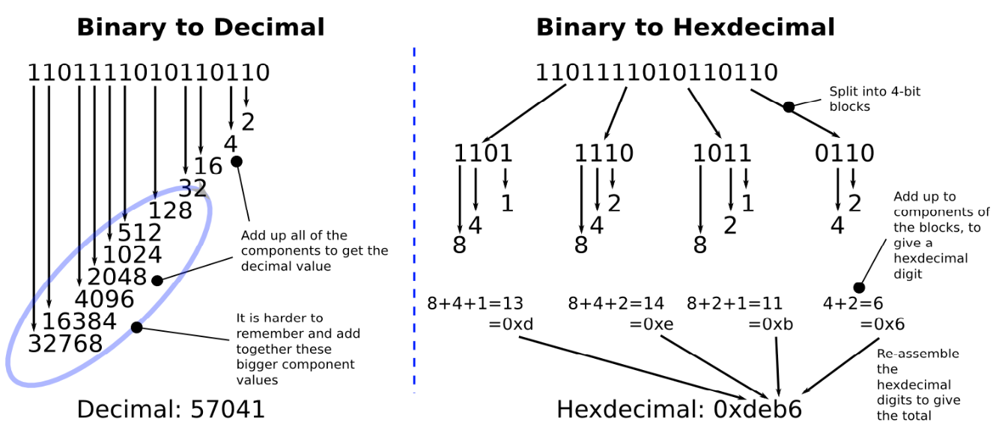

>原文地址 [Writing a Simple Operating System — from Scratch](http://www.cs.bham.ac.uk/~exr/lectures/opsys/10_11/lectures/os-dev.pdf)

# 架构和启动

## 2.1 启动

现在，开始我们的旅途！

当我们启动计算机时，它必须在没有任何 OS 的帮助下完成初始化。然而，它必须从已经加载的永久存储器（比如硬盘等）中加载 OS

我们不久就会发现，启动阶段，计算机提供的功能非常有限：在这个阶段，甚至一个简单的文件系统都非常奢侈（比如读写一个硬盘的问题），但是我们连这个都没有。幸运的是，我们有 BIOS （the Basic Input/Output Software）：一系列软件列程，这些最初是从芯片加载到内存，并在电源开启的那一刻被初始化。 BIOS 提供对关键设备（比如屏幕、键盘和硬盘）的自动检测和基本控制。

当 BIOS 完成对设备的底层测试（最主要的是检测挂载的内存是否工作正常）之后，它必须启动在某个设备中存储的 OS。这里，我们要注意，BIOS 不能简单从硬盘挂载一个代表 OS 的文件，因为 BIOS 没有文件系统。 BIOS 必须从物理设备的特定地址读取特定区块的数据（通常大小是 512 字节）。

所以，BIOS 最初的阶段是硬盘的第一个区块找到 OS（比如，0头0道0扇区），这一区块被称为启动区块。因为某些硬盘可能没有包含 OS（可能这些硬盘存储了另外一些内容），所以对于 BIOS，检测一个硬盘的区块是否包含启动代码还是只是包含简单数据是非常重要的。注意 CPU 并不区分数据和代码，两者都会被解释为 CPU 指令，只是代码是一些对应 CPU 指令的有用算法实现。

对于 BIOS 简单的理解是，启动区块的最后两个字节内容必须是 `0xaa55`。所以，BIOS 循环检测每个存储设备，读取启动区块到内存中，然后指导 CPU 去开始执行在启动区块之后的第一个区块内容（也就是 `0xaa55` 结尾的区块）。

从这里开始，我们开始控制计算机的执行。

## 2.2 启动代码

我们可以使用二进制编辑器，来写原始字节值到文件中（一个标准的文本编辑器会转换字符比如‘A‘成一个 ASCII 编码的值）。因此我们可以制作一个简单合法的启动区块。

启动区块的机器代码，每个字节16进制展示：
```
e9 fd ff 00 00 00 00 00 00 00 00 00 00 00 00 00
00 00 00 00 00 00 00 00 00 00 00 00 00 00 00 00
[ 29 more lines with sixteen zero-bytes each ]
00 00 00 00 00 00 00 00 00 00 00 00 00 00 55 aa
```

注意有三个重要的地方：

- 最初的三字节，`0xe9`，`0xfd` 和 `0xff`。实际上是机器代码指令，是每个 CPU 生厂商定义的，为了执行无穷循环。
- 最后两个字节，`0x55` 和 `0xaa`，组成了魔法数字，暗示 BIOS 它是一个启动区块，而不是碰巧存放在启动区块的数据。
- 中间有很多行零，只是为了简单的把魔法 BIOS 数字放在 512 区块的末端。

要十分关注大小端机制。你可能很奇怪为什么魔法数字 `0xaa55` 在我们的启动区块中被写成连续的字节 `0x55` 和 `0xaa`。这是因为 x86 架构以小端格式处理多个字节值，也就是低位字节存放在高位地址。这和我们熟悉的方式不太一样。比如经过系统的处理，我有 $0000005 美元在我的银行账户，现在我可以退休了（因为我有5百万美元！！），甚至还能捐一点出来！！

编译器和汇编器能帮助我们隐藏大小端的细节，比如说一个 16 位的数据会被自动转换成正确的格式。但是，有时候了解大小端很重要，比如说当寻找 bug 的时候，想要知道一个字节是如何被存放在存储设备上的。

这可能是计算机能运行的最小的程序，不管怎样，它是合法的。我们可以通过两种方式测试。第二种方式最安全也最适合我们的实验目的：

- 使用任何可能的方式，将上述二进制代码写到不重要的存储设备的第一个区块（比如说 U 盘），然后重启电脑。
- 使用虚拟机软件，比如 VMWare 或者 VirtualBox，然后设置上述代码到虚拟机中的磁盘，然后启动虚拟机

如果计算机启动以后一直处于等待状态，没有“没有找到 OS” 这样的信息的话，说明上述代码已经被成功加载和执行。这行代码主要做的就是无限循环，没有这个循环，CPU 就会去执行内存中的下一个指令，大部分情况下是随机的未初始化的字节。这会导致 CPU 进入一些非法的状态，甚至有可能会令 BIOS 运行一些列程去格式化你的磁盘！

记住，是我们编程，然后计算机盲目的执行我们的指令，直到断电。所以我们要确保他执行我们设计好的代码而不是一些在内存中随机存在的字节。在底层，我们有很多权限和能力去控制计算机。我们来开始学习这些吧！

## 2.3 CPU 仿真

有许多方便的第三方工具，帮助我们测试这些底层代码，而不需要不断的启动机器，或者冒着重要数据被丢失的风险。比如说使用 CPU 仿真器，有 Bochs 和 Qemu。不像虚拟机（比如 VMWare 和 VirtualBox）会尝试优化性能，并且借助宿主计算机直接在 CPU 上执行指令，仿真器包含一个模拟 CPU 架构的程序，使用变量来表示 CPU 寄存器，并用高层的控制结构来模拟底层调整等。总的来说，它更慢，但是更适合开发和测试这样的系统。

注意，为了让仿真器做任何有用的事，需要编写代码并被编译成磁盘镜像文件来运行。一个镜像文件就是原生数据（比如机器代码和字节），并会被写进硬盘、CD 或者 U 盘中。甚者有些仿真器能够从下载或者 CD 中的镜像文件中成功的启动和运行一个真实的 OS（虽然这种情况最适合的方案还是虚拟机技术）。

仿真器翻译底层显示设备的指令成像素，并在桌面上渲染，然后你就能在真实的显示器上看到了。

总之，对于这篇文档的练习，在仿真器上能成功运行的机器代码也能成功的在真实架构的设备上运行，唯一的区别就是慢了点。

### 2.3.1 Bochs：x86 CPU 仿真器

Bochs 需要我们在本地目录配置一个文件 `bochsrc`，描述真实设备（比如屏幕和键盘）是如何被仿真的，最重要的是，当仿真计算机开始运行时，磁盘镜像是如何被启动的。

下面展示了一个我们将用到的 Bochs 的配置文件的样子：

```
# Tell bochs to use our boot sector code as though it were 
# a floppy disk inserted into a computer at boot time. 
floppya: 1_44=boot_sect.bin, status=inserted
boot: a
```

为了用 Bochs 测试我们的启动代码，只需要输入

```
$bochs
```

一个简单的实验，试着改变 BIOS 的魔法数字然后重写运行 Bochs。

因为 Bochs CPU 仿真器和真实的很接近，完成在 Bochs 上的测试之后，你可以在真实设备上启动之前的代码，你会发现它会运行的更快。

### 2.3.2 QEMU

QEMU 和 Bochs 很像。但是它更加的高效，并且除了 x86 之外的其他 CPU 架构。不过他的文档没有 Bochs 丰富。它不需要配置文件就可以运行，比如这样：

```
$qemu <your-os-boot-disk-image-file>
```

## 2.4 16进制表示法

我们前面已经看过一个 16进制的例子。理解为什么16进制在底层编程经常被使用到很重要。

首先，可能会问，我们理解10进制是那么自然，为什么不用10进制呢？我不是这方面的专家，不过很可能因为大部分人有十个手指，所以我们习惯用十进制。

十进制的基底是10，有十个不同的数字符号。16进制的基底是16，需要16个数字符号，所以需要额外6个符号，一个简单的做法是使用字符，比如 1，2，...8，9，a，b，c，e，d，f，其中符号 d 表示 13。

为了区别不同的进制，16进制表示的时候会在前面加 `0x`，或者有时候在尾部加 `h`，碰巧不带任何字符的16进制数字要比较注意，比如 0x50 不等于十进制中的 50，而是 80。

计算机表示一个数使用的是一系列位（二进制位），因为计算机基本只能区别两个电路状态：0 和 1，就好像计算机只有两个手指一样。所以为了表示一个大于1的数字，计算机需要将一系列位给组合起来，就像我们表示大于9的数字用两个或者更多的位（比如 456，23...)。

为了简化期间，特定数量的一系列位会被称为 `byte`（字节），一个字节包含8位。其他的比如 `short`、`int`、`long` 相应的表示 16位，32位，64位。我们也会使用术语 `word` （字）表示 CPU 当前模式的最大的处理单元大小：比如在 16 位模式下，一个字表示 16 位数值，在32位保护模式下，一个字表示32位数值，等等。

所以，16进制的优势在于，一系列位的表示会相当的长，很难书写，但是很容易被转换成更短的16进制表示，并且，我们将4位二进制数字表示成一位16进制数字，而不是将所有位表示成一个数字（不管是16进制还是32或者64进制），因为这样更加简单。下面的图清楚的展示了这个：

将二进制数字转换成十进制和16进制：
 