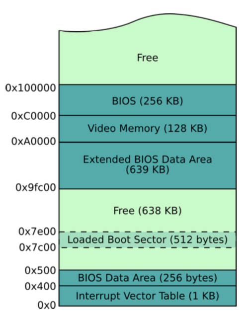

# 引导扇区编程（16位模式）

即使有样例代码，你也毫无疑问会觉得在二进制编辑器编写机器代码是很令人沮丧的。你必须记住或者经常查阅，某些特定的机器码在 CPU 上的不同功能。幸运的是，汇编语言可以更加用户友好，同时能表达特定的机器码在 CPU 上的作用。

在这一章，我们会研究引导扇区编程，让我们能够在熟悉汇编的同时又能够在功能匮乏的引导阶段把我们的程序运行起来。

## 重识引导扇区

现在，让我们用汇编语言重新构建一个扇区代码（而不是之前那样直接用机器代码），因为用汇编可以很好的表达底层变量。

使用汇编器，我们可以将汇编代码转换成真实的机器代码：

```
$nasm boot_sect.asm -f bin -o boot_sect.bin
```

`boot_sect.asm` 代码如下：

```
;
; A simple boot sector program that loops forever. 
;

loop:                   ; Define a label, "loop", that will allow 
                        ; us to jump back to it, forever.
jmp loop                ; Use a simple CPU instruction that jumps
                        ; to a new memory address to continue execution. 
                        ; In our case, jump to the address of the current 
                        ; instruction.
times 510-($-$$) db 0   ; When compiled, our program must fit into 512 bytes,
                        ; with the last two bytes being the magic number,
                        ; so here, tell our assembly compiler to pad out our
                        ; program with enough zero bytes (db 0) to bring us to the ; 510th byte.
dw 0xaa55               ; Last two bytes (one word) form the magic number, 
                        ; so BIOS knows we are a boot sector.
```

`boot_sect.bin` 是汇编器生成的机器代码，我们可以安装到磁盘的一个引导扇区上。

注意，我们这里使用 `-f bin` 选项来指示 `nasm` 产生原始的机器代码。如果不用该选项，会产生一些代码包，这些代码包包含额外的元信息，用于和其他资源链接的时候，比如说我们可能用于更典型的 OS 上会使用到。我们不需要这些，因为除了底层 BIOS 例程，我们是唯一的在计算机上运行的软件。我们就是 OS！！虽然现在我们啥都没有做，只是无穷的循环，不过我们很快就会在此基础上做些事情。

除了保存这个文件到引导扇区然后重启机器，我们也可以很方便的用 Bochs 测试我们的程序：

```
$bochs
```

或者，我们也可以使用 QEMU：

```
$qemu boot_sect.bin
```

除此之外，也可以使用虚拟机加载该镜像文件，或者将该镜像文件写入到可启动的介质（比如 U 盘），然后从真实的计算机上启动它。注意将镜像文件写入介质，不是简单的将它添加到介质的文件系统中：你必须借助合适的工具将它从底层直接写入扇区。

如果我们了解汇编器转换的真是机器代码，可以运行下面的命令，它会将二进制内容转换成16进制格式，方便阅读：

```
$od -t x1 -A n boot_sect.bin
```

运行这个命令，你会看到之前熟悉的机器代码。

祝贺你！！你刚用汇编器写了一个启动代码！我们将会知道，所有的 OS 必须用这种方式启动，然后才能使用高层的抽象（比如高层语言，c/c++）。

## 16位模式

CPU 厂商必须保证他们的产品能够兼容以前的 CPU，这导致一些老的软件，在特定的老的 OS 上，能够运行在更现代的 CPU 上。

Intel 提供的兼容解决方案是模拟老的 CPU：Intel 8086。这款 CPU 支持模拟16位指令并且没有内存保护机制。内存保护对于现代的 OS 的稳定非常重要。因为它允许 OS 严格限制用户进程访问内核内存，无论是故意的还是有意的。因为这会令用户进程规避 OS 的安全机制，甚者令整个系统面临风险。

所以，为了向后兼容，对于 CPU，支持现代 OS 的更高级的32或者64位保护模式的同时，又能通过16位初始化启动，让老的 OS 继续运行，是非常重要的。在后面我们会详细介绍如何从16位模式过度到32位保护模式。

通常，我们说 CPU 是16位的，指的是它一次只能执行最长是16位的指令。比如，一个16位 CPU 有一个特别的指令能够在一个 CPU 周期内将两个16位的数字加起来。如果一个进程需要将两个32位数字相加的话，那么比起16位，它需要更多的 CPU 周期。

首先，我们会研究16位模式环境，因为所有的 OS 都是从此开始的。后面我们会学习32位保护模式，以及这样的好处。

## 额，你好？

现在我们开始写一个简单的启动代码，只是简单的打印信息到屏幕上。为此，我们需要学习一些基本的 CPU 工作概念和如何使用 BIOS 管理屏幕设备

首先，让我们思考我们这里要做什么。我们想要在屏幕上打印一个字符。但是我们不知道如何使用屏幕设备，因为可能有很多不同种类的屏幕设备，并且有不同的接口。这就是为什么使用 BIOS 的原因。因为 BIOS 已经做了自动检测硬件机制，至少很明显，启动阶段 BIOS 就能在屏幕上打印信息。或许这能帮我们一手。

所以，接下来，我们希望请求 BIOS 能为我们打印一些字符，但是怎么做？这里没有 Java 库帮助我们打印信息到屏幕，这简直就是做梦。但是我们可以确定，在计算机内存的某个地方， BIOS 机器代码知道如何打印信息到屏幕。真相是，我们可以知道 BIOS 在内存中的代码，并用某种方式执行它。但显示很糟糕，因为不同的机器 BIOS 内部的细节会有所不同。

在这里，我们使用基本的计算机机制：中断。

### 中断

中断是一种让 CPU 暂时停止当前正在处理的任务，并转而去执行更高优先级的执行，完成之后再返回处理原先的任务的机制。一个中断可以通过软件中断触发（比如 int 0x10），或者被一些更高优先级任务的硬件设备触发（比如读取网络设备的输入数据）。

每一种中断被表示成在中断向量表中的索引。中断向量表是被 BIOS 初始化的，并位于内存的其实地址（比如在物理内存的 0x0 位置），包含的内容是一些地址指针指向 ISR （中断服务例程），一个 ISR 是一系列机器指令，很像我们的启动代码，不过处理的是一些独特的中断服务。（比如从磁盘或者网络读取数据）

BIOS 会添加一些它自己的 ISR 到中断向量表中，来处理计算机某些方面的任务。比如，中断 `0x10` 引起屏幕相关的 ISR 被调用；中断 `0x13` 则是处理磁盘相关的 I/O ISR。

不过，为 BIOS 的每一个例程分配一个中断是很浪费的。所以 BIOS 比如使用 switch 语句，根据预先在某个 CPU 寄存器（`ax`) 中的值来引发一个中断路由到一个相应的 ISR 中。

### 寄存器

就像我们在高层语言中使用变量，如果在某个例程中能够暂时存储数据会很有用。所有的 x86 CPU 都有4中不同目的的寄存器，`ax`、 `bx`、 `cx` 和 `dx`。并且，这些寄存器每个都能存放一个字的数据（16位，两个字节大小），能被 CPU 读写，比起内存访问，几乎没有访问延迟。在汇编程序中，其中一个最重要的通用操作是在寄存器之间移动（准确的说是拷贝）数据：

```
mov ax, 1234    ; store the decimal number 1234 in ax
mov cx, 0x234   ; store the hex number 0x234 in cx
mov dx, ’t’     ; store the ASCII code for letter ’t’ in dx
mov bx, ax      ; copy the value of ax into bx, so now bx == 1234
```

注意 `mov` 指令的目的地址是第一个参数，而不是第二个，不过不同的汇编器可能转换会有所不同。

有时候，处理一个字节会更加方便，所以这些寄存器允许我们独立设置它的高位和低位字节：

```
mov ax, 0       ; ax -> 0x0000, or in binary 0000000000000000
mov ah, 0x56    ; ax -> 0x5600 
mov al, 0x23    ; ax -> 0x5623
mov ah, 0x16    ; ax -> 0x1623
```

### 小结

回忆一下，我们将要用 BIOS 为我们在屏幕上打印字符。通过设置 `ax` 寄存器为 BIOS 指定的值，我们会调用特殊的 BIOS 例程，然后它会帮助我们触发一个特殊的中断。这个特殊的 BIOS 例程是 BIOS 滚动输入。它会在屏幕上打印一个字符，然后向前移动光标，准备输出下一个字符。有个完整的 BIOS 例程表，展示每个中断以及如何预先设置相应的寄存器值。 在这里，我们需要中断 `0x10` ，设置 `ah` 为 `0x0e`（表示需要 tty 模式），同时设置 `al` 为我们想要打印的字符的 ASCII。

下面的代码展示了完成的启动区块代码。注意，在这种情况下，只需要设置 `ah` 一次，然后每个不同的字符设置不同的 `al`

```
;
; A simple boot sector that prints a message to the screen using a BIOS routine.
;
mov ah, 0x0e              ; int 10/ah = 0eh -> scrolling teletype BIOS routine
mov al, ’H’ 
int 0x10 
mov al, ’e’ 
int 0x10 
mov al, ’l’ 
int 0x10 
mov al, ’l’ 
int 0x10 
mov al, ’o’ 
int 0x10
jmp $                   ; Jump to the current address (i.e. forever).

;
; Padding and magic BIOS number. 
;

times 510-($-$$) db 0   ; Pad the boot sector out with zeros
dw 0xaa55               ; Last two bytes form the magic number,
                        ; so BIOS knows we are a boot sector.
```

下面的原生机器码展示了上述汇编代码经过汇编处理的结果：

```
b4 0e b0 48 cd 10 b0 65 cd 10 b0 6c cd 10 b0 6c 
cd 10 b0 6f cd 10 e9 fd ff 00 00 00 00 00 00 00 
00 00 00 00 00 00 00 00 00 00 00 00 00 00 00 00
*
00 00 00 00 00 00 00 00 00 00 00 00 00 00 55 aa
```

上述代码是 CPU 真实执行的代码，如果你惊讶于你要付出如此多的努力和理解来完成这么一个程序，那么请记住，这些指令和 CPU 十分相关，它们看起来简单，但是执行却非常快。你已经开始理解计算机的工作方式了，因为它就是这样字的。


## 你好，世界！

现在我们开始尝试写一个稍微有点不同的但更高级一点的“你好”程序。这会引入一点其他的知识，比如基本的 CPU 知识和内存布局。

### 内存，地址以及标签

我们之前提到过 CPU 是如何获得以及执行内存中的指令的，也知道 BIOS 是如何加载 512 字节的启动代码到内存中的，并且也完成了它的初始化，让 CPU 无限循环的执行第一条指令。

所以，我们的启动区块代码在内存的某个地方，那么具体哪里呢？我们可以想象主内存是一个很长的字节序列，能够被通过地址（比如索引）被访问到。如果我们想知道内存中第 54 字节的内容，那么 54 是我们的地址，为了简单方便起见，经常被表示成16进制格式： `0x36`。

我们启动代码的开始处，也就是机器码的最开始在内存的某个地址处，并且是 BIOS 帮我们放在那儿的。我们可以假设，除非我们知道，那么 BIOS 应该在内存的开始处加载我们的代码，即地址 `0x0`。这不是很直观，因为我们知道 BIOS 在加载我们的代码很久之前就已经为计算机做了初始化的工作，并会不断的为硬件中断服务，比如时钟，磁盘驱动等等。所以，这些 BIOS 例程（比如， ISR，专门处理屏幕打印的，等等），他们自己必须被预先存放在内存的某处，并且在使用的时候需要被保护（就是不能被覆盖）。我们前面也说到，中断向量表处于内存的开始处，这是 BIOS 为我们做的。我们的代码会不断的使用这张表，在下一个中断发生的时候，计算机可能奔溃也可能重启，但中断和中断的编号会有效的对应起来。

BIOS 一般总是加载启动代码到地址 `0x7c00`，并能保证这个地址没有被重要的 BIOS 例程占用。下图展示了当启动代码被加载时计算机一个经典的底层内存布局。我们让 CPU 往任何地址写数据，这会导致不好的事情发送，因为我们要写的内存地址处可能恰好存放了其他例程，比如说时钟中断和磁盘驱动。



### 打印 X

现在我们要开始玩一个游戏叫做“找到这个字节”，通过这个，我们会描述内存映射、汇编代码中的标签，以及知道 BIOS 加载到哪里了。我们将会写一个汇编程序，会持有一个字节的字符数据，然后我们会尝试在屏幕上打印改字符。为此，我们需要知道绝对内存地址，这样我们才能加载它到 `al` 然后让 BIOS 打印它。

```
;
; A simple boot sector program that demonstrates addressing. 
;
    
mov ah, 0x0e    ; int 10/ah = 0eh -> scrolling teletype BIOS routine

; First attempt 
mov al, the_secret 
int 0x10            ; Does this print an X?

; Second attempt
mov al, [the_secret] 
int 0x10            ; Does this print an X?

; Third attempt 
mov bx, the_secret 
add bx, 0x7c00
mov al, [bx]
int 0x10            ; Does this print an X?

; Fourth attempt
mov al, [0x7c1e]
int 0x10            ; Does this print an X?

jmp $               ; Jump forever. 

the_secret:
  db "X"

; Padding and magic BIOS number.

times 510-($-$$) db 0 
dw 0xaa55
```

首先，当我们在程序中定义数据的时候，我们用前置标签（`the_secret`）。我们可以在程序的任意地方放置标签，它们唯一的目的是方便的给我们从代码开始位置到某条指令的偏差。


```
b4 0e b0 1e cd 10 a0 1e 00 cd 10 bb 1e 00 81 c3 
00 7c 8a 07 cd 10 a0 1e 7c cd 10 e9 fd ff 58 00 
00 00 00 00 00 00 00 00 00 00 00 00 00 00 00 00
*
00 00 00 00 00 00 00 00 00 00 00 00 00 00 55 aa
```

上述是汇编器生成的机器代码，可以发现程序中的 X，它的16进制表示是`0x58`，并且在距离代码开始30（`0x1e`）的偏移地址处。就在我们用零填充对齐的前面。

如果我们运行程序，会发现，只有后面两种方式成功打印了 X

第一次尝试的问题是，它试图把偏移地址加载到 `al` 中打印。但实际上我们要打印的是在偏移地址处的字符，而不是偏移地址本身。第二次尝试中的方括号那一行指令意思是想存这个地址的内容。

那么为什么第二次尝试也失败了呢？问题是，CPU 对待偏移地址是认为它是距离内存的起始位置的偏移。而不是我们被加载代码开始的偏移。第二次尝试实际上会导致它访问中断向量表。

第三次尝试中，我们相信 BIOS 是把我们的代码加载到了内存地址 `0x7c00` 处，然后加上 `the_secrect` 偏移，用的是 CPU 的 `add` 指令。我们可以认为 `add` 指令做的是类似高层语言中这样子的事：`bx = bx + 0x7c00`。这里，成功的计算处了字符 ‘X’ 的地址，并将它的内容存到 `al` 中。

第四次尝试，做的有点“小聪明”，通过预先计算 BIOS 加载启动代码中 “X” 的地址，得到 `0x7c1e` 这个值（可以看前面的原生机器码，X 字符相应的距离代码开始位置的偏差地址是 `0x1e`也就是 30 字节）。

第四次尝试提醒我们为什么标签很有用。如果没有标签的话，我们需要手动计算汇编器生成的机器码中的地址，然后再去更新代码中的相应内容，再重新用汇编器生成代码。

现在我们看到了 BIOS 实际上将我们的启动代码加载到了地址 `0x7c00` 处，并且我们也知道了，地址和汇编代码的标签是什么关系。

在代码中总是手动计算标签的内存偏差地址是很不方便的。所以，如果你在代码的起始处添加下列代码的话，很多汇编器会在汇编的时候自动纠正标签的引用地址，该代码告诉汇编器你希望代码被加载到内存的何处。

```
[org 0x7c00]
```

问题1:

当添加 `org` 指令到启动代码中时，你觉得现在会打印什么？解释一下为什么。

### 定义字符串

假设你想打印预定义的信息，（比如，“正在启动中...”），你要如何在汇编代码中定义这样字符呢？我们要记住，我们的计算机不知道什么是字符串，一个字符串只是内存中一系列的数据单元（比如字节、字等）。

汇编中，我们可以如下方式定义字符串：

```
my_string:
  db ’Booting OS’
```

我们之前看到过 `db` 指令，翻译过来的意思是定义一些或者一个字节的数据（declare byte(s) of data），这会告诉汇编器直接将这这一系列字节写到二机制输出文件中（并且，不能被解释成处理器的指令）。因为我们用单引号把数据给包含起来了，汇编器知道将这些字符转换成 ASCII 的字节表示。注意，我们经常使用标签（比如 `my_string`）表示我们数据的开始。不然我们没有什么简单的方法在代码中表示他们。

有一件事我们要知道，知道一个字符串能多长的重要性不亚于它存放在哪儿。因为我们要编写处理这些字符串的代码，所以了解如何得知字符串的长度是很重要的。有几种可能的方式，但是实际上汇编器，会将字符串定义为非空终结符。这里的意思是，字符串的最后一个字节是0：

```
my_string:
  db ’Booting OS’,0
```

后面遍历一个字符串的时候，可能会打印每个字符，我们可以很容易的知道我们时候到达字符串的末尾了。


### 使用栈

当面临底层计算的时候，我们经常听到很多人会讨论栈，好像这个东西很特殊一样。栈其实只是为了解决下面这个不便：CPU 只有有限的寄存器用于暂时的变量存储，但我们经常需要更多