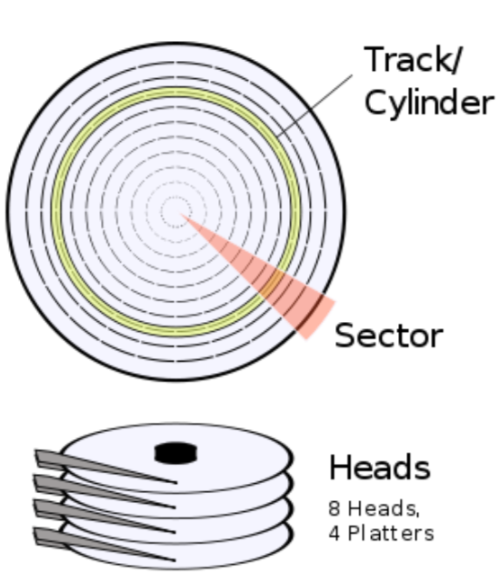

# 引导扇区编程（16位模式）

即使有样例代码，你也毫无疑问会觉得在二进制编辑器编写机器代码是很令人沮丧的。你必须记住或者经常查阅，某些特定的机器码在 CPU 上的不同功能。幸运的是，汇编语言可以更加用户友好，同时能表达特定的机器码在 CPU 上的作用。

在这一章，我们会研究引导扇区编程，让我们能够在熟悉汇编的同时又能够在功能匮乏的引导阶段把我们的程序运行起来。

## 重识引导扇区

现在，让我们用汇编语言重新构建一个扇区代码（而不是之前那样直接用机器代码），因为用汇编可以很好的表达底层变量。

使用汇编器，我们可以将汇编代码转换成真实的机器代码：

```
$nasm boot_sect.asm -f bin -o boot_sect.bin
```

`boot_sect.asm` 代码如下：

```
;
; A simple boot sector program that loops forever. 
;

loop:                   ; Define a label, "loop", that will allow 
                        ; us to jump back to it, forever.
jmp loop                ; Use a simple CPU instruction that jumps
                        ; to a new memory address to continue execution. 
                        ; In our case, jump to the address of the current 
                        ; instruction.
times 510-($-$$) db 0   ; When compiled, our program must fit into 512 bytes,
                        ; with the last two bytes being the magic number,
                        ; so here, tell our assembly compiler to pad out our
                        ; program with enough zero bytes (db 0) to bring us to the ; 510th byte.
dw 0xaa55               ; Last two bytes (one word) form the magic number, 
                        ; so BIOS knows we are a boot sector.
```

`boot_sect.bin` 是汇编器生成的机器代码，我们可以安装到磁盘的一个引导扇区上。

注意，我们这里使用 `-f bin` 选项来指示 `nasm` 产生原始的机器代码。如果不用该选项，会产生一些代码包，这些代码包包含额外的元信息，用于和其他资源链接的时候，比如说我们可能用于更典型的 OS 上会使用到。我们不需要这些，因为除了底层 BIOS 例程，我们是唯一的在计算机上运行的软件。我们就是 OS！！虽然现在我们啥都没有做，只是无穷的循环，不过我们很快就会在此基础上做些事情。

除了保存这个文件到引导扇区然后重启机器，我们也可以很方便的用 Bochs 测试我们的程序：

```
$bochs
```

或者，我们也可以使用 QEMU：

```
$qemu boot_sect.bin
```

除此之外，也可以使用虚拟机加载该镜像文件，或者将该镜像文件写入到可启动的介质（比如 U 盘），然后从真实的计算机上启动它。注意将镜像文件写入介质，不是简单的将它添加到介质的文件系统中：你必须借助合适的工具将它从底层直接写入扇区。

如果我们了解汇编器转换的真是机器代码，可以运行下面的命令，它会将二进制内容转换成16进制格式，方便阅读：

```
$od -t x1 -A n boot_sect.bin
```

运行这个命令，你会看到之前熟悉的机器代码。

祝贺你！！你刚用汇编器写了一个启动代码！我们将会知道，所有的 OS 必须用这种方式启动，然后才能使用高层的抽象（比如高层语言，c/c++）。

## 16位模式

CPU 厂商必须保证他们的产品能够兼容以前的 CPU，这导致一些老的软件，在特定的老的 OS 上，能够运行在更现代的 CPU 上。

Intel 提供的兼容解决方案是模拟老的 CPU：Intel 8086。这款 CPU 支持模拟16位指令并且没有内存保护机制。内存保护对于现代的 OS 的稳定非常重要。因为它允许 OS 严格限制用户进程访问内核内存，无论是故意的还是有意的。因为这会令用户进程规避 OS 的安全机制，甚者令整个系统面临风险。

所以，为了向后兼容，对于 CPU，支持现代 OS 的更高级的32或者64位保护模式的同时，又能通过16位初始化启动，让老的 OS 继续运行，是非常重要的。在后面我们会详细介绍如何从16位模式过度到32位保护模式。

通常，我们说 CPU 是16位的，指的是它一次只能执行最长是16位的指令。比如，一个16位 CPU 有一个特别的指令能够在一个 CPU 周期内将两个16位的数字加起来。如果一个进程需要将两个32位数字相加的话，那么比起16位，它需要更多的 CPU 周期。

首先，我们会研究16位模式环境，因为所有的 OS 都是从此开始的。后面我们会学习32位保护模式，以及这样的好处。

## 额，你好？

现在我们开始写一个简单的启动代码，只是简单的打印信息到屏幕上。为此，我们需要学习一些基本的 CPU 工作概念和如何使用 BIOS 管理屏幕设备

首先，让我们思考我们这里要做什么。我们想要在屏幕上打印一个字符。但是我们不知道如何使用屏幕设备，因为可能有很多不同种类的屏幕设备，并且有不同的接口。这就是为什么使用 BIOS 的原因。因为 BIOS 已经做了自动检测硬件机制，至少很明显，启动阶段 BIOS 就能在屏幕上打印信息。或许这能帮我们一手。

所以，接下来，我们希望请求 BIOS 能为我们打印一些字符，但是怎么做？这里没有 Java 库帮助我们打印信息到屏幕，这简直就是做梦。但是我们可以确定，在计算机内存的某个地方， BIOS 机器代码知道如何打印信息到屏幕。真相是，我们可以知道 BIOS 在内存中的代码，并用某种方式执行它。但显示很糟糕，因为不同的机器 BIOS 内部的细节会有所不同。

在这里，我们使用基本的计算机机制：中断。

### 中断

中断是一种让 CPU 暂时停止当前正在处理的任务，并转而去执行更高优先级的执行，完成之后再返回处理原先的任务的机制。一个中断可以通过软件中断触发（比如 int 0x10），或者被一些更高优先级任务的硬件设备触发（比如读取网络设备的输入数据）。

每一种中断被表示成在中断向量表中的索引。中断向量表是被 BIOS 初始化的，并位于内存的其实地址（比如在物理内存的 0x0 位置），包含的内容是一些地址指针指向 ISR （中断服务例程），一个 ISR 是一系列机器指令，很像我们的启动代码，不过处理的是一些独特的中断服务。（比如从磁盘或者网络读取数据）

BIOS 会添加一些它自己的 ISR 到中断向量表中，来处理计算机某些方面的任务。比如，中断 `0x10` 引起屏幕相关的 ISR 被调用；中断 `0x13` 则是处理磁盘相关的 I/O ISR。

不过，为 BIOS 的每一个例程分配一个中断是很浪费的。所以 BIOS 比如使用 switch 语句，根据预先在某个 CPU 寄存器（`ax`) 中的值来引发一个中断路由到一个相应的 ISR 中。

### 寄存器

就像我们在高层语言中使用变量，如果在某个例程中能够暂时存储数据会很有用。所有的 x86 CPU 都有4中不同目的的寄存器，`ax`、 `bx`、 `cx` 和 `dx`。并且，这些寄存器每个都能存放一个字的数据（16位，两个字节大小），能被 CPU 读写，比起内存访问，几乎没有访问延迟。在汇编程序中，其中一个最重要的通用操作是在寄存器之间移动（准确的说是拷贝）数据：

```
mov ax, 1234    ; store the decimal number 1234 in ax
mov cx, 0x234   ; store the hex number 0x234 in cx
mov dx, ’t’     ; store the ASCII code for letter ’t’ in dx
mov bx, ax      ; copy the value of ax into bx, so now bx == 1234
```

注意 `mov` 指令的目的地址是第一个参数，而不是第二个，不过不同的汇编器可能转换会有所不同。

有时候，处理一个字节会更加方便，所以这些寄存器允许我们独立设置它的高位和低位字节：

```
mov ax, 0       ; ax -> 0x0000, or in binary 0000000000000000
mov ah, 0x56    ; ax -> 0x5600 
mov al, 0x23    ; ax -> 0x5623
mov ah, 0x16    ; ax -> 0x1623
```

### 小结

回忆一下，我们将要用 BIOS 为我们在屏幕上打印字符。通过设置 `ax` 寄存器为 BIOS 指定的值，我们会调用特殊的 BIOS 例程，然后它会帮助我们触发一个特殊的中断。这个特殊的 BIOS 例程是 BIOS 滚动输入。它会在屏幕上打印一个字符，然后向前移动光标，准备输出下一个字符。有个完整的 BIOS 例程表，展示每个中断以及如何预先设置相应的寄存器值。 在这里，我们需要中断 `0x10` ，设置 `ah` 为 `0x0e`（表示需要 tty 模式），同时设置 `al` 为我们想要打印的字符的 ASCII。

下面的代码展示了完成的启动区块代码。注意，在这种情况下，只需要设置 `ah` 一次，然后每个不同的字符设置不同的 `al`

```
;
; A simple boot sector that prints a message to the screen using a BIOS routine.
;
mov ah, 0x0e              ; int 10/ah = 0eh -> scrolling teletype BIOS routine
mov al, ’H’ 
int 0x10 
mov al, ’e’ 
int 0x10 
mov al, ’l’ 
int 0x10 
mov al, ’l’ 
int 0x10 
mov al, ’o’ 
int 0x10
jmp $                   ; Jump to the current address (i.e. forever).

;
; Padding and magic BIOS number. 
;

times 510-($-$$) db 0   ; Pad the boot sector out with zeros
dw 0xaa55               ; Last two bytes form the magic number,
                        ; so BIOS knows we are a boot sector.
```

下面的原生机器码展示了上述汇编代码经过汇编处理的结果：

```
b4 0e b0 48 cd 10 b0 65 cd 10 b0 6c cd 10 b0 6c 
cd 10 b0 6f cd 10 e9 fd ff 00 00 00 00 00 00 00 
00 00 00 00 00 00 00 00 00 00 00 00 00 00 00 00
*
00 00 00 00 00 00 00 00 00 00 00 00 00 00 55 aa
```

上述代码是 CPU 真实执行的代码，如果你惊讶于你要付出如此多的努力和理解来完成这么一个程序，那么请记住，这些指令和 CPU 十分相关，它们看起来简单，但是执行却非常快。你已经开始理解计算机的工作方式了，因为它就是这样字的。


## 你好，世界！

现在我们开始尝试写一个稍微有点不同的但更高级一点的“你好”程序。这会引入一点其他的知识，比如基本的 CPU 知识和内存布局。

### 内存，地址以及标签

我们之前提到过 CPU 是如何获得以及执行内存中的指令的，也知道 BIOS 是如何加载 512 字节的启动代码到内存中的，并且也完成了它的初始化，让 CPU 无限循环的执行第一条指令。

所以，我们的启动区块代码在内存的某个地方，那么具体哪里呢？我们可以想象主内存是一个很长的字节序列，能够被通过地址（比如索引）被访问到。如果我们想知道内存中第 54 字节的内容，那么 54 是我们的地址，为了简单方便起见，经常被表示成16进制格式： `0x36`。

我们启动代码的开始处，也就是机器码的最开始在内存的某个地址处，并且是 BIOS 帮我们放在那儿的。我们可以假设，除非我们知道，那么 BIOS 应该在内存的开始处加载我们的代码，即地址 `0x0`。这不是很直观，因为我们知道 BIOS 在加载我们的代码很久之前就已经为计算机做了初始化的工作，并会不断的为硬件中断服务，比如时钟，磁盘驱动等等。所以，这些 BIOS 例程（比如， ISR，专门处理屏幕打印的，等等），他们自己必须被预先存放在内存的某处，并且在使用的时候需要被保护（就是不能被覆盖）。我们前面也说到，中断向量表处于内存的开始处，这是 BIOS 为我们做的。我们的代码会不断的使用这张表，在下一个中断发生的时候，计算机可能奔溃也可能重启，但中断和中断的编号会有效的对应起来。

BIOS 一般总是加载启动代码到地址 `0x7c00`，并能保证这个地址没有被重要的 BIOS 例程占用。下图展示了当启动代码被加载时计算机一个经典的底层内存布局。我们让 CPU 往任何地址写数据，这会导致不好的事情发送，因为我们要写的内存地址处可能恰好存放了其他例程，比如说时钟中断和磁盘驱动。


### 打印 X

现在我们要开始玩一个游戏叫做“找到这个字节”，通过这个，我们会描述内存映射、汇编代码中的标签，以及知道 BIOS 加载到哪里了。我们将会写一个汇编程序，会持有一个字节的字符数据，然后我们会尝试在屏幕上打印改字符。为此，我们需要知道绝对内存地址，这样我们才能加载它到 `al` 然后让 BIOS 打印它。

```
;
; A simple boot sector program that demonstrates addressing. 
;
    
mov ah, 0x0e    ; int 10/ah = 0eh -> scrolling teletype BIOS routine

; First attempt 
mov al, the_secret 
int 0x10            ; Does this print an X?

; Second attempt
mov al, [the_secret] 
int 0x10            ; Does this print an X?

; Third attempt 
mov bx, the_secret 
add bx, 0x7c00
mov al, [bx]
int 0x10            ; Does this print an X?

; Fourth attempt
mov al, [0x7c1e]
int 0x10            ; Does this print an X?

jmp $               ; Jump forever. 

the_secret:
  db "X"

; Padding and magic BIOS number.

times 510-($-$$) db 0 
dw 0xaa55
```

首先，当我们在程序中定义数据的时候，我们用前置标签（`the_secret`）。我们可以在程序的任意地方放置标签，它们唯一的目的是方便的给我们从代码开始位置到某条指令的偏差。


```
b4 0e b0 1e cd 10 a0 1e 00 cd 10 bb 1e 00 81 c3 
00 7c 8a 07 cd 10 a0 1e 7c cd 10 e9 fd ff 58 00 
00 00 00 00 00 00 00 00 00 00 00 00 00 00 00 00
*
00 00 00 00 00 00 00 00 00 00 00 00 00 00 55 aa
```

上述是汇编器生成的机器代码，可以发现程序中的 X，它的16进制表示是`0x58`，并且在距离代码开始30（`0x1e`）的偏移地址处。就在我们用零填充对齐的前面。

如果我们运行程序，会发现，只有后面两种方式成功打印了 X

第一次尝试的问题是，它试图把偏移地址加载到 `al` 中打印。但实际上我们要打印的是在偏移地址处的字符，而不是偏移地址本身。第二次尝试中的方括号那一行指令意思是想存这个地址的内容。

那么为什么第二次尝试也失败了呢？问题是，CPU 对待偏移地址是认为它是距离内存的起始位置的偏移。而不是我们被加载代码开始的偏移。第二次尝试实际上会导致它访问中断向量表。

第三次尝试中，我们相信 BIOS 是把我们的代码加载到了内存地址 `0x7c00` 处，然后加上 `the_secrect` 偏移，用的是 CPU 的 `add` 指令。我们可以认为 `add` 指令做的是类似高层语言中这样子的事：`bx = bx + 0x7c00`。这里，成功的计算处了字符 ‘X’ 的地址，并将它的内容存到 `al` 中。

第四次尝试，做的有点“小聪明”，通过预先计算 BIOS 加载启动代码中 “X” 的地址，得到 `0x7c1e` 这个值（可以看前面的原生机器码，X 字符相应的距离代码开始位置的偏差地址是 `0x1e`也就是 30 字节）。

第四次尝试提醒我们为什么标签很有用。如果没有标签的话，我们需要手动计算汇编器生成的机器码中的地址，然后再去更新代码中的相应内容，再重新用汇编器生成代码。

现在我们看到了 BIOS 实际上将我们的启动代码加载到了地址 `0x7c00` 处，并且我们也知道了，地址和汇编代码的标签是什么关系。

在代码中总是手动计算标签的内存偏差地址是很不方便的。所以，如果你在代码的起始处添加下列代码的话，很多汇编器会在汇编的时候自动纠正标签的引用地址，该代码告诉汇编器你希望代码被加载到内存的何处。

```
[org 0x7c00]
```

问题1:

当添加 `org` 指令到启动代码中时，你觉得现在会打印什么？解释一下为什么。

### 定义字符串

假设你想打印预定义的信息，（比如，“正在启动中...”），你要如何在汇编代码中定义这样字符呢？我们要记住，我们的计算机不知道什么是字符串，一个字符串只是内存中一系列的数据单元（比如字节、字等）。

汇编中，我们可以如下方式定义字符串：

```
my_string:
  db ’Booting OS’
```

我们之前看到过 `db` 指令，翻译过来的意思是定义一些或者一个字节的数据（declare byte(s) of data），这会告诉汇编器直接将这这一系列字节写到二机制输出文件中（并且，不能被解释成处理器的指令）。因为我们用单引号把数据给包含起来了，汇编器知道将这些字符转换成 ASCII 的字节表示。注意，我们经常使用标签（比如 `my_string`）表示我们数据的开始。不然我们没有什么简单的方法在代码中表示他们。

有一件事我们要知道，知道一个字符串能多长的重要性不亚于它存放在哪儿。因为我们要编写处理这些字符串的代码，所以了解如何得知字符串的长度是很重要的。有几种可能的方式，但是实际上汇编器，会将字符串定义为非空终结符。这里的意思是，字符串的最后一个字节是0：

```
my_string:
  db ’Booting OS’,0
```

后面遍历一个字符串的时候，可能会打印每个字符，我们可以很容易的知道我们时候到达字符串的末尾了。


### 使用栈

当面临底层计算的时候，我们经常听到很多人会讨论栈，好像这个东西很特殊一样。栈其实只是为了解决下面这个不便：CPU 只有有限的寄存器用于暂时的变量存储，但我们经常需要比寄存器数量更多的临时存储。我们当然可以使用内存，不过通过内存地址读写是不方便的，尤其当我们不在乎数据被存放的真实地方。不久我们很看到，在函数调用中的参数传递中是非常有用的。

CPU 提供两个指令，允许我们存取栈顶的数据：`push` 和 `pop`，并不需要关系它们实际被存放的地方。但是注意在16位模式下，我们不能 push 或者 pop 一个字节数据，我们此时只能以16位为单元存取。

栈是通过两个特殊的 CPU 寄存器实现的：`bp` 和 `sp`，分别存放栈底和栈顶的地址。因为我们经常 push 数据到栈中，通常栈底十分远离内存其他区域（比如 BIOS 代码和我们的代码），这样当栈变得很大的时候，复写的可能就比较底了。一个迷惑的事实是，当 push 的时候，栈是相对于 bp 向低地址增长的。所以对于 `bp`，`sp` 等于它减去值的大小。

下面的启动代码展示了栈的使用

问题2:

下面的启动代码将会以什么顺序打印？ 'C' 这个字符会存放在哪个绝对内存地址？你可以改代码来验证你的想法，不过一定要解释为什么是这样。

```
;
; A simple boot sector program that demonstrates the stack. 
;

mov ah, 0x0e        ; int 10/ah = 0eh -> scrolling teletype BIOS routine

mov bp, 0x8000      ; Set the base of the stack a little above where BIOS 
mov sp, bp          ; loads our boot sector - so it won’t overwrite us.

push ’A’            ; Push some characters on the stack for later 
push ’B’            ; retreival. Note, these are pushed on as
push ’C’            ; 16-bit values, so the most significant byte
                    ; will be added by our assembler as 0x00.

pop bx              ; Note, we can only pop 16-bits, so pop to bx 
mov al, bl          ; then copy bl (i.e. 8-bit char) to al
int 0x10            ; print(al)

pop bx              ; Pop the next value 
mov al, bl 
int 0x10            ; print(al)

mov al, [0x7ffe]    ; To prove our stack grows downwards from bp,
                    ; fetch the char at 0x8000 - 0x2 (i.e. 16-bits) 
int 0x10            ; print(al)

jmp $               ; Jump forever. 

; Padding and magic BIOS number.
times 510-($-$$) db 0 
dw 0xaa55
```

### 控制结构

如果我们不知道如何写基本的控制代码，比如 `if..then..elseif..else`， `for` 和 `while`，我们会无所适从的！这些语句允许可选的执行分支。

这些高层的控制语句最终会被转换成 jump 语句。事实上，我们前面已经看过最简单的代码了：

```
some_label:
  jmp some_label ; jump to address of label
```

或者上述的等价的代码：

```
jmp $ ; jump to address of current instruction
```

这个指令提供了一个无条件转移功能（它总是 jump），不过我们更希望根据某个条件跳转（比如不断循环直到循环十次等等）。

在汇编语言中实现条件跳转是这样的：首先执行一个比较指令，然后执行一个特殊的条件转移指令

```
cmp ax, 4     ; compare the value in ax to 4
je then_block ; jump to then_block if they were equal 
mov bx , 45   ; otherwise , execute this code
jmp the_end   ; important: jump over the ’then’ block,
              ; so we don’t also execute that code.
then_block: 
  mov bx , 23
the_end:
```

在 C 或者 Java 语言中，看起来像这样：

```
if(ax == 4) { 
  bx = 23;
} else { 
  bx = 45;
}
```

我们可以从上面的汇编代码中看到，在幕后，`cmp` 和 `je` 指令应该有一定关系在。事实是，CPU 有一个 `flags` 寄存器用于存放 `cmp` 指令的结果，然后随后的条件跳转指令可以决定是否跳转到相应的地址。

基于 `cmp x, y` 指令的结果，有下列跳转指令可用：

```
je target   ; jump if equal                 (i.e. x == y)
jne target  ; jump if not equal             (i.e. x != y)
jl target   ; jump if less than             (i.e. x < y)
jle target  ; jump if less than or equal    (i.e. x <= y)
jg target   ; jump if greater than          (i.e. x > y)
jge target  ; jump if greater than or equal (i.e. x >= y)
```

问题3：

从高层语言的角度规划跳转代码，然后用汇编语言替换会很有用。试一下转换下列的伪汇编代码为真实的汇编代码，使用 `cmp` 和相关的跳转指令。用不同的 `bx` 值测试。并给每行代码添加注释。

```
mov bx , 30
if (bx <= 4) {
  mov al, ’A’
} else if (bx < 40) { 
  mov al, ’B’
} else {
  mov al, ’C’
}

mov ah, 0x0e      ; int=10/ah=0x0e -> BIOS tele-type output 
int 0x10          ; print the character in al

jmp $

; Padding and magic number. 
times 510-($-$$) db 0
dw 0xaa55
```

### 调用函数

在高层语言中，我们会将一个大问题写成一个通用目的函数（比如打印信息，写文件等等），然后我们会在代码中不断的使用它，一般是通过改变传递给函数的参数来获取不同的输出。从 CPU 角度，函数就是跳转到某个有用的例程的地址处，然后再跳转回到跳转之前的下一条指令。

我们可以模拟一个函数的调用像这样：

```
...
...
mov al, ’H’ ; Store ’H’ in al so our function will print it.

jmp my_print_function
return_to_here:       ; This label is our life-line so we can get back.
...
...

my_print_function:
  mov ah, 0x0e          ; int=10/ah=0x0e -> BIOS tele-type output 
  int 0x10              ; print the character in al
  jmp return_to_here    ; return from the function call.
```

首先，注意我们是如何使用 `al` 作为参数的，预先为相应的函数设置它。这就是高层语言中参数转递的实现的基础，同时调用方和被调用者必须要对参数个数和参数存放地址达成一致。

不幸的是，上面这种方式我们需要明确的告诉它当结束的时候要返回到哪里，这样的话，就不能从任意的地方调用这个函数了（它总是返回到同样的地址，在这里就是 `return_to_here`）。

从参数传递的方式借鉴一下，调用者代码可用存放一个准确的返回地址（比如，调用之后的那行代码）在某个公认的地方。然后被调用者可以跳转回那个地址。 CPU 会用 `ip`（instruction pointer） 寄存器追踪现在正在被执行的指令的地址。不过，很不幸，我们不能直接访问它。不过 CPU 提供了一对指令 `call` 和 `ret`，它们的工作方式正是我们想要的：`call` 的行为像 `jmp`，不过在跳转之前，它会把返回地址 push 到栈中。`ret` 会 从栈上 pop 返回地址，然后跳转到那，像下面这样：

```
...
...
mov al, ’H’   ; Store ’H’ in al so our function will print it. 
call my_print_function
...
...

my_print_function: 
  mov ah, 0x0e  ; int=10/ah=0x0e -> BIOS tele-type output
  int 0x10      ; print the character in al
  ret
```

我们的函数基本上很完美了，不过有一个很丑陋的问题，尽早的认识到会很有帮助。当我们在汇编代码中调用一个函数的时候，比如一个打印函数，这个函数的内部很可能会用几个寄存器去帮助它的执行的实现（事实上，由于寄存器资源稀有，它几乎一定会这样做的），所以当我们的代码从函数调用返回的时候，我们之前存放在 `dx` 中的值很可能已经不在了。

一个明智的守规矩的函数会立刻将任何它想要使用的寄存器的内容 push 到栈中，然后在它要返回的时候马上 pop（重新恢复寄存器在调用之前的值） 它们。因为一个函数很可能会使用许多通用寄存器，CPU 实现了两个方便的指令，`pusha` 和 `popa`，这对指令会向栈中 push 和 pop 所有寄存器的内容。比如：

```
some_function:
  pusha         ; Push all register values to the stack
  mov bx, 10 
  add bx, 20 
  mov ah, 0x0e  ; int=10/ah=0x0e -> BIOS tele-type output 
  int 0x10      ; print the character in al
  popa          ; Restore original register values
  ret
```

### 包含文件

有时候，你可能会想在多个程序中复用你的代码。 `nasm` 运行你包含外部文件：

```
%include "my_print_function.asm"  ; this will simply get replaced by 
                                  ; the contents of the file
...
mov al, ’H’                       ; Store ’H’ in al so our function will print it. 
call my_print_function
```

### 小结

我们已经了解了一下 CPU 和汇编相关的知识，现在可用开始编写一个稍微复杂有点的 “Hello, word” 启动程序了。

问题4:

将这一节学到的内容利用起来，来写一个函数打印以0结尾的字符串，这个函数可以用如下的方式使用：

```
;
; A boot sector that prints a string using our function.
;
[org 0x7c00] ; Tell the assembler where this code will be loaded

mov bx, HELLO_MSG       ; Use BX as a parameter to our function, so
call print_string       ; we can specify the address of a string.

mov bx, GOODBYE_MSG 
call print_string
jmp $

%include "print_string.asm"

; Data
HELLO_MSG:
  db ’Hello, World!’, 0   ; <-- The zero on the end tells our routine
                        ; when to stop printing characters.

GOODBYE_MSG:
  db ’Goodbye!’, 0

; Padding and magic number. 
  times 510-($-$$) db 0
  dw 0xaa55
```

为了好的分数，请注意函数要小心处理寄存器，并且最好每行代码都有相应的注释来阐述你的理解。


### 总结

我们好像仍然没有什么很大的进展。不过，因为我们要工作的环境比较特殊，所以这还好，也很正常。如果你到现在为止的理解的话，我们的进展就很顺利。

## 护士，帮帮我！！

目前，我们已经成功的让计算机打印我们加载到内存中的字符和字符串，很快，我们会试着从磁盘加载数据。如果我们能够展示存储在任意内存地址处的16进制的格式的数据的话，这对我们实际想要加载的东西很有帮助。记住，我们没有奢侈的好用的开发环境，也没有调试器帮助我们一行行调试观察代码。当我们犯错的时候，计算机给我们唯一的最好的反馈是什么也没有发生，所以我们要仔细。

我们已经完成了一个例程来打印字符串。现在我们要拓展那个想法，一个打印16进制格式的例程，这对于我们在底层环境工作会很有用。

我们仔细想想要怎么做，首先思考一下我们会怎样用这个例程呢？在高级语言中，我们可能会像这样：`print_hex(0x1fb6)`，这个会打印`0x1fb6`。在前面的章节中，我们已经看到，汇编是如何调用函数，以及我们如果用寄存器作为参数。现在让我们用 `dx` 作为存储我们 print_hex 函数参数的地方：

```
mov dx, 0x1fb6 ; store the value to print in dx 
call print_hex ; call the function

; prints the value of DX as hex.
print_hex:
...
...
ret
```

既然我们想要屏幕上打印字符串，我们可能可以复用我们之前的打印函数去做真正的打印工作，所以我们主要的工作是如何转换在 `dx` 中的字符串参数。在汇编中，我们肯定不想引入太多不比较的东西，所以让我们以下列的想法开始我们的函数。首先，我们定义完整的16进制字符串为代码中的模版变量，就像我们之前定义 “Hello, World” 一样，然后我们可以让打印函数打印它。 `print_hex` 例程的主要任务是将模版字符串中的每一个组成部分转换成16进制的 ASCII 码值。

```
mov dx, 0x1fb6 ; store the value to print in dx 
call print_hex ; call the function

; prints the value of DX as hex.
print_hex:
; TODO: manipulate chars at HEX_OUT to reflect DX

mov bx, HEX_OUT     ; print the string pointed to 
call print_string   ; by BX
ret

; global variables 
HEX_OUT: db ’0x0000’,0
```

### 问题5

实现 `print_hex` 函数，你可能会发现 CPU 指令 `and` 和 `shr` 很有用，你可以网上搜索找到相关资料。确保给每行代码添加注释。

## 读取磁盘

我们已经介绍了 BIOS，以及尝试了一下计算机底层的开发，但是有个小问题挡在我们开发 OS 的路上：BIOS从磁盘的第一个扇区加载我们的启动代码，但这几乎是它能加载的所有了。如果我们的 OS 代码很庞大怎么办？比如说大于 512 字节？

OS 通常不会是一个 512 字节大小的。所以，第一件要做的事就是，将它们剩余的代码从磁盘引导到内存中，然后开始执行。幸运的是，就像之前提示的一样，BIOS 提供了一些例程允许我们管理在磁盘上的数据。

### 基于段的扩展内存

当 CPU 运行在16位真实环境中时，寄存器最大的大小是16位，这意味着，我们能引用的最大的内存地址是 `0xfff`，以现在的标准就是说大约 64KB （65536 字节），我们将要完成的 OS 不太可能会超过这个限制，不过这么小的一个空间，现代的 OS 可能就不太舒服了。所以了解这个问题的解决方案很重要：段切割

为了绕过这个限制，CPU 设计者添加了一些特殊的寄存器，`cs`、`ds`、`ss` 和 `es`，这些被叫做段寄存器。我们可以想象内存被划分为好几段，并通过这些段寄存器被索引。这样子，当我们指定一个16位地址，CPU 会通过合适的段开始地址加上我们指定的偏移地址自动计算绝对地址。比如：`mov ax, [0x45ef]` 中使用的地址默认情况下会根据数据寄存器发生偏移也就是 `ds` （data segment）。同样的栈的段寄存器 `ss` 用于计算栈底指针 `bp` 的绝对地址。

关于段地址最恼人的一件事是：相邻的段总是会发生16字节的重叠，所以不同的段和偏移计算出来的绝对地址有时候会一样。但是，在遇到这个问题之前，我们暂时了解到这里。

为了计算绝对地址，CPU 会将段寄存器中的值乘以16，然后加上你提供的偏移地址。因为我们用的是16进制，当将一个数乘16时，我们只需要简单的将两个0添加到左边（原文有误，说一个0，应该是两个0），比如 0x42 * 16 = 0x4200.所以如果我们设置 `ds` 为 `0x4d` 然后执行 `mov ax, [0x20]`，ax 中的结果将会是地址 `0x4d20` 的内容（16 * 0x4d + 0x20）。

下面展示了一个等价于我们使用 `[org 0x7c00]` 指令的代码，我们通过设置 `ds` 来完成类似的标签地址纠正。

```
;
; A simple boot sector program that demonstrates segment offsetting 
;

mov ah, 0x0e        ; int 10/ah = 0eh -> scrolling teletype BIOS routine

mov al, [the_secret]
int 0x10            ; Does this print an X?

mov bx, 0x7c0       ; Can ’t set ds directly , so set bx
mov ds, bx          ;then copy bx to ds.
mov al, [the_secret] 
int 0x10            ; Does this print an X?

mov al, [es:the_secret] ; Tell the CPU to use the es (not ds) segment.
int 0x10                ; Does this print an X?

mov bx, 0x7c0
mov es, bx
mov al, [es:the_secret]
int 0x10                ; Does this print an X?

jmp $                   ; Jump forever.

the_secret:
  db "X"

; Padding and magic BIOS number. 

times 510-($-$$) db 0
dw 0xaa55
```

由于这里我们没有时候 `org` 指令，当我们通过 BIOS 加载到地址 `0x7c00` 时，汇编器不会帮我们偏移标签到正确的内存地址。所以第一次尝试打印 'X' 失败了。然而，如果我们设置数据段寄存器为 `0x7c`（原文有误，为 0x7c0 应该是 0x7c），CPU 会帮我们做这个偏移计算（比如 0x7c * 16 + the_secret），所以第二次尝试成功的打印了 ‘X’。在第三四次尝试中，我们做法一样，结果也是成功的，不过我们没有使用 段寄存器，而是使用通用的目的段寄存器 `es`。

注意至少在16位模式下，CPU 的一个限制，一个看起对的指令 `mov ds, 0x1234` 并不会被成功执行：我们能往通用目的寄存器中用字面量存值，并不意味着我们可以对每种类型的寄存器都这样做，比如说段寄存器就不行。必须多一步先将数据存到通用目的寄存器中。

所以，基于段的地址允许我们访问到更多的内存，大于1MB（0xffff * 16 + 0xffff）。后面当我们转到32位保护模式时，我们会了解到如何访问更多的内存。目前对于16位模式，了解这些已经够了。

### 磁盘驱动工作方式

硬盘驱动包含一个或多个堆叠起来的盘，盘下面有个读写头，就像老式播放器，（为了增加容量，所以将几个盘堆叠起来）访问磁头会从某个特定的盘的表面经过。因为某个特定的盘可以在它两个表面都被读写，一个读写磁头会有一个在盘上面，一个在盘下面。下图展示了经典的硬盘驱动的内部结构，并展示了堆叠的磁盘和暴露出来的磁头。


注意这里的描述的内容在软磁盘上也一样适用，不过没有堆叠的磁盘，只有一个磁盘。

金属外表的磁盘使得它们表面的特定区域可以被磁头磁化，或反磁化，所以能够有效的永久存储任何状态。因此如何描述将要被读写的数据在磁盘表面的精确地址很重要。目前使用 CHS （Cylinder-Head-Sector）来表示磁盘的数据地址。这是一个有效的 3D 坐标系统：

- Cylinder（柱体）：柱体描述了与磁头不相关的相对于磁盘的外边缘的距离，也是因此得名的。当多个磁盘堆叠在一起时，你可以想象，在每个磁盘上的所有的磁头定义了一个柱体。
- Head（头）：头描述了哪个 track （即某个特定磁盘的表面） 是我们关心的。
- Sector：每一个 track 被划分成了几个扇区，通常是 512 字节大小，可以通过扇区索引来引用。

如下图所示：




### 使用 BIOS 读取磁盘

不久我们会知道，不同的设备需要使用不同的例程。比如，软盘在使用之前我们需要手动为磁盘下的读写磁头开启关闭发动装置。大部分的硬盘设备有很多实用的自动化本地芯片，不过设备是如何连接 CPU 的总线技术（比如 ATA/IDE，SATA，SCSI，USB 等）影响了我们如何使用它们。幸运的是，BIOS 提供了几种磁盘例程将所有这些不同抽象化为一般的磁盘设备。

我们想要使用的这个 BIOS 例程就是通过 `0x13` 引发的中断（预先设置 `al` 为 0x02）。这个例程要求我们设置几个寄存器，告诉它要使用哪个磁盘的哪一块，并且要读到内存的哪里。使用这个例程最难的地方是我们必须使用 CHS 地址模式指定第一个被读的块。如下代码所示：

```
mov ah, 0x02  ; BIOS read sector function
mov dl, 0     ; Read drive 0 (i.e. first floppy drive)
mov ch, 3     ; Select cylinder 3
mov dh, 1     ; Select the track on 2nd side of floppy
              ; disk, since this count has a base of 0
mov cl, 4     ; Select the 4th sector on the track - not
              ; the 5th, since this has a base of 1.
mov al, 5     ; Read 5 sectors from the start point

; Lastly, set the address that we'd like BIOS to read the
; sectors to, which BIOS expects to find in ES:BX
; (i.e. segment ES with offset BX).

mov bx, 0xa000    ; Indirectly set ES
mov es, bx
mov bx, 0x1234    ; Set BX to 0x1234

; In our case, data will be read to 0xa000:0x1234, which the
; CPU will translate to physical address 0xa1234

int 0x13          ; Now issue the BIOS interrupt to do the actual read.
```

注意，出于某种原因（比如，我们索引一个扇区但是没有考虑磁盘的限制，尝试读一个不存在的扇区，软盘没有被考虑在内），BIOS 可能会读取磁盘失败，所以知道如何检测这种情况很重要，不然，我们可能觉得我们已经读了一些数据，但事实上，目的地址的内存仍然包含的是一些随机的字节数据。幸运的是，BIOS 会更新某些寄存器让我们知道这些失败的情况：`falgs` 寄存器的 `CF` （carry flag）值表示一个通用的错误，同时，`al` 被设置为实际读取的扇区数量。在触发 BIOS 的磁盘读取中断之后，我们可以执行一个简单的测试：

```
...
...
int 0x13        ; Issue the BIOS interrupt to do the actual read.
jc disk_error   ; jc is another jumping instruction, that jumps 
                ; only if the carry flag was set.

; This jumps if what BIOS reported as the number of sectors
; actually read in AL is not equal to the number we expected.
cmp al, <no. sectors expected >
jne disk_error

disk_error :
  mov bx, DISK_ERROR_MSG 
  call print_string
  jmp $

; Global variables
  DISK_ERROR_MSG: db "Disk read error!", 0
```

### 小结

像早前解释的，能够从磁盘读取很多字节对于启动我们的 OS 是很重要的。所以这里，我们使用这一节学到的内容来实现了一个有用的例程，这个例程的作用是从磁盘简单的读取紧随启动代码之后的前面n个扇区内容：

```
; load DH sectors to ES:BX from drive DL
disk_load:
  push dx     ; Store DX on stack so later we can recall
              ; how many sectors were request to be read,
              ; even if it is altered in the meantime

  mov ah, 0x02  ; BIOS read sector function
  mov al, dh    ; Read DH sectors
  mov ch, 0x00  ; Select cylinder 0
  mov dh, 0x00  ; Select head 0
  mov cl, 0x02  ; Start reading from second sector (i.e. after the boot sector)
  int 0x13      ; BIOS interrupt

  jc disk_error ; Jump if error (i.e. carry flag set)

  pop dx        ; Restore dx from the stack
  cmp dh, al    ; if AL (sector read) != DH (sectors expected)
  jne disk_error  ; display error message

disk_error :
  mov bx, DISK_ERROR_MSG 
  call print_string
  jmp $

; Variables
DISK_ERROR_MSG db "Disk read error!", 0
```

我们可以写一个启动代码测试上述代码：

```
; Read some sectors from the boot disk using our disk_read function
[org 0x7c00]

mov [BOOT_DRIVE], dl      ; BIOS stores our boot drive in DL, so it’s
                          ; best to remember this for later.

mov bp, 0x8000            ; Here we set our stack safely out of the 
mov sp, bp                ; way, at 0x8000

mov bx, 0x9000            ; Load 5 sectors to 0x0000(ES):0x9000(BX)
mov dh, 5                 ; from the boot disk.
mov dl, [BOOT_DRIVE] 
call disk_load

mov dx, [0x9000]          ; Print out the first loaded word, which
call print_hex            ; we expect to be 0xdada , stored
                          ; we expect to be 0xdada , stored

mov dx , [0 x9000 + 512   ; Also, print the first word from the
call print_hex            ; 2nd loaded sector: should be 0xface

jmp $

%include "../print/print_string.asm"  ; Re-use our print_string function
%include "../hex/print_hex.asm"       ; Re-use our print_hex function
%include "disk_load.asm"
; Include our new disk_load function

; Global variables 
BOOT_DRIVE: db 0
; Bootsector padding 
times 510-($-$$) db 0 
dw 0xaa55

; We know that BIOS will load only the first 512-byte sector from the disk, 
; so if we purposely add a few more sectors to our code by repeating some
; familiar numbers, we can prove to ourselfs that we actually loaded those 
; additional two sectors from the disk we booted from.

times 256 dw 0xdada 
times 256 dw 0xface
```