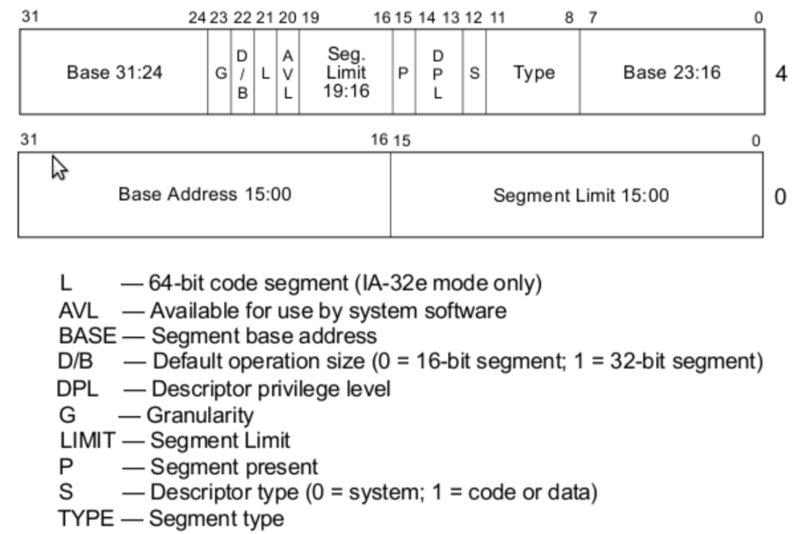

>原文地址 [Writing a Simple Operating System — from Scratch](http://www.cs.bham.ac.uk/~exr/lectures/opsys/10_11/lectures/os-dev.pdf)

# 32位保护模式

继续16位模式可以加深我们的之前学到的内容，这很好，不过，为了充分发挥 CPU 的作用，为了更好理解现代计算机是如何从 CPU 的发展中受益的（主要是硬件级别的内存保护），我们必须要学习 32 位保护模式。

32位保护模式主要的不同有：

- 寄存器拓展到了32位，其他的不变，只要在原先使用寄存器的地方前面加上 e，比如 `mov ebx, 0x274fe8fe`。
- 为了方便，有额外两个新的通用段寄存器：`fs` 和 `gs`。
- 32位内存地址偏移变的可能了，所以，现在一个偏移可以引用4GB的内存（0xffffffff）
- CPU 对内存的段划分支持的更好，（虽然也稍微有点复杂了），主要有下面两个优势：
  - 一个普通的段内的代码在更高优先级的段会被禁止执行，所以你可以保护你的内核代码不被用户应用改变。
  - CPU 可以为用户进程实现虚拟内存，这样，一页的进程内存可以被透明的交换到磁盘，当需要的时候交换回到内存中。这保证了内存被有效的使用，因为很少被使用或者执行的代码不需要占用宝贵的内存空间
- 中断处理更加成熟

将 CPU 从16位模式切换到32位保护模式最难的地方在于我们必须在内存中准备一个复杂的数据结构，叫做 GDT （global descriptor table），这张表定义了内存的段和它们的保护模式属性。一旦定义了 GDT，可以使用一个特殊的指令加载它，并确保在此之前没有对 CPU 的任何控制寄存器设置内容。

如果我们不需要在汇编中定义 GDT 的话，会很简单。不幸的是，如果我们想加载高层语言比如C编译的内核的话，这种底层的切换是无法避免的，通常这种情况下，代码会被编译成32位指令而不是更低效的16位指令。

有一个令人震惊的事实：切换到32位保护模式的时候，我们不能再使用 BIOS 了。如果你觉得使用  BIOS 太底层了，这就像是退了一步，但是前进了两步。

## 没有 BIOS

为了更好的使用 CPU，我们必须抛弃所有 BIOS 提供的有用的例程。当我们深入32位保护模式的切换的时候，我们会知道，所有的 BIOS 例程，是基于16位模式开发运行的，这在32位中变得非法了。如果试着使用的话，很可能把机器弄崩溃了。

所以这意味着，所有32位的 OS 必须自己提供机器的所有硬件需要的驱动（比如键盘、屏幕、磁盘驱动，鼠标，等等）。事实上，将32位模式短暂的切换到16位然后使用 BIOS 是可能的，不过这种技术带来的问题比解决的问题还多，尤其是性能相关的部分。

切换到32位碰到的第一个问题是如何在屏幕上打印信息，这样我们就知道正在发生什么了。之前我们请求 BIOS 在屏幕上打印一个 ASCII 字符，但是它是如何做到将合适的像素展示在计算机屏幕恰当的位置上的呢？目前，只要知道显示设备可以用很多种方式配置成两种模式：文本模式和图像模式。屏幕上展示的内容只是某一特定区域的内存内容的视觉化展示。所以为了操作屏幕的展示，我们必须在当前的模式下管理内存的某特定区域。显示设备就是这样子的一种设备，和内存相互映射的硬件。

当大部分计算机启动时候，虽然它们可能有更先进的图像硬件，但是它们都是先从简单的视频图像数组（VGA，video graphics array）颜色文本模式，尺寸80*25，开始的。在文本模式，编码人员不需要为每个字符渲染每一个独立的像素点，因为一个简单的字体已经在 VGA 显示设备内部内存中定义了。每一个屏幕上字符单元，在内存中通过两字节表示，第一个字节被展示字符的 ASCII 编码，第二个字节包含字符的一些属性，比如字符的前景色和背景色，字符是否应该闪烁等。

所以，如果我们想在屏幕上展示一个字符，那么我们需要为当前的 VGA 模式，在正确的内存地址处设置一个 ASCII 码值，通常这个地址是 `0xb8000`。我们稍微改一下原先16位模式的 `print_string` 例程，我们就可以构建一个32位模式的例程，它会将数据直接写到视频内存中，如下所示：

```
[bits 32]
; Define some constants 
VIDEO_MEMORY equ 0xb8000 
WHITE_ON_BLACK equ 0x0f

; prints a null-terminated string pointed to by EDX

print_string_pm:
  pusha
  mov edx, VIDEO_MEMORY         ; Set edx to the start of vid mem.

print_string_pm_loop:
  mov al, [ebx]                 ; Store the char at EBX in AL 
  mov ah, WHITE_ON_BLACK        ; Store the attributes in AH

  cmp al, 0                     ; if (al == 0), at end of string, so 
  je done                       ; jump to done

  mov [edx], ax                 ; Store char and attributes at current
                                ; character cell.
  add ebx, 1                    ; Increment EBX to the next char in string. 
  add edx, 2                    ; Move to next character cell in vid mem.


jmp print_string_pm_loop        ; loop around to print the next char.

print_string_pm_done :
  popa
  ret                           ; Return from the function
```

注意，虽然屏幕是通过每一行每一列展示的，视频相关内存区域是简单的序列，比如，第5列第3行的地址可以像下面这样计算：`0xb8000 + 2 * (row * 80 + col)`

我们的代码的缺点是它总是打印字符到屏幕的左上角，所以它会覆盖之前的信息而不是滚动下去，我们可以花时间添加复杂的汇编代码进来，不过，我们不要把事情搞的太难了，既然我们已经在32位模式了，我们不久就可以用高层语言编写启动代码，然后很多工作就会变得简单很多。

## 理解 GDT 表

在我们深入之前，理解 GDT 很重要，因为在32位模式下它十分的基础。回忆之前的章节，经典的16位模式下基于段的地址运行程序员访问超过16位的地址内容。现在假设程序员希望将 `ax` 中的内容存到地址 `0x4fe56` 中。没有基于段的地址，只能这样子：

```
mov [0xffff], ax
```

这行指令离预期的地址很远。与之对比的，使用段寄存器，这个任务可以通过下面这样子完成：

```
mov bx, 0x4000
mov es, bx
mov [es:0xfe56], ax
```

虽然，段内存和使用偏移到达内存的想法没有改变，32位实现的方式完全变了，主要是提供了更多的灵活性。一旦 CPU 切换到32位，它将逻辑地址（比如结合段寄存器和偏移）转换到物理地址的方式完全不同了：不同于将段寄存器的内容乘16，然后加上偏移，现在一个段寄存器变成了 GDT 表中的一个索引，指向一个特别的 段描述符 （SD，segment descriptor）。

一个段描述符是一个8字节的结构，定义了如下的保护模式段的属性：

- 基底层（32位），定义了物理内存中段的开始地址
- 段限制（20位），定义了一个段的大小
- 各种标志，影响了 CPU 是如何解释段的，比如一个特权代码是否能在它内部执行或者它是只读的还是只写的

下图展示了段描述符的实际结构：



注意，为了避免迷惑，在整个结构中基地址和段的限制大小都被从内部分开存放了。所以，比如，段限制部分的低16位是在结构体中的前面2个字节，但是高4位在第7个字节的开始处。这么做的原因可能是出于开玩笑，也有可能是历史原因或者受到了 CPU 硬件设计的影响。

我们不会去详细了解所有段描述符的可能的配置，完整的解释可以在因特尔的开发者手册中找到。为了有助于将代码在32位模式下跑起来，我们会学习我们需要的内容。

Intel 描述了一个最简单的段寄存器配置，叫做基本的平坦模型（basic flat model）。在这里，定义了两个重叠的段，覆盖了所有可以引用的4GB内存，其中一部分是代码一部分是数据。这个模型里面，两个段重叠说明它没有试图保护其中一个段免受另一个段的影响，也没有试图在虚拟内存中使用页技术。让事情变得简单很重要，特别是当我们启动到高层语言的阶段时，改变段描述符会更加简单。

除了代码段和数据段，CPU 需要 GDT 的第一项是一个非法的空描述符（比如，一个8字节的0）。空描述符是用于一个简单的机制，即为了捕获在访问地址前忘记设置特定的段寄存器（这很容易发生，比如当我们的段寄存器有些是 `0x0`，然后在切换到保护模式的时候，忘记更新它们为合适的值）。如果地方访问的时候是一个空描述符，那么 CPU 会引发一个异常，也就是一个中断（不要和高层语言比如 Java 中的异常相混淆）。

我们的代码段将会有下面这些配置：

- Base：0x0
- Limit：0xfffff
- Present： 1，因为段是在内存中，用于虚拟内存
- Privilige：0，ring 0 是最高的优先级
- Descriptor type：对于代码或者数据寄存器是1，对于 trap 是0
- Type：
  - Code：1，因为这是一个代码段
  - Conforming：0，意思是低优先级的段的代码，无法调用这个段的代码，这是内存保护的关键
  - Readable：1，意思是可读，若为0表示只能用于执行。可读的话，允许我们读取代码中定义的常量
  - Accessed：0，这个通常用于调试或者虚拟内存技术，因为当 CPU 访问段的时候，它会设置这个位
- 其他 flags
  - Granularity：如果设置为1，它将以4K倍的方式扩大我们的限制（即16*16*16），所以我们的 0xfffff 会变成 0xfffff000（也就是左移3个16进制位），允许我们的段扩大到4GB 内存
  - 32-bit default：1，因为我们的段会包含32位的代码，不然就用0，表示16位代码。这个实际上为操作设置了默认的数据单元大小，比如 `push 0x4` 将表示32位的 0x4
  - 64-bit code segment：0，32位下不用
  - AVL：0，当需要的时候（比如调试）可以设置，不过现在不需要。
  
因为用的是简单平坦模式，使用两个重叠的代码和数据段，数据段和代码段差不多，但是 type 标志不一样：

- Code：对于 data 是 0
- Expand down：0，这允许段被扩展下来（TODO，解释这里）
- Writable：1，表示允许数据段被写，不然的话是只读的。
-  Accessed：0，经常用于调试和虚拟内存技术，因为 CPU 访问段内存时候会设置这一位。

既然我们已经知道两个段的实际的配置了，也了解了大部分可能的段描述符设置，保护模式为什么在内存使用提供了比16位更多的灵活性应该也比较清楚了。


## 使用汇编定义 GDT

现在我们理解了对于我们基本平坦模型，我们要包含怎样的段描述符在 GDT 中，让我们看看要如何在汇编中设置 GDT，这里最需要的是耐心！当你觉得这个很无聊的时候，记住：我们现在做的将会在不久帮助我们启动用高层语言写的 OS 内核。引用一句名言，现在的一小步将是未来的一大步！

我们已经知道如何在汇编代码中定义数据：使用 `db`、`dw` 和 `dd`汇编指令。这些就是我们在设置 GDT 项中段描述符字节的时候将要使用的。

事实上，出于一个简单的原因（CPU 需要中断我们的 GDT 表有多长），我们实际不会直接把 GDT 表的地址给 CPU，而是将一个更加简单的结构数据的地址给 CPU，也就是 GDT 描述符（意思就是一种描述 GDT 的东西）。GDT 描述符是一个6字节的结构包含下面这些：

- GDT 的大小（16位）
- GDT 的地址（32位）

注意，像这种复杂的数据结构，在底层语言中我们没法给出很详细的注释。下面的代码定义了我们的 GDT 和 GDT 描述符，在代码中，注意我们是如何使用 `db`、`dw` 这些指令的，如何完善结构的每一部分以及标志位是如何使用字面二进制数字（后缀为 `b`）被轻松的定义：


```
; GDT
gdt_start:

gdt_null:     ; the mandatory null descriptor
dd 0x0        ; ’dd’ means define double word (i.e. 4 bytes)
dd 0x0

gdt_code:     ; the code segment descriptor
  ; base=0x0, limit=0xfffff,
  ; 1st flags: (present)1 (privilege)00 (descriptor type)1 -> 1001b
  ; type flags: (code)1 (conforming)0 (readable)1 (accessed)0 -> 1010b
  ; 2nd flags: (granularity)1 (32-bit default)1 (64-bit seg)0 (AVL)0 -> 1100b

  dw 0xffff   ; Limit (bits 0-15)
  dw 0x0      ; Base (bits 0-15)
  db 0x0      ; Base (bits 16-23)
  db 10011010b; 1st flags, type flags
  db 11001111b; 2nd flags, Limit (bits 16-19)
  db 0x0      ; Base (bits 24-31)

gdt_data:     ; the data segment descriptor
  ; Same as code segment except for the type flags:
  ; type flags: (code)0 (expand down)0 (writable)1 (accessed)0 -> 0010b

  dw 0xffff   ; Limit (bits 0-15)
  dw 0x0      ; Base (bits 0-15)
  db 0x0      ; Base (bits 16-23)
  db 10010010b; 1st flags, type flags
  db 11001111b; 2nd flags, Limit (bits 16-19)
  db 0x0      ; Base (bits 24-31)

gdt_end:      ; The reason for putting a label at the end of the
              ; GDT is so we can have the assembler calculate
              ; the size of the GDT for the GDT decriptor (below)

; GDT descriptior
gdt_descriptor:
  dw gdt_end - gdt_start - 1  ; Size of our GDT, always less one
                              ; of the true size
  dd gdt_start                ; Start address of our GDT

; Define some handy constants for the GDT segment descriptor offsets, which
; are what segment registers must contain when in protected mode. For example,
; when we set DS = 0x10 in PM, the CPU knows that we mean it to use the
; segment described at offset 0x10 (i.e. 16 bytes) in our GDT, which in our
; case is the DATA segment (0x0 -> NULL; 0x08 -> CODE; 0x10 -> DATA)

CODE_SEG equ gdt_code - gdt_start
DATA_SEG equ gdt_data - gdt_start
```

## 切换32位模式

一旦 GDT 和 GDT 描述符在我们的启动代码中准备好了，我们就已经准备好让 CPU 从16位切换到32位模式了。

像我之前说的，实际的切换的代码是相当简单的，不过理解代码中的每一步很重要。

第一件我们要做的事是禁止中断指令：`cli` （清除中断，clear interrupt），意味着 CPU 会简单的忽略将来发生的任何中断，直到中断被重新打开。这非常重要，因为，像基于段的地址访问一样，32位下的中断处理完全不同于16位，导致目前 BIOS 在内存中设置的 IVT 完全失效。即使 CPU 可以将中断信号映射到正确的 BIOS 例程（比如用户按了一个键盘键位，将它的值存到缓冲区中），因为 BIOS 例程是工作在16位模式的，没有我们定义在 GDT 中的32位段概念，所以最终一定会把 CPU 弄崩溃（段寄存器存在的值意味着16位的段模式）

下一步是把我们之前幸苦准备的 GDT 表告诉 CPU。我们使用一个简单的指令来完成，这个指令需要 GDT 描述符：

```
lgdt [gdt_descriptor]
```

一切就绪，开始真正的切换操作，通过设置 CPU 一个特殊的控制寄存器的第一位：`cr0`。现在，我们不能直接设置寄存器的位，我们必须加载它到一个通用目的寄存器，设置位，然后存回到 `cr0` 中。和前面章节我们使用 `and` 指令来排除一个值中的无效的位，我们可以使用 `or` 指令来包含特定的位到一个值中（不会影响其他设置在控制寄存器中的位，这些位可能被设置成用于别的重要目的）。

```
mov eax, cr0  ; To make the switch to protected mode, we set
or eax , 0x1  ; the first bit of CR0 , a control register
mov cr0, eax  ; Update the control register
```

当 `cr0` 被更新之后，CPU 就在32位模式了。

最后一句话不完全正确。因为现代的处理器使用一种被叫做指令流水的技术。这种技术允许并行的执行不同阶段的指令（这里的并行是单个 CPU 中发生的，而不是多个 CPU），所以会更加快。比如，每一个指令可能先从内存中获得，然后解码成微指令，再执行，然后可能结果会存回到内存中。因为上述这些阶段是半独立的，它们可以在一个 CPU 周期内被同时完成，不过，每个阶段属于不同指令的不同周期（比如说，前一条指令可以在被解码的同时从内存中读取下一条指令）。

一般为 CPU 编程的时候，我们不需要担心 CPU 内部的机制，比如指令流水，不过，切换 CPU 模式情况比较特殊。因为存在风险，比如可以某些指令的处理阶段被执行在错误的模式下。所以在让 CPU 切换模式后，我们需要立刻要求 CPU 完成当前流水中的工作。这样我们就可以确保未来的指令将被执行在正确的模式下。

当 CPU 知道后面将要执行的几条指令，指令流水工作的很好，因为 CPU 可以预先从内存中获取他们。但是 `jmp` 和 `call` 指令有点不太一样。因为除非所有的指令都已经被执行完了，不然 CPU 不知道它们之后将要执行的指令，尤其当我们要跳转到或者调用一个很远的地方，可能意味着我们会跳转到别的段中。所以，在切换 CPU 模式之后，我们可以立刻调用跳转指令来跳到很远的地方，这会强制要求 CPU 处理完指令流水中剩下的内容（即完成所有指令流水中处于不同阶段的指令）。

为了跳的远，不同于一个正常的跳转，我们额外提供一个地点段：

```
jmp <segment>:<address offset>
```

对于这条指令，我们要仔细思考我们想要跳到哪里。假设我们已经在代码中设置了一个标签比如说是 `start_protected_mode`，指的是我们的32位代码开始的地方。就像我们讨论过的，一个近的跳转，比如 `jmp start_protected_mode` 可能还不足以清空当前的流水线，而且，我们现在处于一种奇怪的状态，因为我们的当前代码段（比如 `cs`）在32位下是非法的。所以我们必须更新 `cs` 寄存器为 GDT 中的代码段描述符。段描述符每个8字节长，并且我们的代码描述符是 GDT 中的第二项（第一项是空描述符），所以它的偏移是 `0x8`，这就是我们要设置 `cs` 寄存器的值。注意，由于要跳到很远的地方执行，它会自动引起 CPU 更新 `cs` 寄存器为目标段的值。利用标签，我们可以让汇编器去计算这些段描述符偏移，然后将他们存为 `CODE_SEG` 和 `DATA_SEG` 常量。下面是相应代码：

```
jmp CODE_SEG:start_protected_mode

[bits 32]
start_protected_mode:

...           ; By now we are assuredly in 32-bit protected mode. 
...
```

注意，事实上，从实际开始跳和跳到的地方之间的距离的角度，我们不需要跳转到很远，重要的是我们如何跳转。

也要注意，我们要使用 `[bits 32]` 指令告诉汇编器，从这里开始，它需要编码32位模式的指令。注意这并不意味着我们不能在16位模式下使用32位指令，只是说汇编器需要知道32位的情况，因为32位模式的指令和16位下编码有一点点不同。当切换到32位模式，我们使用32位寄存器 `eax` 来设置控制位。

现在我们在32位模式下了。进入32位模式之后一件重要的要做的事是更新所有的其他段寄存器，（令它们指向我们32位的数据段而不是已经非法的16位段）并更新栈的位置。

所有这些处理归结为如下代码：

```
[bits 16]
; Switch to protected mode
switch_to_pm:

cli           ; We must switch of interrupts until we have 
              ; set-up the protected mode interrupt vector
              ; otherwise interrupts will run riot.

lgdt [gdt_descriptor]   ; Load our global descriptor table, which defines
                        ; the protected mode segments (e.g. for code and data)

mov eax , cr0         ; To make the switch to protected mode, we set
or eax, 0x1           ; the first bit of CR0, a control register
mov cr0 , eax

jmp CODE_SEG:init_pm  ; Make a far jump (i.e. to a new segment) to our  32-bit
                      ; code. This also forces the CPU to flush its cache of
                      ; pre-fetched and real-mode decoded instructions, which can 
                      ; cause problems.

[bits 32]
; Initialise registers and the stack once in PM.
init_pm:

  mov ax, DATA_SEG    ; Now in PM , our old segments are meaningless ,
  mov ds, ax          ; so we point our segment registers to the
  mov ss, ax          ; data selector we defined in our GDT
  mov es, ax 
  mov fs, ax 
  mov gs, ax

  mov ebp, 0x90000    ; Update our stack position so it is right 
                      ; at the top of the free space.
  mov esp , ebp

  call BEGIN_PM       ; Finally, call some well-known label
```

## 总结

终于，我们可以把所有的例程包含到启动代码中了，并实现了16位到32位的切换。

```
; A boot sector that enters 32-bit protected mode. 
[org 0x7c00]

mov bp, 0x9000          ; Set the stack.
mov sp, bp

mov bx, MSG_REAL_MODE 
call print_string

call switch_to_pm       ; Note that we never return from here.

jmp $

%include "../print/print_string.asm" 
%include "gdt.asm"
%include "print_string_pm.asm" 
%include "switch_to_pm.asm"

[bits 32]

; This is where we arrive after switching to and initialising protected mode.
BEGIN_PM:

mov ebx , MSG_PROT_MODE
call print_string_pm      ; Use our 32-bit print routine.

jmp $                     ; Hang.

; Global variables
MSG_REAL_MODE db "Started in 16-bit Real Mode", 0
MSG_PROT_MODE db "Successfully landed in 32-bit Protected Mode", 0

; Bootsector padding 
times 510-($-$$) db 0 
dw 0xaa55
```